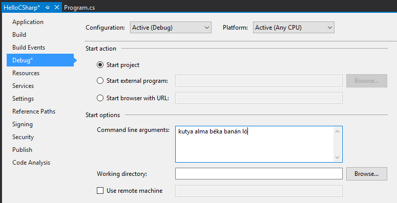

[#csharp1]
= C# alapok, szintaxis

== Célkitűzés

A labor során a hallgatók elkezdenek megismerkedni a C# nyelv alapjaival, mondattanával, a Visual Studio fejlesztőeszközzel. Röviden, dióhéjban hasonlítsuk össze más programozási nyelvekkel (Java, C/C{pp}, Python, JavaScript).

Ezen a laboron célunk, hogy a hallgatók legalább részben megértsék és ráérezzenek a C# szintaktikájára, megismerkedjenek alapvető nyelvi elemekkel és konstrukciókkal.

== Hello C#!

Navigáljunk a File → New → Project dialógusablakra! Magyarázzuk el, hogy van lehetőségünk előre gyártott sablonokból létrehozni projekteket.

* Egy C# Project egy szerelvénnyé fordul (.dll, .exe).
* A _Solution_ dolga, hogy logikailag összefogja a _Project_-eket (több-többes kapcsolatban vannak).
* Project-ek között referenciákat adhatunk másik projektekre úgy, hogy a fordítási mechanizmus figyelembe veszi a referenciákat és szükség esetén újrafordítja a szerelvényeket.
* Project-ek hivatkozhatnak külső forrásból származó szerelvényekre is NuGet csomagok formájában. A NuGet egy egységes módszer szerelvényeink terjesztésére.

Hozzunk létre egy új C# Console Application-t! Ehhez az Installed → Templates → Visual C# → Console App (.NET Framework)-öt válasszuk, vagy használjuk a jobb felső sarokban levő keresőt („cons`"). A neve legyen _HelloCSharp_.

Hozzunk létre hozzá új solution-t (csak azért, hogy szokják a hallgatók a koncepciót), és adjunk meg egy olyan helyet, ahová a hallgatók is menthetnek. A Create directory for solution lehetőséget hagyjuk üresen, így nem fog létrejönni egy felesleges mappa a könyvtárszerkezetben. A .NET Framework verziót állítsuk legalább 4.6.1-esre.

Észrevehetjük, hogy az alkalmazás template-ek között .NET Core, .NET Framework és .NET Standard alkalmazásokat is fejleszthetünk. Az utóbbit önmagában nem használhatjuk konzolos alkalmazás készítésére, ugyanis az nem implikál semmiféle futtatókörnyezetet.

* *.NET Standard:* az alábbi környezet megcélzásával a lehető leghordozhatóbb osztálykönyvtárakat készíthetjük el. A .NET standardizálásából készült egy szabványos megoldás, amelyet bármely másik .NET Standard-et támogató keretrendszer és alkalmazás felhasználhat (Mono/Xamarin, .NET Core, .NET Framework).
* *.NET Core:* a .NET Framework modularizált, modernizált, cross-platform és nyílt forráskódú megvalósítása. Kisebb NuGet csomagokban érhető el a teljes .NET Framework funkcionalitása (Collections, Reflection, XML feldolgozás, stb.).
* *.NET Framework:* a „klasszikus", teljesértékű .NET keretrendszer, out-of-the-box támogatja a legelterjedtebb alkalmazásfejlesztési lehetőségeket. A .NET Core megjelenését követően is támogatott, enterprise környezetekben használatos, ugyanis teljes értékű support támogatással rendelkezik.

Az alábbi elemeket ismertethetjük, mielőtt a kódírásba belekezdünk:

* Rövid áttekintés az IDE-ről: menüsáv, Solution Explorer, Properties, Output, Error List ablakok, ablakozórendszer. Mutassuk meg, hogy drag-n-drop műveletekkel testreszabható a felület, pl. helyezzük a Solution Explorert a képernyő bal oldalára. Ha valaki véletlenül átrendezi az alapértelmezett elrendezést, a Window → Reset Window Layout lehetőséggel visszaállíthatja.
* A projekt tulajdonságok (jobb klikk → Properties) oldalán az Application fülön megnézhetjük, hogy az Output type értéke határozza meg, hogy milyen jellegű (konzolos, Windows, osztálykönyvtár) alkalmazást készítünk.
* Mutassuk meg, hogy milyen alapvető szerelvényekre adunk referenciát a projektben!
* Nézzük meg a Program.cs fájl tartalmát és fussuk át a látható elemeket!
* Magyarázzuk el a `using` és `namespace` kulcsszavak jelentését, egymáshoz képesti viszonyukat! A névtér értéke egy újonnan létrehozott fájlnál alapértelmezetten Projektnév.Mappaszerkezet alakú, érdemes konvencionálisan ezt követni. Sok hallgatónál nem tiszta, hogy hogyan viszonyul egymáshoz a névtér és a szerelvény fogalma, ezért próbáljuk meg ezt tisztázni!
* Utaljunk arra, hogy hackelés nélkül kizárólag objektumorientáltan tudunk kódot írni, így a `Program` egy osztály, a `Main` belépési pont pedig egy statikus metódus.
* Beszéljünk röviden a C# elnevezési konvenciókról! A publikus elemeket (pl. Java-val és JavaScripttel ellentétben) és minden metódust ökölszabályként PascalCasing elnevezési konvenció követ, a nem publikus elemeknél camelCasing (ezek közül vannak kivételek és más konvenciók, de ez egy gyakori megközelítés).

Egészítsük ki a `Main` metódust az alábbi kódrészlettel, közben hívjuk fel a figyelmet az IntelliSense használatára:

[source,csharp]
----
int a = 5;
int b = 7;
Console.WriteLine(a + b);
Console.ReadLine();
----

Az IntelliSense-t demonstrálhatjuk az alábbi módon:

* A kódban bármely logikus helyen használható az IntelliSense a Ctrl+Spacebar billentyűkombinációval, ezen kívül alapértelmezetten felugrik kódírás közben is.
* Írjuk be a `Console` és a `.WriteLine()` elemeket úgy, hogy gépelés közben az IntelliSense legördülőből válasszuk ki az elemet, majd _[Tab]_-bal véglegesítsük a választást.
* Használjuk a _cw_ code snippetet, amit az IntelliSense is jelez, azaz írjuk be: _cw[TAB][TAB]_.
* Ha a `Console.ReadLine()` helyett `Console.Readline()`-t írunk, elsőként az IDE azonnal javítja a hibát. Ha ezt a javítást visszavonjuk (Ctrl+Z), lehetőségünk van a javításra a Ctrl+. használatával: a fejlesztőeszköz észreveszi, hogy hibát vétettünk, és felkínálja a gyakori megoldásokat.
* _Overload_-ok: jelöljük ki a `WriteLine` hívás nyitó zárójelét, és írjuk be ismét a nyitó zárójelet. Így előjön az overload-ok listája, amik közül a megfelelőt a föl/le iránybillentyűkkel választhatjuk ki. Az overload listát megnyithatjuk úgy is, hogy a zárójelben bárhova írunk egy ',' karaktert. Az overload azt jelenti, hogy ugyanazzal a függvénynévvel több, különböző szignatúrájú metódust is felvehetünk, a megfelelő függvény kiválasztása a megadott paraméterek száma és típusa alapján történik.

Indítsuk el az alkalmazást! Ehhez a fent található Start lehetőséget használhatjuk, de mondjuk el, hogy ez a menü Debug → Start Debugging (kbd:[F5]) lehetőséggel ekvivalens.

Mutassuk be a `for` és `foreach` vezérlési szerkezeteket! A projekt _Properties_ oldalán (_Alt+Enter_ a projekt kijelölése után) adjunk meg a _Debug_ fülön a _Start Options_ blokknál legalább öt tetszőleges parancssori argumentumot (szóközzel elválasztva), pl. kutya alma béka banán ló.

[source,csharp]
----
for (int i = 0; i < args.Length; i++)
    Console.WriteLine(args[i]);

foreach (string arg in args)
    Console.WriteLine(arg);

Console.ReadLine();
----

Indítsuk el, és gyönyörködjünk.

Rakjunk egy breakpointot (F9, vagy klikkeljünk baloldalon a függőleges sávon a kód sorszáma mellett) a `Console.WriteLine(args[i]);` sorra, majd indítsuk újra az alkalmazást! Amikor a breakpointon megáll az alkalmazás futása, a sor sárga színű lesz. Ekkor vigyük az egeret az `i`, az `args` és az `args.Length` elemek felé, és mutassuk meg, hogy láthatjuk az aktuális értékeiket, komplexebb objektumok esetén be tudjuk járni az objektumgráfot. A _Watch_ ablakba is írhatunk kifejezéseket, és megmutathatjuk a _Locals_ ablakot is. _F10_-zel (vagy a menüsoron a _Step Over_ elemmel) lépjünk tovább, nézzük meg, milyen sorrendben értékelődik ki a `for` ciklus. Az _F5_-tel továbbengedhetjük az alkalmazás futását, majd zárjuk is be.

Mutassuk meg a Conditional Breakpoint használatát is. Tegyünk még egy breakpointot a másik `Console.WriteLine`-ra is. Jobb egér gomb az első breakpointon → Conditions... Adjuk meg az alábbiakat: _Conditional Expression Is true_ `(i == 3)`. A másik breakpointon is adjunk meg feltételt: _Hit Count = 4_. Mindkét alkalommal a 4. elemen (banán) állunk meg. Megjegyezhetjük, hogy a Conditional Breakpoint használatával nem érdemes mellékhatást okozó műveleteket megadni, illetve hogy jelentősen le tudja csökkenteni a debuggolás sebességét.

=== Tulajdonságok (Property-k)

Hozzuk létre a Person adatosztályt! Ehhez jobb katt a projekten → Add → Class, a fájl neve legyen Person (a kiterjesztést automatikusan hozzábiggyeszti a Visual Studio, ha nem adjuk meg). .NET-ben nincs megkötés arra, hogy a kódokat tartalmazó fájlok és az egyes típusok számossága hogyan viszonyul egymáshoz: lehetséges egy kódfájlba is írnunk a teljes alkalmazás-kódot, illetve egy osztályt is szétdarabolhatunk több fájlra (ehhez a partial kulcsszót használjuk).

A C# tulajdonság (_property_) egy szintaktikai édesítőszer, amely egy objektumpéldány (vagy osztály) egy explicit (memóriabeli) vagy implicit (származtatott vagy indirekt) jellemzőjét írja le. Egy tulajdonsággal két művelet végezhető: lekérdezés (_get_) és értékadás (_set_); ezeknek megadható külön a láthatósága és a kettő közül elegendő egy implementálása. A legtöbb C# szintaktikai édesítőszer a boilerplate kódok írásának elkerülése végett készült, így kevesebb kódolással érjük el ugyanazt az eredményt (sokszor az IL kód nem is változik, gyakorlatilag hasonló a kódgeneráláshoz).

A `Person` osztályban hozzuk létre a `string Name` property-t, `name` backer fielddel. Ehhez használjuk a _propfull_ code snippetet (_propf[TAB][TAB]_, majd _[TAB]_-bal lehet lépkedni a módosítandó elemek között):

[source,csharp]
----
public class Person
{
    private string name;

    public string Name
    {
        get { return name; }
        private set { name = value; }
    }

    public Person(string name)
    {
        this.name = name;
    }
}
----

Magyarázzuk el, hogy igazából csak két további (kódban nem látható) metódust hozunk létre, mintha egy-egy `GetName` és `SetName` metódust készítenénk, viszont használat szempontjából ugyanolyannak tűnik, mintha egy sima mező lenne. A settert privát láthatóságúra tesszük, ezért csak egy Person példányon belülről tudjuk állítani a `Name` property értékét. Jegyezzük meg, hogy a getterben és setterben teljesen más jellegű műveleteket is végezhetünk (pl. elsüthetünk egy eseményt, hogy megváltozott a felhasználó neve, naplózhatjuk, hányszor kérték le a nevét, stb.). A property egyik nagy erénye, hogy osztályon kívülről az osztályváltozóknál megszokott szintaxissal használhatjuk.

A `Main` függvénybe írhatjuk például:

[source,csharp]
----
Person p= new Person("Eric Lippert");
p.Name = "Mads Torgersen";
Console.WriteLine(p.Name);
----

Debuggerrel mutassuk meg, hogy az első sor a konstruktort, míg a második a property setterét, végül a harmadik sor ugyanazon property getterét hívja.

Mivel a backing field állításán kívül nem csinálunk semmit a kódban, ezért használhatjuk a _propg_ code snippetet is:

[source,csharp]
----
public class Person
{
    public string Name { get; private set; }

    public Person(string name)
    {
        Name = name;
    }
}
----

A láthatóság miatt a `Main` függvényünkben a setter hívás már nem fordul, kommentezzük ki.

[source,csharp]
----
//p.Name = "Mads Torgersen";
----

Említsük meg a _prop_ code snippetet is, ami mindkét módosítószót publikusan hagyja. Láthatósági módosítószót a `get` és `set` közül csak az egyik elé tehetünk ki, és az is csak szigoríthat a külső láthatóságon (ekkor a másik a külsőt kapja meg).

Ez a megoldás az előzővel teljes mértékben ekvivalens (csak nem látjuk a generált backing fieldet, de valójában ott van). Ha van időnk, akkor megmutathatjuk decompilerben, hogy valóban így van.

Az előzőhöz hasonlóan vegyük fel a születési dátumot is. A születési dátum nem változhat, gyakorlatilag `readonly` mezőről van szó. Ha egy tulajdonság értékét az objektum is csak a konstruktorban tudja megadni, akkor a setter teljes mértékben elhagyható:

[source,csharp]
----
public DateTime DateOfBirth { get; }

public Person(string name, DateTime dateOfBirth)
{
    Name = name;
    DateOfBirth = dateOfBirth;
}
----

Ez a szintaktika megegyezik azzal, mintha egy `readonly` mezőt használnánk, azaz a mező értéke legkésőbb a konstruktorban inicializálandó.

Vegyünk fel neki egy azonosítót, ami egy `Guid` struktúra:

[source,csharp]
----
public Guid Id { get; } = Guid.NewGuid();
----

Ez egy csak lekérdezhető tulajdonság, ami konstruáláskor inicializálódik.

Megadhatjuk a korát, mint implicit tulajdonságot:

[source,csharp]
----
public int Age { get { return DateTime.Now.Subtract(DateOfBirth).Days / 365; } }
----

Újabb szintaktikával megadhatjuk „expression bodied property`"-ként is:

[source,csharp]
----
public int Age => DateTime.Now.Subtract(DateOfBirth).Days / 365;
----

TIP: Alkalmazások fejlesztésekor a legfontosabb első lépések egyike, hogy az objektummodellünk átlátható, karbantartható és egyértelmű legyen. A C# változatos szintaxisa nagyon sokat segít ezen célok elérésében.

=== Listázás

A `Main` metódusban vegyünk fel néhány `Person` objektumot, és listázzuk ki a releváns tulajdonságaikat! Ehhez egy `Person` listában tároljuk a személyeket. A `List` generikus kollekció, azaz típusparamétert vár, típusokkal paraméterezhető. A `List` típusparamétere jelzi, hogy milyen típusú objektumokat tárol. Metódusok, tulajdonságok, típusok lehetnek generikusak. A genericitás fontos a kódunk újrafelhasználhatósága és karbantarthatósága érdekében.

[source,csharp]
----
static void Main(string[] args)
{
    List<Person> people = new List<Person>();
    people.Add(new Person("Horváth Aladár", new DateTime(1991, 06, 10)));
    people.Add(new Person("Kovács István", new DateTime(1994, 04, 22)));
    people.Add(new Person("Kovács Géza", new DateTime(1998, 03, 16)));

    foreach (Person person in people)
        Console.WriteLine(person);

    Console.ReadLine();
}
----

Indítsuk el az alkalmazást, és nézzük meg, mi történik!

Ha a `WriteLine` fölé visszük az egeret, látható, hogy az overload-ok közül az hívódik meg, amelyik objektumot vár paraméterül. Ebben az esetben a paraméter `ToString` metódusát hívja meg a `WriteLine`, ami alapértelmezés szerint az objektum _fully qualified_ típusának nevét adják vissza. Tegyük szebbé a kiírást, override-oljuk az alapértelmezett `ToString` implementációt a `Person` osztályban:

[source,csharp]
----
public override string ToString()
{
    return string.Format("{0} ({1}) [ID: {2}]", Name, Age, Id);
}
----

Ennek az implementációjára más szintaktikai édesítőszereket is használhatunk:

[source,csharp]
----
public override string ToString() => $"{Name} ({Age}) [ID: {Id}]";
----

A két implementáció ekvivalens, először az elsőt, majd a másodikat mutassuk meg. A második implementáció az ún. _expression bodied method_ és a _string interpoláció_ kombinálásából adódik.

Próbáljuk ki az alkalmazást!

Hozzuk létre a `Student` osztályt, ami származik a `Person` osztályból!

[source,csharp]
----
public class Student : Person
{
    public string Neptun { get; set; }
    public Student(string name, DateTime dateOfBirth, string neptun)
        : base(name, dateOfBirth)
    {
        Neptun = neptun;
    }
    public override string ToString() => $"{base.ToString()} Neptun: {Neptun}";
}
----

A `Main` metódusban vegyünk fel néhány hallgatót is:

[source,csharp]
----
people.Add(new Student("Nagy Sándor", new DateTime(1995, 11, 23), "RHSSDR"));
people.Add(new Student("Nagy Sándor", new DateTime(1994, 7, 3), "HSSWG4"));
people.Add(new Student("Horváth Géza", new DateTime(1994, 7, 3), "ASYF2K"));
----

Próbáljuk ki az alkalmazást!
