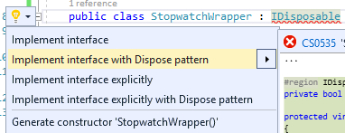

[#csharp4]
= C# alapok IV.

Ezen a gyakorlaton több különféle nyelvi konstrukciót tekintünk át, vegyesfelvágott jelleggel. Az egyes fő témaköröket külön projektként dolgozzuk ki. A projekteket hozzáadhatjuk az elsőként létrehozott projekt solutionjéhez (menu:jobbklikk a projekten[Add > New project]). Hozzáadás után ne felejtsük el átállítani a futtatandó projektet: menu:jobbklikk a projekten[Set as Startup Project].

== Bejárási problémák

Enumerátorok használata esetén két alapvető problémába ütközünk: az egyik a mögöttes kollekció módosulása bejárás során, a másik pedig a késleltetett kiértékelésből adódó mellékhatások kezelése.

=== Kollekció módosulása bejárása során

Szűrjünk le egy szám-szám szótárat csak azokra az elemekre, amik megfelelnek egy feltételnek, és ezeket távolítsuk el a szótárból!

[source,csharp]
----
var numbers = Enumerable.Range(1, 8).ToList();
foreach (var p in numbers)
{
    if (p % 2 == 0)
    {
        numbers.Remove(p);
    }
}
numbers.ForEach(Console.WriteLine);
----

Futtatáskor kivételt kapunk. Mi a probléma? A kollekciót bejárás közben szerettük volna módosítani, viszont ez könnyen nem várt működést (túlcímzést, nemdeterminisztikus bejárást) tenne lehetővé, ezért kivételt kapunk. Oldjuk meg a problémát: nem módosíthatjuk a forrás objektumot bejárás közben, tehát ne azt a kollekciót járjuk be, másoljuk le!

[source,csharp]
----
/**/foreach (var p in numbers.ToList()) // a ToList bekerült
/**/{/*...*/}
----

Ez megoldja a problémát, sikerül eltávolítani az elemeket a kollekcióból. De miért? A `ToList` `IEnumerable` bővítő, tehát bejárhatja a kollekciót, ezután pedig egy **másik ** `List<>` objektumban tárolja az elemeket. Így tehát két listánk lesz (a `numbers` és a `numbers.ToList` visszatérési értéke), amik kezdetben egymás klónjai, menet közben az egyikből veszünk ki, a másikon pedig iterálunk.

TIP: Bár a fenti az általános szabály, bizonyos kollekciók bizonyos módosító műveletei mégsem dobnak kivételt, ilyen például a `Dictionary<,>` `Remove` és `Clear` műveletei.

=== Azonnali és késleltetett kiértékelés

Amennyiben egy metódus generátor (`IEnumerable` vagy `IEnumerable<>` visszatérési értékű), az egyes elemeken történő iteráció a generátorok egymásba ágyazását jelenti, azaz az egyes generátorokban a `yield return` által visszaadott értéket fogja az enumerátor `MoveNext` metódusa visszaadni. Amíg az `IEnumerable`-re van referenciánk, és nem járjuk azt közvetlenül be, addig _késleltetett kiértékelésről_ beszélünk.

Az eddigiek alá:

[source,csharp]
----
var i = 0;
foreach (var n in numbers
                    .Where(p => p > 2)
                    .Select(p => new { p, x = ++i }))
{
    Console.WriteLine($"{n} - {i}");
}

Console.WriteLine();

i = 0;
foreach (var n in numbers
                    .Where(p => p > 2)
                    .Select(p => new { p, x = ++i })
                    .ToList())
{
    Console.WriteLine($"{n} - {i}");
}
----

A `ToList` hívásunk először bejárja az iterátort és visszaad egy listát, amelybe összegyűjti az `IEnumerable` elemeit. Ezért az `i` változónk a második esetben nem együtt inkrementálódik a bejárással, mert az kétszer történik meg. Az első bejáráskor (a `ToList` hívásakor) inkrementálódik az `i` értéke, másodjára pedig már csak bejárjuk a kapott listát. Eddigre az `i` értéke már meg van növelve.

Ezzel a megközelítéssel futásidőben is állíthatunk össze egy időben változó lekérdezést, amit majd egyszer, a későbbiekben fogunk bejárni (pl. sorosításkor).

== Aszinkron működés

Töltsünk le egy HTML oldalt, és ezen a problémán keresztül bemutatjuk az aszinkron programozási modellt. A `HttpClient` működésének a részletesebb ismertetése most nem téma, csak a legalapvetőbb funkciókat fogjuk használni.

A fő gond, hogy a hosszan futó műveletek blokkolhatják a fő/UI/aktuális szál futását, mindez kliens alkalmazások esetében úgy jelentkezik, hogy nem lesz a alkalmazásunk reszponzív a felhasználói bemenetekre; szerveralkalmazások esetében pedig az adott kérést kiszolgáló szál feleslegesen blokkolódik, amikor esetleg mással is tudna foglalkozni.

Ötlet a hosszan tartó műveleteket végezzük aszinkron módon, és ha az befejeződött az eredményről valamilyen módon értesüljünk. A keretrendszer többféle mintát kínál erre: Asynchronous Programming Model (APM), Event-based Asynchronous Pattern (EAP), Task-based Asynchronous Pattern (TAP). Mi most a legutóbbival foglalkozunk csak, a többi jórészt elavultnak számít ma már.

A TAP-ra már C# nyelvi támogatást is kapunk az `async`/`await` kulcsszavakon keresztül.
Vegyünk fel egy új metódust és hívjuk meg a legfelső szintű kódban. A megírt metódus írása során hivatkozzuk be a `System.Net.Http` névteret. A kód semmi mást nem csinál, csak elindít aszinkron módon egy HTTP GET kérést a megadott URL-re, illetve a válasz tartalmát is aszinkron módon kiolvassa és kiírja a konzolra.

[source,csharp]
----
LoadWebPageAsync();
Console.WriteLine("Ez a vége");
Console.ReadKey();

static async void LoadWebPageAsync()
{
    using (var client = new HttpClient())
    {
        var response = await client.GetAsync(new Uri("http://www.bing.com"));
        Console.WriteLine(response.StatusCode.ToString());

        var content = await response.Content.ReadAsStringAsync();
        Console.WriteLine(content.Take(1000).ToArray());
    }
}
----

*await:* Mindig egy `Task` `await`-elhető (vagy taszk szerű dolog: vagyis van neki `GetAwaiter` metódusa, ami meghatározott metódusokkal rendelkező objektummal tér vissza)! Akár létre is hozhatunk egy `Task`-ot, amit egy lokális változóban tárolunk, akkor azt is tudjuk `await`-elni.

*async:* ha await-elni akarunk, akkor muszáj `async`-nak lennie a tartalmazó metódusnak, mert ilyenkor építi fel a fordító az aszinkron végrehajtáshoz szükséges állapotgépet.

Debuggoljuk ki! Minden `Console`, `async` sorra tegyünk töréspontot, debuggolás során (kbd:[F5]) kövessük végig milyen sorrendben éri el őket a végrehajtás. Nézzük meg melyik rész milyen szálon fut le (debug közben menu:Debug[Windows > Threads]). A `LoadWebPageAsync` utáni rész előbb fog lefutni, mint az első `await` utáni rész. Az `await` utáni rész nem a _Main Thread_-en fut. Figyeljük meg azt is, hogy az _Ez a vége_ szöveg hamarabb kiíródik, mit a HTML oldal letöltése.

Próbáljuk ki a `Console.ReadKey`-t kikommentezve is, ilyenkor jó eséllyel hamarabb leáll a process, minthogy a `Task` befejeződne. Az ilyen fire-and-forget típusú hívásoknál nem figyel arra senki, hogy itt még valami háttérművelet folyik.

WARNING:  Az async void általában helytelen kód, mert nem lehet bevárni a háttérművelet végét. Az `async Task` máris jobb a bevárhatóság és a hibakezelés miatt, és alig kell módosítani a kódot. Kivétel, amikor valamiért kötelező a `void`, például, ha esemény vagy interfész előírja.

=== Az oldalletöltés bevárása

Módosítsuk úgy a kódot, hogy a `LoadWebPageAsync` utáni rész várja meg a letöltés befejeződését. Ez akkor jó például, ha a letöltés után valamit még szeretnék elvégezni a hívó függvényben.

Módosítsuk a `LoadWebPageAsync` fejlécét, hogy taszkot adjon vissza:

[source,csharp]
----
public static async Task LoadWebPageAsync() //void helyett Task
----

Várjuk be az szinkron művelet végét a legfelső szintű kódban.

[source,csharp]
----
    await LoadWebPageAsync(); //await bekerült

/**/Console.WriteLine("Ez a vége");
/**//*Console.ReadKey();*/
----

Figyeljük meg, hogy így már az _Ez a vége_ felirat már a letöltés után jelenik meg.

`await`-et használtunk a legfelső szintű kódban, ilyenkor automatikusan `async` kulcsszóval ellátott `Main` generálódik - valami hasonló, mint az alábbi kódrészlet.

[source,csharp]
----
await LoadWebPageAsync();
Console.WriteLine("Ez a vége");
//Console.ReadKey();
----

=== Háttérművelet eredményének visszaadása

Alakítsuk át, hogy a weboldal tartalmának kiíratása a legfelső szintű kódban történjen, és a `LoadWebPageAsync` csak adja vissza a tartalmat `string`-ként. Ehhez módosítsuk a visszatérési értéket `Task<string>`-re, így az `await` már eredménnyel fog tudni visszatérni.

[source,csharp]
----
    var content = await LoadWebPageAsync();
    Console.WriteLine(content);

/**/Console.WriteLine("Ez a vége");
    Console.ReadKey();

    static async Task<string> LoadWebPageAsync() //generikus paraméter
/**/{
/**/    using (var client = new HttpClient())
/**/    {
/**/        var response = await client.GetAsync(new Uri("http://www.bing.com"));
/**/        Console.WriteLine(response.StatusCode.ToString());
/**/
/**/        var content = await response.Content.ReadAsStringAsync();
            return new string(content.Take(1000).ToArray());
/**/    }
/**/}
----

A `return` valójában ezen `Task` eredményét állítja be `async` metódusok esetében, és nem egy nemgenerikus `Task` objektummal kell visszatérjünk.

== Nem(igazán) nullozható referencia típusok

Korábban láttuk, hogy hogyan lehet egy érték típusnak null értéket adni (`Nullable<T>`). Az érem másik oldala a C# 8-ban megjelent nem nullozható referencia típusok. Nem egy új típust vezettek be, hanem az eddig megszokott típusneveket értelmezi máshogyan a fordító. A projektfájlban az alábbi beállítás kapcsolja be ezt a funkciót.

[source,xml]
----
<Nullable>enable</Nullable>
----

TIP: Ezen kívül még https://docs.microsoft.com/en-us/dotnet/csharp/nullable-references#nullable-contexts[preprocessor direktívákkal] is szabályozhatjuk a működést.

Induljunk ki egy egyszerű személyeket nyilvántartó adatosztályból, ahol elhatározzuk, hogy a középső név kivételével a többi névdarab nem nullozható szöveg lesz.

[source,csharp]
----
Console.WriteLine("Hello World!");
class Person
{
    string FirstName;   // Not null
    string? MiddleName; // May be null
    string LastName;    // Not null
}
----

Ez máris számos figyelmeztetést generál. A nem nullozható referencia típusok bekapcsolásával alapesetben nem hibák csak új figyelmeztetések generálódnak. A vezetéknév és keresztnév adatoknak nem szabadna `null` értékűnek lennie (a sima `string` típus nem nullozható típust jelent), viszont így az alapérték nem egyértelmű, explicit inicializálnunk kellene.

Fontos megértenünk, hogy a string típus fizikailag továbbra is lehet null értékű, mindössze a fordító számára jelezzük, hogy szándékunk szerint sohasem szabadna `null` értéket felvennie. A fordító cserébe figyelmeztet, ha ezt megsértő kódot detektál.

Az egyik legkézenfekvőbb megoldás (az inline inicializáció mellett), ha konstruktorban inicializálunk konstruktorparaméter alapján. Adjunk konstruktort a típusnak:

[source,csharp]
----
public Person(string fname, string lname, string? mname)
{
    FirstName = fname;
    LastName = lname;
    MiddleName = mname;
}
----

Ezzel meg is oldottunk minden figyelmeztetést.

WARNING: Ha biztosan látni akarjuk az összes figyelmeztetést, akkor sima Build művelet helyett használjuk a Rebuild-et.

WARNING: Sajnos a kötelezően konstruktoron keresztüli inicializáció nem mindig működik, például a sorosítók általában nem szeretik, ha nincs alapértelmezett konstruktor.

Mennyire okos a fordító a `null` érték detektálásában? Nézzünk pár példát! Az alábbi statikus függvényt tegyük bele a `Person` osztályunkba és vegyük fel a `using static System.Console;` névtérhivatkozást is.

[source,csharp]
----
static void M(string? ns)
{
    WriteLine(ns.Length);        //<1>
    if (ns != null)
    {
        WriteLine(ns.Length);    //<2>
    }
    if (ns == null)
    {
        return;
    }
    WriteLine(ns.Length);        //<3>
    ns = null;
    WriteLine(ns.Length);        //<4>
    string s = default(string);  //<5>
    string[] a = new string[10]; //<6>
}
----
<1> Figyelmeztetés lehetséges `null` értékre, mert a típusa szerint nullozható.
<2> Ha egy egyszerű `if`-fel levizsgáljuk, akkor máris ok. Pedig pl. többszálú környezetben az `if` kiértékelése és ezen sor végrehajtása között a változó akár `null` értékre is beíródhat.
<3> Az előtte lévő rövidzár is megnyugtatja a fordítót, így itt sincs figyelmeztetés.
<4> Ezt az előző sor alapján figyelmeztetéssel jutalmazza.
<5> Ez is figyelmeztetés, a `default` operátor által adott értékkel (`null`) nem inicializálhatunk.
<6> Ez viszont nem figyelmeztetés, pedig egy csomó `null` jön létre. Ha ez figyelmeztetés lenne, az aránytalanul megnehezítené a tömbök kezelését.

Látható, hogy az egyszerűbb eseteket jól kezeli a fordító, de korántsem mindenható, illetve nem mindig szól akkor sem, amikor egyébként szólhatna.

A további példákhoz vegyünk fel pár segédfüggvényt a `Person` osztályba:

[source,csharp]
----
private Person GetAnotherPerson()
{
    return new Person(LastName, FirstName, MiddleName ?? string.Empty);
}

private void ResetFields()
{
    FirstName = default!;
    LastName = null!;
    MiddleName = null;
}
----

Látható, hogy vannak megkerülő megoldások arra, hogy ráerőszakoljuk a fordítóra az akaratunkat, a felkiáltójel használatával beírhatunk `null` értékeket nem nullozható változókba (ez az ún. *null forgiving operator* ). Illetve `string` esetén null helyett használhatjuk az üres `string` értéket - ami nem biztos, hogy sokkal jobb a `null` értéknél. Mindenesetre ezek a függvények nem okoznak újabb figyelmeztetéseket.

Nézzük meg, hogy mennyire tudja lekövetni a fenti függvények működését a fordító. Vegyünk fel ennek tesztelésére egy újabb függvényt a `Person` osztályba:

[source,csharp]
----
void M(Person p)
{
    if (p.MiddleName != null)
    {
        p.ResetFields();
        WriteLine(p.MiddleName.Length); //<1>

        p = GetAnotherPerson();
        WriteLine(p.MiddleName.Length); //<2>
    }
    p.FirstName = null;          //<3>
    p.LastName = p.MiddleName;   //<4>
}
----
<1> A fordító nem követi le, hogy a `ResetFields` veszélyes módon változtatja az állapotot, csak azt nézi, hogy az `if` már kivédte a veszélyt.
<2> Ez egy fals pozitívnak tűnő eset, az előző sorban lévő függvény alapján a `p.MiddleName` nem lehetne `null`, de a fordító csak azt figyeli, hogy a beburkoló `if` ellenőrzése a `p` megváltozása miatt már nem érvényes.
<3> Egyértelműen jogos figyelmeztetés.
<4> Jogos a figyelmeztetés, mert nem kezeljük a `p.MiddleName == null` esetet.

Struktúratagok esetén is a fals negatív eset jön elő. Próbáljuk ki, akár a `Person` osztályba írva:

[source,csharp]
----
struct PersonHandle
{
    public Person person;
}
----

Nem kapunk figyelmeztetést.

A felkiáltójeles ráerőszakolást a `ResetFields`-ben látható ámokfutás helyett inkább a fals pozitív esetek kezelésére használjuk. Javítsuk ki a `GetAnotherPerson` hívás miatti fals pozitív esetet az `M(Person)` függvényben:

[source,csharp]
----
/**/p = GetAnotherPerson();
    WriteLine(p.MiddleName!.Length); //bekerült egy '!'
----

Figyeljük meg, ahogy a figyelmeztetés eltűnik.

Ha igazán elkötelezettek vagyunk a `null` kiirtása mellett, akkor bekapcsolhatjuk, hogy minden, a `null` kezelés miatti, fordító által detektált figyelmeztetés legyen hiba. A projekt beállítási között (menu:a projekten jobbklikk[Properties]), a _Build_ lapon adjuk meg a _Treat specific warnings as errors_ opciónak a `nullable` értéket. (Ha több értéket akarunk megadni, akkor a `;` elválasztót alkalmazhatjuk.)

Ellenőrizzük, hogy tényleg hibaként jelennek-e meg az eddigi `null` kezelés miatti figyelmeztetések.

Mivel ez csak egy példakód, ne javítsuk ki a hibákat, csak távolítsuk el a projektet a solutionből (menu:a projekten jobbklikk[Remove]).

== Tuple nyelvi szinten, lokális függvények, Dispose minta

=== Tuple nyelvi szinten, lokális függvények

Készítsünk Fibonacci számsor kiszámolására alkalmas függvényt, ahol használjunk ki az alábbi két új nyelvi elemet. Természetesen nagyon sokféleképpen meg lehetne valósítani ezt a metódust, de most kifejezetten a _tuple_-ök nyelvi támogatását és lokális függvényeket szeretnénk demonstrálni.

* Lokális függvények: ezek a függvények csak adott metódusban láthatók. Két esetben érdemes őket használni: ha nem szeretnénk „szennyezni” a környező osztályt különféle privát segédmetódusokkal, vagy ha egy mélyebb, komplexebb hívási láncban nem szeretnénk a paramétereket folyamatosan továbbpasszolni, ugyanis ezek a metódusok elérik a külső scope-on található változókat is (a lenti esetben például az `x`-et).

* Value tuple típus: a tuple (ennes) több összetartozó érték összefogása, ami gyors, nyelvi szinten támogatott adattovábbítást tesz lehetővé - gyakorlatilag inline, nevesítetlen struktúratípust hozunk így létre. Publikus API-kon, függvényeken nem érdemes használni, viszont privát, belső használatnál sebességnövekedést és API tisztulást érhetünk vele el. Érték típus.

TIP: Léteznek generikus `Tuple<>` típusok is. Ezek referencia típusok, hasonló szerepet töltenek be, viszont az egyes értékeiket az elég semmitmondó `Item1`, `Item2`... neveken lehet elérni.

[source,csharp]
----
static long Fibonacci(long x)
{
    (long Current, long Previous) Fib(long i) //<1> 
    {
        if (i == 0) return (1, 0);
        var (curr, prev) = Fib(i - 1); //<2>
        Thread.Sleep(100); //<3>
        return (curr + prev, curr);
    }

    return x < 0
        ? throw new ArgumentException("Less negativity please!", nameof(x))
        : Fib(x).Current;
}
----
<1> Nevesített tuple visszatérés. Ez egy lokális függvény, szintaxist tekintve függvényen belüli függvény.
<2> Az eredmény eltárolása egy tuple változóban. Ezzel dekonstruáljuk is, darabokra szedjük a tuple-t, mert `curr`, `prev` változón keresztül elérjük a két `long` alkotórészt. Ugyanezen sorban történik a rekurzív hívás is.
<3> Lassú művelet szimulációja mesterséges késleltetéssel.

TIP: A dekonstrukciós szintaxis a korábbi gyakorlaton megismert rekord típusok esetén is működik.

=== Dispose minta

A Dispose minta az erőforrás-felszabadítás megfelelő megvalósításához készült. Hasonló elv mentén üzemel, mint a destruktor, viszont a minta nem feltétlenül kötött az objektum életciklusának elejéhez és végéhez. Amennyiben egy objektum megvalósítja az `IDisposable` interfészt, van `Dispose` metódusa. A metódus meghívásával az objektum által használt, nem a keretrendszer által menedzselt erőforrásokat szabadítjuk fel. Nem csak memóriafoglalásra kell gondolni, hanem lehetnek nyitott fájlrendszeri handle-ök, adatkapcsolatok, stream-ek, vagy üzleti erőforrások, tranzakciók.

Mérjük meg az első pár Fibonacci szám kiszámítását (a mesterséges késleltetéssel):

[source,csharp]
----
var sw = Stopwatch.StartNew();
foreach (var n in Enumerable.Range(1, 15))
{
  Console.WriteLine($"{n}: {Fibonacci(n)}");
}
sw.Stop();
Console.WriteLine($"Elapsed: {sw.ElapsedMilliseconds}");
Console.ReadKey();
----

Ez így jó, működik, viszont nem újrahasznosítható ez az időmérési mechanizmus.

Készítsünk egy saját időmérő osztályt `StopwatchWrapper` néven, ami a `Stopwatch` használatát egyszerűsíti a *Dispose* mintán keresztül.

[source,csharp]
----
public class StopwatchWrapper : IDisposable
{
    public Stopwatch Stopwatch { get; }

    public string Title { get; }

    public StopwatchWrapper(string? title = default)
    {
        Title = title ?? Guid.NewGuid().ToString();
        Console.WriteLine($"Task {title} starting at {DateTime.Now}.");
        Stopwatch = Stopwatch.StartNew();
    }
}
----

Ha kérjük a villanykörte segítségét az `IDisposable`-ön, akkor 2x2 lehetőségünk van: megvalósítjuk az interfészt implicit vagy explicit, illetve megvalósítjuk-e az interfészt a Dispose mintát alkalmazva. Valósítsuk meg implicit a Dispose mintát!

Fussuk át a generált kódot, ami szépen kommentezett. A pattern lényege, hogy a nem menedzselt erőforrásokat (_unmanaged objects / resources_) szükséges felszabadítanunk, amit a `Dispose` metódusokban, illetve menedzselt kód esetén a kommentekkel kijelölt helyen érdemes ezt elvégeznünk. Készítsük el az időmérő mechanizmust!

[source,csharp]
----
/**/protected virtual void Dispose(bool disposing)
/**/{
/**/    if (!disposedValue)
/**/    {
/**/        if (disposing)
/**/        {
                Stopwatch.Stop();
                Console.WriteLine(
                    $"Task {Title} completed in { Stopwatch.ElapsedMilliseconds} ms "+
                    $"at { DateTime.Now}");
/**/        }
/**/        disposedValue = true;
/**/    }
/**/}
----

Csak felügyelt erőforrásokkal (_managed objects_) dolgozunk, így csak egy helyen kellett a leállító logikát megadnunk.

Az `IDisposable` interfészt megvalósító elemekkel használhatjuk a `using` konstrukciót:

[source,csharp]
----
using (new StopwatchWrapper("Fib 1-15"))
{
    foreach (var n in Enumerable.Range(1, 15))
    {
        Console.WriteLine($"{n}: {Fibonacci(n)}");
    }
}    
----

Tehát a `using` használatával a blokk elejét és végét tudjuk kezelni. Gyakorlatilag egy `try-finally`-val ekvivalens a minta, a `finally`-ben meghívódik a `Dispose` metódus.

Jelenleg csak a folyamat végén kapunk jelentést az eltelt időről. Részidők kiírásához készítsünk egy segédfüggvényt a `StopwatchWrapper`-be:

[source,csharp]
----
public void Snapshot(string text) =>
    Console.WriteLine(
        $"Task {Title} snapshot {text}: {Stopwatch.ElapsedMilliseconds} ms"
    );
----

Hívjuk meg a `foreach` ciklusból:

[source,csharp]
----
/**/using (
    var sw =
/**/      new StopwatchWrapper("Fib 0-15"))
/**/{
/**/    foreach (var n in Enumerable.Range(1, 15))
/**/    {
            sw.Snapshot(n.ToString());
/**/        Console.WriteLine($"{n}: {Fibonacci(n)}");
/**/    }
/**/}
----
