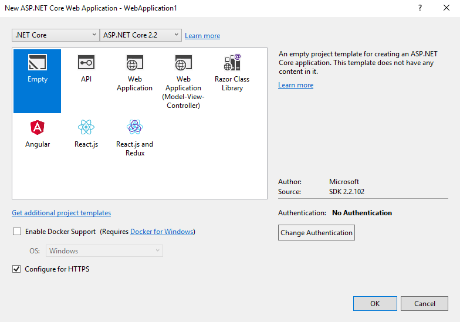
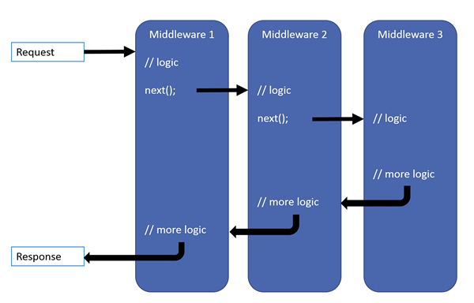

= ASP.NET Core alapok

== Projekt létrehozása

Ezen a laboron nem a beépített API projektsablont fogjuk felhasználni, hanem egy üres ASP.NET Core projektből próbáljuk felépíteni és megérteni azt a funkcionalitást, amit egyébként az előre elkészített VS projektsablonok adnának készen a kezünkbe.

=== Generálás

Hozzunk létre a Visual Studioban egy új, C# nyelvű _ASP.NET Core Web Application_ projektet, a neve legyen _HelloAspNetCore_.
A következő dialógusablakban válasszuk ki a _.NET Core_ és az _ASP.NET Core 3.1_ opciókat, valamint a sablonok közül az _Empty_ sablont. A jobb sávban legyen minden kikapcsolva, a HTTPS is. Most szándékosan nem a _Web Api_ vagy a _Web Application_ opciót választottuk, mivel a labor célja egy általános ASP.NET Core alkalmazás működésének megismerése, amit most saját kezűleg fogunk felépíteni.

=== Kitérő: NuGet

A .NET Core gyakorlatilag teljes mértékben publikusan elérhető komponensekből épül fel. A komponensek kezelésének infrastruktúráját a NuGet csomagkezelő szolgáltatja. A csomagkezelőn keresztül elérhető csomagokat a https://www.nuget.org/[nuget.org] listázza és igény esetén a NuGet kliens, illetve a .NET Core eszközök (dotnet.exe, Visual Studio) is innen tölti le. A fejlesztőknek teljesítményszempontból nem érné meg az alap keretrendszert alkotó csomagokat állandóan letöltögetni, így a klasszikus framework-ökhöz hasonlóan a .NET Core SDK telepítésekor a fejlesztő gépén egy könyvtárba (Windows-on ide: *C:\Program Files (x86)\dotnet\shared\*, illetve *C:\Program Files\dotnet\shared\*) bekerülnek az alap keretrendszert alkotó komponensek - lényegében egy csomó .dll egy könyvtárban - ezek az ún. *Shared Framework*-ök. Általában ebből a könyvtárból vesszük ezeket az alapvető függőségeket.

Nem fejlesztői, például végfelhasználói vagy szerver környezetben- ahol nem is biztos, hogy fel van telepítve az SDK, nem feltétlenül így biztosítjuk a függőségeket, de ennek a boncolgatása nem témája ennek a labornak.

=== Eredmény

Nézzük meg milyen projekt generálódott:

* *.csproj*: (Projekten jobb gomb, edit .csproj) a projekt fordításához szükséges beállításokat tartalmazza. Előző verziókhoz képest itt erősen építenek az alapértelmezett értékekre, hogy minél karcsúbbra tudják fogni ezt az állományt.
 ** *SDK*: projekt típusa (Microsoft.NET.Sdk.Web), az eszközkészlet funkcióit szabályozza, illetve meghatározza a Framework-öt (lásd lentebb)
 ** *TargetFramework*: netcoreapp3.1
* *Connected Services*: külső szolgáltatások, amiket használ a projektünk, most nincs ilyenünk.
* *Dependencies*: Framework-ök és NuGet csomagfüggőségek kezelése. Egyelőre csak Framework-jeink vannak.
 ** *Frameworks*: Az AspNetCore.App csomag került be, ami egy https://www.nuget.org/packages/Microsoft.AspNetCore.App[metacsomag], összefog kb. minden MS fejlesztésű, ASP.NET Core alapcsomagot. Ezen kívül kívül a _NetCore.App_ .NET Core metacsomag is bekerül. Jobbklikk → Properties ablakban megfigyelhetjük, hogy ezek a referenciák egy-egy _Shared Framework_ könyvtárra mutatnak.
 ** *Analyzers*: speciális komponensek, amik kódanalízist végzenek, de egyébként ugyanúgy külső függőségként (NuGet csomag) kezelhetjük őket. Ha kibontjuk az egyes analizátorokat, akkor láthatjuk, hogy miket ellenőriznek. Ezek a függőségek a futáshoz nem szükségesek.
* *Properties*: duplakattra előjön a klasszikus projektbeállító felület
 ** *launchSettings.json:* a különböző indítási konfigurációkhoz tartozó beállítások.
* *appsettings.json*: futásidejű beállítások helye. Kibontható, kibontva a különböző környezetekre specifikus konfigurációk találhatóak (lásd később).

==== Program.cs

Az előző ASP.NET verzióval ellentétben, itt már az ASP.NET Core alkalmazások a születésüktől fogva klasszikus konzolos alkalmazásként is indíthatók, ekkor az alkalmazás alapértelmezett belépési pontja a `Program` osztály statikus `Main` metódusa. Itt a következő lépéseket végzi el a kód:

* a hosztolási környezetet és az alkalmazás szerkezetét felállító builder objektum összeállítása (`CreateHostBuilder` függvényhívás)
* a builder objektum alapján a hosztolási környezet és az alkalmazás szerkezetének felállítása (`Build` függvényhívás)
* a felállított szerkezet futtatása (`Run` függvényhívás)

Az igazán munkás feladat a builder megalkotása lenne, igen sok mindent lehetne benne konfigurálni, ez a kódban a `CreateHostBuilder`-ben történik. Szerencsére meghívhatjuk a `CreateDefaultBuilder` gyártófüggvényt, ami egy szokványos (főleg hosztinggal kapcsolatos) beállításokat tartalmazó buildert állít elő. Az alkalmazás szerkezetét pedig a `Startup` osztállyal írjuk le. A ``Startup ``osztályra nincsenek erős megkötések, nem kötelező interfészt implementálnia, csupán a megfelelő szignatúrájú függvényeket (`Configure`, `ConfigureServices` - opcionális) fogja az ASP.NET Core keresni.

TIP: Később érdemes megnézni a `CreateDefaultBuilder` implementációját, de most még nem sok mindent értenénk belőle.

==== Startup.cs

A `Startup` osztály tartalmazza az ASP.NET Core alkalmazásunk konfigurációját, ahol két kitüntetett metódus van.

A `ConfigureServices`-ben konfigurálhatjuk fel a dependency injection konténert. (lásd később)

A `Configure` metódusban pedig a middleware (MW) csővezetéket adjuk meg, tehát azokat a komponenseket, amelyeken a HTTP kérés feldolgozása fut végig. Az alábbi ábra szemlélteti a middleware pipeline működését.

Az ASP.NET Core alkalmazás alapszerkezete, hogy a befutó HTTP kérés (végig)fusson a middleware-ekből álló csővezetéken és valamelyik (alapesetben az utolsó) middleware előállítja a választ, ami visszairányban halad (végig) a csővezetéken.

Esetünkben most csak három middleware-ünk van:

* Kivételkezelő middleware, ami az őt követő middleware-ek hibáit képes elkapni és ennek megfelelően egy hibaoldalt jelenít meg. Ez csak opcionálisan kerül beregisztrálásra attól függően, hogy most éppen _Development módban_ futtatjuk-e az alkalmazást vagy sem. (lásd később)
* Routing middleware, aminek a feladata, hogy a bejövő kérés és az endpointok (lásd lentebb) által adott információk alapján kitalálja, hogy melyik endpoint  felé továbbítsa a bejövő kérést.
* endpointokat összefogó middleware, amiben jelenleg egy endpoint árválkodik, ami a gyökércímre (`/`) küldött GET kérésre reagál (ez a routing információ) és válaszba ír egy _Hello World!_ szöveget (ez a működés). Figyeljük meg, hogy ez most egy lambda kifejezéssel kerül megadásra, viszont bonyolultabb esetben érdemes a middleware logikát egy külön osztályba kiszervezni (lásd később)

== Hosztolási lehetőségek

Próbáljuk ki IIS Expressen keresztül futtatva, azaz a VS-ben az indítógomb (zöld nyíl) mellett az IIS Express felirat legyen!

Két dolog is történik: az alkalmazásunk IIS Express webkiszolgálóban hosztolva kezd futni és egy böngésző is elindul, hogy ki tudjuk próbálni. Figyeljük meg a tálcán megjelenő IIS Express ikont és azon jobbklikkelve a hosztolt alkalmazás címét.

TIP: A indítógomb legördülőjében a böngésző típusát is állíthatjuk.

TIP: Debuggerrel mutassuk meg, hogy a `Main` ilyenkor is meghívódik, illetve, ahogy az egysoros middleware-ünk előállítja a választ.

TIP: Az IIS Express a Microsoft web szerverének (IIS) fejlesztői célra optimalizált változata. Alapvetően csak ugyanarról a gépről érkező (localhost) kéréseket szolgál ki.

A másik lehetőség, ha közvetlenül a konzolos alkalmazást szeretnénk futtatni, akkor ezt az indítógombot lenyitva a projekt nevét kiválasztva tehetjük meg. Ebben az esetben egy beágyazott web szerverhez (_Kestrel_) futnak be a kérések. Próbáljuk ki a Kestrelt közvetlenül futtatva!

Két dolog is történik: az alkalmazásunk konzolos alkalmazásként kezd futni, illetve az előző esethez hasonlóan a böngésző is elindul. Figyeljük meg a konzolban megjelenő naplóüzeneteket.

TIP: Bár ezek a hosztolási opciók fejlesztői környezetben nagyon kényelmesek, érdemes áttekinteni az éles hosztolási opciókat https://docs.microsoft.com/en-us/aspnet/core/fundamentals/servers/?view=aspnetcore-3.1 [itt]. A Kestrel ugyan jelenleg már alkalmas arra, hogy kipublikáljuk közvetlenül a világhálóra, de mivel nem rendelkezik túl bő konfigurációs és biztonsági beállításokkal, így érdemes lehet egy fejlettebb webszervert a Kestrel elé rakni proxy gyanánt, például az IIS-t vagy nginx-et.

Rakjunk most az utolsó middleware-ünkbe egy kivétel dobást a kiírás helyett, hogy kipróbáljuk a hibakezelő MW-t.

[source,csharp]
----
/**/endpoints.MapGet("/", async context =>
/**/{
    throw new Exception("hiba");
    //await context.Response.WriteAsync("Hello World!");
/**/});
----

Próbáljuk ki!

Láthatjuk, hogy a kivételt a hibakezelő middleware elkapja és egy hibaoldalt jelenítünk meg, sőt még a konzolon is megjelenik naplóbejegyzésként.

== Alkalmazásbeállítások vs. indítási profilok

Figyeljük meg, hogy most Development konfigurációban fut az alkalmazás (konzolban a legelső sor). Ezt az információt a keretrendszer környezeti változó alapján állapítja meg. Ha a *lauchSettings.json* állományt megnézzük, akkor láthatjuk, hogy az _ASPNETCORE_ENVIRONMENT_ környezeti változó _Development_-re van állítva.

Próbáljuk ki Visual Studión kívülről futtatni. Projekten jobb gomb Open Folder → címsorba cmd + [Enter] → dotnet run.

Ugyanúgy fog indulni, mint VS-ből, mert az újabb .NET Core verziókban már a _dotnet run_ is figyelembe veszi a *launchSettings.json*-t. Ha nem akarjuk ezt, akkor a --no-launch-profile kapcsolót használhatjuk a _dotnet run_ futtatásánál.

Most az alkalmazásunk Production módban indul el, és ha a _localhost:5000_-es oldalt megnyitjuk a böngészőben, akkor nem kapunk hibaoldalt, de a konzolon megjelenik a naplóbejegyzés.

TIP: A konzolban a setx ENV_NAME Value utasítással tudunk felvenni, ami a konzol bezárásáig marad érvényben, ha permanensen akarjuk tartani ezt akkor ezt a /M kapcsolóval tudjuk megtenni. (Admin/nem admin, illetve powershell konzolok különbözőképpen viselkednek)

Az alkalmazás számára a különböző beállításokat JSON állományokban tárolhatjuk, amelyek akár környezetenként különbözőek is lehetnek. A generált projektünkben ez az *appsettings.json*, nézzünk bele - főleg naplózási beállítások vannak benne. A fájl a Solution Explorer ablakban kinyitható, alatta megtaláljuk az *appsettings.Development.json*-t. Ez a _Development_ nevű konfigurációra vonatkozó beállítások.

A Hello World kiírásunkat kommentezzük vissza.

[source,csharp]
----
/**/endpoints.MapGet("/", async context =>
/**/{
    //throw new Exception("hiba"); //kikommentezve
    await context.Response.WriteAsync("Hello World!");  //komment levéve
/**/});
----

Próbáljuk ki a projektneves indítással és figyeljük meg, hogy ahányszor frissítünk a böngészőben a kérés megjelenik a konzolablakban _Info_ előtaggal, tehát az info szintű naplóbejegyzések megjelennek. Jelen állás szerint a _Development_ konfiguráció jut érvényre a fent tárgyalt *launchsettings.json* környezeti változó beállítása alapján, ami így érvényre juttatja az *appsettings.Development.json*-t.

VS-ből is tudjuk állítani a környezetei változókat, nem kell a *launchsettings.json*-ban kézzel varázsolni. A projekt tulajdonságok _Debug_ lapján tudunk új indítási profilt megadni, illetve a meglévőeket módosítani. Válasszuk ki az aktuálisan használt profilunkat (projektneves), majd írjuk át az _ASPNETCORE_ENVIRONMENT_ környezeti változó értékét az _Environment Variables_ részen mondjuk _Production_-re.

Indítsuk ezzel a profillal és figyeljük meg, hogy már nem jelennek meg info szintű naplóbejegyzések bárhogy is frissítgetjük a böngészőt. Oka: nincs *appsettings.Production.json*, így az általános *appsettings.json* jut érvényre.

TIP: Parancssorban a dotnet run --launch-profile [profilnév] kapcsolóval adhatjuk meg az indítási profilt.

TIP: Számos forrásból lehet konfigurációt megadni: parancssor, környezeti változó, fájl (ezt láttuk most), felhő (Azure Key Vault), stb. Ezek közül többet is használhatunk egyszerre, a különböző források konfigurációja a közös kulcsok mentén összefésülődik. A források (_configuration provider_-ek) között sorrendet adhatunk meg, amikor regisztráljuk őket, a legutolsóként regisztrált provider konfigurációja a legerősebb. Az alapértelmezett provider-ek regisztrációját elintézi a `CreateDefaultBuilder`.

=== Statikus fájl MW

Hozzunk létre a projekt gyökerébe egy _wwwroot_ nevű mappát (jobbklikk) és tegyünk egy képfájlt bele. (Ellophatjuk pl. a http://www.bme.hu honlap bal felső sarkából a logo-t)

A statikus fájlkezelést a teljes modularitás jegyében egy külön middleware-ként implementálták a _Microsoft.AspNetCore.StaticFiles_ nuget csomagban (az AspNetCore.App már függőségként tartalmazza, így nem kell feltennünk most), csak hozzá kell adnunk a pipeline-hoz. Mindig gondoljunk arra, hogy a `Configure` metódusban a mw-ek konfigurációjának sorrendje fontos, mindig az általunk szabályozott kódlefutási sorrendben fog a kérés a csővezetéken végigfutni. A routing MW által nyújtott szolgáltatás felesleges a statikus fájl middleware-nek, hiszen nem egy endpoint-on elérhető logikát akarunk meghívni, így őt majdnem legelőre a hibakezelés után érdemes rakni.

[source,csharp]
----
/**/public void Configure(IApplicationBuilder app, 
/**/                      IWebHostEnvironment env)
/**/{
/**/   //... hibakezelés
        app.UseStaticFiles();
/**/   //... routing
/**/}
----

Próbáljuk ki! Láthatjuk hogy a _localhost:port_ címen még mindig a _Hello World_ szöveg tűnik fel, de amint a _localhost:port/[képfájlnév]_-vel próbálkozunk, a kép töltődik be. A static file MW megszakítja a pipeline futását, ha egy általa ismert fájltípusra hivatkozunk, egyébként továbbhív a következő MW-be.

TIP: Ezt az egysoros middleware-re tett törésponttal is szemléltethetjük. Figyeljünk arra, hogy csak az `await`-es sorra kerüljön a töréspont és ne az egész `endpoints.MapGet` sorra, illetve csak akkor nézzük, hogy mi fut le, amikor a kép URL-re hívunk.

Próbáljuk ki úgy is, hogy kikommentezzük a static files middleware-t. Így hiába hívunk bármilyen címre, a „Hello world!"-öt kapjuk vissza.

== Alkalmazásbeállítások vs. DI

Az alkalmazásbeállításokat kódban egy `IConfiguration` interfészt megvalósító objektumon keresztül érhetjük el. Az objektum életciklusát az ASP.NET Core DI konténere kezeli. Ha egy konstruktor szignatúrájában jelezzük, hogy az adott osztályban szeretnénk dolgozni a konfigurációs objektummal, akkor a DI alrendszer beinjektálja nekünk.

Valósítsuk meg ezt a `Startup` osztályban:

[source,csharp]
----
//ctor snippet ajánlott
public Startup(IConfiguration configuration)
{
    Configuration = configuration;
}

public IConfiguration Configuration { get; }
----

A konstruktor végén törésponton megállva megvizsgálhatjuk például a `Configuration["AllowedHosts"]` értéket - az appsettings.json szerint ennek * értékűnek kell lennie.

== Web API

Minden API-nál nagyon magas szinten az a cél, hogy egy kérés hatására egy szerveroldali kódrészlet meghívódjon. ASP.NET Core-ban a kódrészleteket függvényekbe írjuk, a függvények pedig ún. _controllerek_-be kerülnek. Összességében tehát a cél, hogy a webes kérés hatására egy kontroller egy függvénye meghívódjon.

=== DummyController

Hozzunk létre egy új mappát _Controllers_ néven. A mappába hozzunk létre egy kontrollert (Add → Controller... → API Controller with read/write actions) `DummyController` néven. Ez a művelet hozzáad egy új nuget csomagot a projekthez, ami a kódgeneráláshoz (scaffolding) kell és le is generálja az új kontrollerünket. A kontrollerünk az _AspNetCore.Mvc.Core_ nuget csomagban található Controller osztályból származik. (Ezt a csomagot sem kell feltennünk, mivel az AspNetCore.App függősége)

Adjuk hozzá a DI konténerhez az MVC-s szolgáltatásokat, és adjuk hozzá a csővezetékhez az MVC MW-t. Az egysoros MW-t kommentezzük ki.

[source,csharp]
----
/**/public void ConfigureServices(IServiceCollection services)
/**/{
        services.AddControllers();
/**/}
/**/
/**/public void Configure(IApplicationBuilder app, IWebHostEnvironment env)
/**/{
/**/    if (env.IsDevelopment())
/**/    {
/**/        app.UseDeveloperExceptionPage();
/**/    }
/**/
/**/    //app.UseStaticFiles();
/**/
/**/    app.UseRouting();
/**/
/**/    app.UseEndpoints(endpoints =>
/**/    {
            //endpoints.MapGet("/", async context =>
            //{ 
            //    //throw new Exception("hiba");
            //    await context.Response.WriteAsync("Hello World!");
            //});
            endpoints.MapControllers();
/**/    });
/**/}
----

Próbáljuk ki. Az alapoldal üres, viszont ha a _/api/Dummy_ címre hívunk, akkor megjelenik a `DummyController.Get` által visszaadott érték. Magyarázzuk el a routing szabályokat, hogy hogyan jut el a HTTP kérés alapján a végrehajtás a függvényig: attribútum alapú routing-ot használunk, azaz a kontroller osztályra és a függvényeire biggyesztett attribútumok határozzák meg, hogy a HTTP kérés adata (pl. URL) alapján melyik függvény hívódik meg.

TIP: API-t publikáló alkalmazásoknál az attribútum alapú routing az ajánlott, de emellett vannak más megközelítések is, például Razor alapú weboldalaknál konvenció alapú routing az ajánlott. Bővebben a témakörről https://docs.microsoft.com/en-us/aspnet/core/fundamentals/routing?view=aspnetcore-3.1[itt] lehet olvasni.

Ha van időnk, próbáljuk ki az _/api/Dummy/[egész szám]_ címet is.

== IOption<T>

Fentebb láttuk, hogy a konfigurációt ki tudtuk olvasni az `IConfiguration` interfészen keresztül, de még jobb lenne, ha csoportosítva és csoportonként külön C# osztályokon keresztül látnánk őket.

TIP: Ezen alfejezethez tartozó legtöbb kódrészlet kóddarabkaként is elérhető.

Bővítsük az _appsettings.json_-t egy saját beállításcsoporttal (_DummySettings_):

[source,javascript]
----
/**/{
/**/  "Logging": {
/**/    "LogLevel": {
/**/      "Default": "Information",
/**/      "Microsoft": "Warning",
/**/      "Microsoft.Hosting.Lifetime": "Information"
/**/    }
/**/  },
     "AllowedHosts": "*", // a sor végére bekerült egy vessző
     "DummySettings": {
       "DefaultString": "My Value",
       "DefaultInt": 23,
       "SuperSecret":  "Spoiler Alert!!!"
     }
/**/}
----

Hozzunk létre egy új mappát _Options_ néven. A mappába hozzunk létre egy sima osztályt _DummySettings_ néven, a szerkezete feleljen meg a JSON-ben leírt beállításcsoportnak:

[source,csharp]
----
public class DummySettings
{
    public string DefaultString { get; set; }

    public int DefaultInt { get; set; }

    public string SuperSecret { get; set; }
}
----

A `ConfigureServices`-ben adjuk meg, hogy egy `DummySettings` példányt mi alapján kell inicializálni - a konfiguráció megfelelő szekciójára hivatkozzunk:

[source,csharp]
----
public void ConfigureServices(IServiceCollection services)
{
    services.Configure<DummySettings>(
        Configuration.GetSection(nameof(DummySettings)));
}
----

A DI alrendszer így már beinjektálhatja, ahol csak igényeljük ezt a konstruktorban. Igénylejük a `DummyController` konstruktorban:

[source,csharp]
----
private DummySettings options;

public DummyController(IOptions<DummySettings> options)
{
    this.options=options.Value;
}
----

TIP: Látható, hogy a beállítás `IOptions`-ba burkolva érkezik. Vannak az `IOptions`-nál okosabb burkolók is (pl. `IOptionsMonitor`), ami például jelzi, ha megváltozik valamilyen beállítás. Bővebb információ az `IOptions` és társairól a hivatalos dokumentációban https://docs.microsoft.com/en-us/aspnet/core/fundamentals/configuration/options?view=aspnetcore-3.1#general-options-configuration[található].

Az egész számot váró `Get` változatban használjuk fel az értékeket:

[source,csharp]
----
[HttpGet("{id}", Name = "Get")]
public string Get(int id)
{
    return id % 2 == 0 ? options.DefaultString : options.DefaultInt.ToString();
}
----

Próbáljuk ki, hogy az _/api/Dummy/[páros szám]_, illetve _/api/Dummy/[páratlan szám]_ a megfelelő értéket kapjuk-e vissza.

== User Secrets

A projekt könyvtára gyakran valamilyen verziókezelő (pl. git) kezelésében van. Ilyenkor gyakori probléma, hogy a konfigurációs fájlokba írt szenzitív információk (API kulcsok, adatbázis jelszavak) bekerülnek a verziókezelőbe. Ha egy publikus projekten dolgozunk, például publikus GitHub projekt, akkor ez komoly biztonsági kockázat lehet.

WARNING: Ne tegyünk a verziókezelőbe szenzitív információkat. Gondoljunk arra is, hogy a verziókezelő nem felejt! Ami egyszer már bekerült, azt vissza is lehet nyerni belőle (history).

Ennek a problémának megoldására egy eszköz a _User Secrets_ tároló. Jobbklikkeljünk a projekten a Solution Explorer ablakban, majd válasszuk a _Manage User Secrets_ menüpontot. Ennek hatására megnyílik egy *secrets.json* nevű fájl. Vizsgáljuk meg hol is van ez a fájl: vigyük az egeret a fájlfül fölé - azt láthatjuk, hogy a fájl a felhasználónk saját könyvtárán belül van és az útvonal része egy GUID is. A projektfájlba (.csproj) bekerült ugyanez a GUID (a _UserSecretsId_ címkébe).

Másoljuk át az *appsettings.json* tartalmát a *secrets.json*-be, vegyük ki a `DummySettings`-en kívüli részeket, végül írjuk át a titkos értéket (_SuperSecret_):

[source,javascript]
----
{
  "DummySettings": {
    "DefaultString": "My Value",
    "DefaultInt": 23,
    "SuperSecret": "SECRET"
  }
}
----

Töréspontot letéve (pl. a `DummyController` konstruktorának végén) ellenőrizzük, hogy a titkos érték melyik fájlból jön. Fontos tudni, hogy a _User Secrets_ tároló csak **Development** mód esetén jut érvényre, így figyeljünk rá, hogy a megfelelő módot indítsuk és a környezeti változók is jól legyenek beállítva.

Ez az eljárás tehát a futtató felhasználó saját könyvtárából a GUID alapján kikeresi a projekthez tartozó *secrets.json*-t, annak tartalmát pedig futás közben összefésüli az *appsettings.json* tartalmával. Így szenzitív adat nem kerül a projekt könyvtárába.

TIP: Mivel a _User Secrets_ tároló csak Development mód esetén jut érvényre, így ha az éles változatnak szüksége van ezekre a titkos értékekre, akkor további trükkökre van szükség. Ilyen megoldás lehet, ha Azure Key Vault-ból https://docs.microsoft.com/en-us/aspnet/core/security/key-vault-configuration?view=aspnetcore-3.1[töltjük be] vagy a DevOps eszközből (pl. https://docs.microsoft.com/en-us/azure/devops/pipelines/process/variables?view=azure-devops&tabs=yaml%2Cbatch#secret-variables[Azure DevOps Pipelines]) a szenzitív beállításokat.
