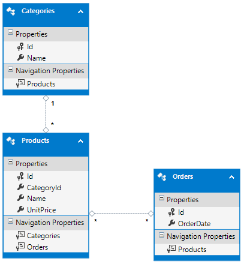
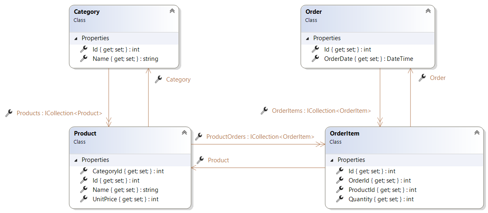
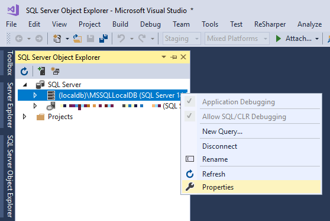

= Entity Framework Core I-II.

== Az Entity Framework leképezési módszerei

Az objektum-relációs (OR) leképzés (_mapping_) két fő részből áll, az egyik az adatbázis séma, a másik pedig egy menedzselt kódbéli objektummodell. Esetünkben a C# kódban lévő osztályokat képezzük le adatbázisbeli objektumokká, ezt hívjuk _Code-First_ mapping módszernek. A másik irány is lehetséges, ha már van egy adatbázis sémánk, akkor azt is leképezhetjük Code-First modellé. Ezt a folyamatot __Reverse Engineered Code-First__nek vagy https://docs.microsoft.com/en-us/ef/core/managing-schemas/scaffolding[__scaffolding__nak] hívjuk (ez utóbbival nem foglalkozunk ezen gyakorlat keretében).

Akárhogy is, az Entity Framework (EF), mint OR leképező eszköz (ORM) használatához az alábbi összetevőkre van szükség:

- objektummodell kódban
- relációs modell az adatbázisban
- leképezés (mapping) az előbbi kettő között, szintén kódban megadva
- maga az Entity Framework Core, mint (NuGet) komponens
- Entity Framework Core kompatibilis adatbázis driver (provider)
- adatbázis kapcsolódási adatok, connection string formátumban

== A Code-First leképezési módszer

A Code-First módszer lényege, hogy elsőként az OO entitásokat definiáljuk egyszerűen programkódban, majd a leképezést szintén programkódban. A leképezés alapján az EF eszközök képesek az adatbázis létrehozására, inicializálására és a séma változáskövetésére is (lásd lentebb a _Code-First Migrations_ részt).

=== Az entitások definiálása

Készítsünk egy .NET 5 konzolos alkalmazást (csak https://github.com/dotnet/efcore/issues/8035[*ne* EF legyen a neve]), majd a projekten belül hozzunk létre egy _Entities_ nevű mappát. Adjunk hozzá a mappához egyszerű osztályokat az alábbi sémának megfelelően:

* *Product* (`Id`: `int`, `Name`: `string`, `UnitPrice`: `int`)
* *Order* (`Id`: `int`, `OrderDate`: `DateTime`)
* *Category* (`Id`: `int`, `Name`: `string`)
Az osztályok legyenek publikusak, az attribútumok pedig egyszerű auto-implementált property-k (_prop_ snippet).

=== Mapping és egyéb metaadatok megadása I.

Eddig megadtuk az entitás nevét, az attribútumok nevét és típusát, azonban ezen felül még sok mindent lehet/kell megadni: az entitás elsődleges kulcsa idegen kulcsok, relációk, kényszerek és egyéb mapping információk (pl. hogy mi legyen az attribútum oszlopneve az adatbázisban). A Code-First stratégia kétfajta módszert is kínál ezek megadására. Az egyik módszer, hogy attribútumokat helyezünk az entitásosztályok különböző részeire, a másik, hogy ún. fluent jellegű kódot alkalmazunk. Ez utóbbi módszer elsőre furcsán néz ki, de többet tud (van, amit attribútummal nem lehet megadni).

A fenti két módszert kiegészíti a konvenció alapú konfiguráció, amikor az EF a rendelkezésekre álló adatokból automatikusan következteti ki a metaadatokat: például gyakori, hogy az elsődleges kulcs neve tartalmazza az _id_ szöveget. Az EF tehát a konvenció alapján kitalálhatja, hogy melyik ez elsődleges kulcs oszlop. Ha valamit rosszul találna ki, vagy változtatni akarunk a kitalált neveken, akkor azt az attribútumos vagy a fluent megadással tehetjük meg.

TIP: EF 6-ban saját konvenciókat is megadhatunk, viszont Core-ban https://github.com/aspnet/EntityFrameworkCore/issues/214[még] nem.

Elsőként azt fogjuk megnézni, hogy mit talál ki az EF, ha semmi plusz adatot nem adunk meg.

=== Relációk

A fő entitások közötti kapcsolatokat mutatja sematikusan az alábbi ábra:

A relációkat idegen kulcs propertyk és navigációs propertyk reprezentálják. Az idegen kulcs propertyk típusa a kapcsolat másik végén lévő entitás *kulcsának* típusa. A navigációs propertyk típusa pedig a kapcsolat másik végén lévő entitás típusa vagy ilyen típusú kollekció.

Egy konkrét kapcsolat esetében: a `Product`-`Category` egy-többes kapcsolathoz egy idegen kulcs property és egy navigációs property tartozik a `Product` osztályban és egy kollekció típusú navigációs property a `Category`-ban. A többes navigációs property-k legyenek csak olvashatók és a típusuk legyen `ICollection<>`.

TIP: Általánosságban nem kötelező egy kapcsolat mindkét oldalán navigációs property-t felvenni, de erősen javasolt és mindig jó, ha van. Az entitáson végzendő műveleteket egyszerűsíti, illetve a konvenciós logika is következtet belőle.

Az `Order`-`Product` több-többes kapcsolatokhoz hozzuk létre a kapcsolótáblának megfelelő entitást is, ami egy-egy Product és Order közötti kapcsolatot reprezentálja.

* *OrderItem* (`Id`: `int`, `ProductId`: `int`, `OrderId`: `int`, `Quantity`: `int`)

TIP: Nem kötelező létrehozni osztályt a kapcsolótáblának, konfigurációval is lehet érni, hogy a kapcsolótábla létrejöjjön és az EF megfelelően használja. Ezt a módszert akkor érdemes követni ha a kapcsolótábla csupán technikai tehertétel, de ha például extra adatot is tárol,  esetünkben a rendelt mennyiséget (`Quantity`), akkor jobban követhető kódot eredményez, ha explicit létrehozzuk a kapcsolótáblának megfelelő entitástípust.

Az így kialakult modell:

Kódként:

[source,csharp]
----
include::code/efcore-category.cs[]

include::code/efcore-order.cs[]

include::code/efcore-product.cs[]

include::code/efcore-orderitem.cs[]
----

Vegyük észre, hogy eddig semmilyen EF specifikus kódot nem írtunk, a modellünk sima ún. https://stackoverflow.com/a/250006/472575[_POCO_] osztályokból áll.

== Kapcsolat az adatbázissal

=== DbContext - NuGet

Az entitásokat definiáltuk, a mapping-et az EF eszére bíztuk, a következő lépés az adatbázisséma létrehozása a mapping alapján, amit képes az EF migrációs eszköze megoldani. Műveletet az ún. _kontext_-en keresztül tudunk végezni. Érdemes saját kontext típust létrehozni, amit az alap `DbContext`-ből származtatunk. Eddig még nem is írtunk semmilyen EF specifikus kódot, most viszont már kell a `DbContext` típus, így NuGet-ből hozzá kell adnunk a *Microsoft.EntityFrameworkCore.SqlServer* csomagot. Nem ez a csomag tartalmazza a `DbContext`-et, viszont függőségként hivatkozza (*Microsoft.EntityFrameworkCore*).

TIP: NuGet csomagok telepítéséhez segítség a https://docs.microsoft.com/en-us/nuget/quickstart/install-and-use-a-package-in-visual-studio#nuget-package-manager[dokumentációban].

Az Entity Framework önmagában független az adatbázis implementációktól, azokhoz különböző, adatbázisgyártó-specifikus https://docs.microsoft.com/en-us/ef/core/providers/[_adatbázis providereken_] keresztül kapcsolódik. A *Microsoft.EntityFrameworkCore.SqlServer* csomag hivatkozza az EF absztrakt relációs komponensét (_EntityFrameworkCore.Relational_), és tartalmazza az _MS SQL Server_-hez tartozó providert. A providert a `DbContext` `OnConfiguring` metódusában adhatjuk meg, esetünkben a `UseSqlServer` metódussal, ami egy connection stringet vár.

MS SQL Server helyett a _LocalDB_ nevű fejlesztői adatbázist használjuk, mely fejlesztői szempontból gyakorlatilag megegyezik az MS SQL Server-rel. A LocalDB a Visual Studio-val együtt települ, minden Windows felhasználónak külön LocalDB példány indítható el. A Visual Studio az _SQL Server Object Explorer_ ablak megnyitásakor automatikusan létrehozza a felhasználónkhoz tartozó, _MSSQLLocalDB_ nevű példányt.

TIP: A LocalDB külön is letölthető, illetve a vele együtt települő _sqllocaldb_ parancs segítségével egyszerűen kezelhető. Minderről bővebb információ a dokumentációban https://docs.microsoft.com/en-us/sql/tools/sqllocaldb-utility?view=sql-server-ver15[olvasható].

Adjunk hozzá új osztályt a projekthez `NorthwindContext` néven, ebben definiáljuk majd, hogy milyen entitáskollekciókon lehet műveleteket végezni.

Az automatikusan létrejövő MSSQLLocalDB nevű LocalDB példány connection stringjét adjuk meg, pontosabban az _SQL Server Object Explorer_ ablak segítésével másoljuk ki: menu:SQL Server-t kibontva[_(localdb)\MSSQLLocalDB_-n jobbklikk > Properties > Connection String]. A kimásolt stringben az _Initial Catalog_ értékét (a DB nevét) a *master*-ről változtassuk meg valamilyen más névre, például a Neptun kódunkra. Ha nincs a stringben _Initial Catalog_ rész, akkor írjuk a string végére, hogy `;Initial Catalog=neptunkod`.

WARNING: Mivel a connection string-ben különleges karakterek (pl. '\') vannak, ne felejtsük el a @-ot a string elé írni!

[source,csharp]
----
public class NorthwindContext : DbContext
{
    protected override void OnConfiguring(DbContextOptionsBuilder optionsBuilder)
    {
        optionsBuilder.UseSqlServer(@"<connstring>");
    }

    public DbSet<Product> Products { get; set; }
    public DbSet<Category> Categories { get; set; }
    public DbSet<Order> Orders { get; set; }
}
----

TIP: A nagyobb rugalmasság érdekében érdemes a connection stringet konfigurációs fájlba helyezni, majd az ASP.NET Core konfigurációs megoldásaival felolvasni. Erre egy későbbi gyakorlaton nézünk példát.

Az első verziós adatelérési (DAL) rétegünk ezzel kész is van.

== Sémamódosítás

=== Code-First Migrations

A kódban történő sémamódosításokat követni tudja a keretrendszer, és a változások alapján frissíteni tudja az adatbázis sémáját lefele, illetve felfele irányban is. Ezt a mechanizmust nevezzük migrációnak. Esetünkben a séma nulláról felhúzása is már módosításnak számít.

A migráció elvégzésére parancssoros utasításokat kell igénybe vennünk. Itt kétfajta megközelítés is adott: vannak PowerShell és vannak klasszikus cmd (dotnet cli) parancsaink.
Fel kell telepítsük a projektünkbe valamelyik NuGet csomagot:

* *PowerShell*: Microsoft.EntityFrameworkCore.Tools (telepítsük fel most ezt)
* *Parancssor*: Microsoft.EntityFrameworkCore.Tools.DotNet

Hozzuk elő a *Package Manager Console*-t. (menu:Tools[NuGet Package Manager > Package Manager Console]). Ellenőrizzük, hogy a _Default Project_ legördülőben a mi projektünk van-e kiválasztva. Az `Add-Migration <név>` paranccsal tudunk készíteni egy új migrációs lépést, így az első migrációnk a kiinduló sémánk migrációját fogja tartalmazni.

[source,powershell]
----
Add-Migration Init
----

Figyeljük meg mit generált a projektünkbe ez a parancs. Itt a migrációhoz egy osztályt készít, ami tartalmazza azokat az utasításokat, amikkel fel- vagy le tudjuk frissíteni az adatbázis sémánkat. Fontos, hogy lefordítsuk a projektet, mert ezen és a többi kódunk alapján fog futni a migráció.

Fordítás után adjuk ki az `Update-Database` parancsot, amivel egy adott migrációs állapotig próbálja frissíteni a sémát. Ha nem adunk meg sémanevet akkor a legfrissebb migrációig frissít:

[source,powershell]
----
Update-Database Init
----

WARNING: Bizonyos LocalDB verzióknál hibára futhat az adatbázislétrehozás (_CREATE FILE encountered operating system error 5(Access is denied.)_), mert rossz helyen próbálja létrehozni az adatbázisfájlt. Ilyenkor az SQL Server Object Explorer ablakban bontsuk ki a LocalDB példányunk, alatta a menu:Databases mappán jobbklikk[_Add New Database_]. A megjelenő ablakban adjuk meg névként ugyanazt az adatbázisnevet, amit korábban a connection string-ben a _master_ helyett megadtunk.

Ellenőrizzük le az adatbázis sémáját az _SQL Server Object Explorer_ ablakban. Nézzük meg, hogy pusztán konvenciók alapján milyen tulajdonságokat talált ki az EF.

TIP: Kódból is legenerálhatnánk az adatbázist az aktuális sémával a `DbContext.Database.EnsureCreated` metódus segítségével, viszont ez a későbbiekben megnehezíti a további sémamódosítást, mivel mindig el kellene dobjuk az adatbázist, illetve a migrációt sem könnyű utólag bevezetni.

=== Leképezés és egyéb metaadatok megadása II. -- fluent és attribútum alapú leképezés

Definiáljuk felül a kontextünkben az ős `OnModelCreating` metódusát és itt állítsunk be pár mapping információt.

[source,csharp]
----
protected override void OnModelCreating(ModelBuilder modelBuilder)
{
    base.OnModelCreating(modelBuilder);

    modelBuilder.Entity<Category>()
        .Property(c => c.Name)
        .HasMaxLength(15)
        .IsRequired();
}
----

Ezzel a `Name` property hosszát állítottuk be és megadtuk, hogy kötelező (nem `NULL`-ozató) mező.

A fluent mellett próbáljuk ki az attribútumos konfigurációt is. Állítsunk át egy oszlopnevet a `Product` osztályban a `Column` attribútummal.

[source,csharp]
----
[Column("ProductName")]
public string Name { get; set; }
----

TIP: A fenti miatt az entitásmodellünk már nem POCO, mert EF specifikus attribútum jelent meg a kódjában.

TIP: Érdemes megfigyelni a táblanevek kapcsán, hogy eleve többesszámosított neveket találunk az adatbázisban. Ezt az `IPluralizer` service végzi, melyhez saját implementáció is https://docs.microsoft.com/en-us/ef/core/what-is-new/ef-core-2.0#pluralization-hook-for-dbcontext-scaffolding[írható].

Mivel már létezik az adatbázisunk migráció segítségével kell frissítsük az adatbázis sémáját. Készítsünk egy új migrációs lépést az `Add-Migration` utasítással és frissítsük a sémát az `Update-Database` paranccsal.

[source,powershell]
----
Add-Migration CategoryName_ProductName
Update-Database CategoryName_ProductName
----

TIP: Ha van időnk megnézhetjük az adatbázison futtatott SQL-t is a Script-Migration paranccsal. Például ez mutatja a legutóbbi módosítást érvényesítő SQL-t: `Script-Migration -From Init`

TIP: Természetesen mivel még nincsenek adataink az adatbázisban akár el is dobhatnánk az adatbázist és újra legenerálhatnánk nulláról a sémát, de most kifejezetten a migrációt szeretnénk gyakorolni. Az `Add-Migration` kimenete figyelmeztet, hogy adatvesztés is történhet. Vannak veszélyes migrációs műveletek, ezért érdemes átnézni a generálódó migrációs kódot.

WARNING: Ha valamilyen okból nem megfelelő a migrációnk, ne töröljük kézzel a generált .cs fájlokat. Használjuk helyette a `Remove-Migration` parancsot (mindenfajta paraméter nélkül), ami a legutóbbi migrációt törli.

Nézzük meg milyen migrációs osztályt generáltunk, és hogy ez milyen utasításokat tartalmaz.

Ellenőrizzük, hogy a _Name_ oszlop most már az új kényszereknek megfelelően lett-e felvéve, és hogy a terméknév oszlop neve is megváltozott-e.

Ezzel kész a DAL rétegünk konfigurációja, egyúttal mindent kipipáltunk az anyagrész elején lévő felsorolásból.

== Adatbázis naplózás

A következő feladat könnyebb követhetősége érdekében állítsuk be a naplózást az Entity Framework kapcsán. A kontext osztályba:

[source,csharp]
----
/**/protected override void OnConfiguring(DbContextOptionsBuilder optionsBuilder)
/**/{
/**/    optionsBuilder.UseSqlServer(@"<connstring>")
            .LogTo(Console.WriteLine, LogLevel.Information);
/**/}
----

TIP: Ha nem a konzolt szeretnénk teleszemetelni, akkor akár a Debug kimenetre (Output ablak) is írhatunk. Ehhez a `LogTo`-nak adjuk meg paraméterként a `m => Debug.WriteLine(m)` delegátot.

== Beszúrás

Írjunk egy egyszerű beszúró kódot a `Program` osztályba. Várjunk paraméterül egy kontext-et, és csak akkor szúrjunk be az adatbázisba bármit, ha még üres.

[source,csharp]
----
//using System.Linq;

static void SeedDatabase(NorthwindContext ctx)
{
    if (!ctx.Products.Any())
    {
        var cat_drink = new Category { Name = "Ital" };
        var cat_food = new Category { Name = "Étel" };
        ctx.Categories.Add(cat_drink);
        ctx.Categories.Add(cat_food);
        ctx.Products.Add(new Product
                     { Name = "Sör", UnitPrice = 50, Category = cat_drink });
        ctx.Products.Add(new Product
                    { Name = "Bor", Category = cat_drink });
        ctx.Products.Add(new Product
                    { Name = "Tej", CategoryId = cat_drink.Id });
        ctx.SaveChanges();
    }
}
----

Figyeljük meg, hogy kevertük a kapcsolatok beállításánál a navigációs property szerinti, illetve a sima `Id` érték beállítást.

Hívjuk meg a `Main` függvényben és próbáljuk meg lekérdezni az első terméket. Rakjunk a `Main` végére egy `Console.ReadKey`-t, hogy legyen időnk megnézni a naplót.

[source,csharp]
----
/**/static void Main(string[] args)
/**/{
        using (var ctx = new NorthwindContext())
        {
            SeedDatabase(ctx);

            var p = ctx.Products.FirstOrDefault();
        }
        Console.ReadKey();
/**/}
----

Próbáljuk ki! Hibára fut, mert beszúrásnál az `Id` értékes hivatkozás alapértelmezett `int`, azaz 0 értékű lesz, hiszen a kategória is új. Az új elemeknél gyakori, hogy az adatbázis osztja ki az elsődleges kulcs értéket, addig az alapértelmezett értékű. Konvenció szerint a mi _Id_ oszlopaink is ilyenek lesznek (https://docs.microsoft.com/en-us/sql/t-sql/statements/create-table-transact-sql-identity-property[ún. IDENTITY oszlopok]).  A termék beszúrásakor viszont a 0 érték már nem lesz helyes, hiszen addigra a kategória kapott valamilyen kulcs értéket. Mindezt a problémát navigációs property-s hivatkozással elkerülhetjük.

TIP: Figyeljük meg, hogy a konzol naplóban, hogy a `Category` beszúrása még megtörténik, de az egyik `Product` hozzáadása már elszáll. A debuggerrel, ha megállunk a `SaveChanges` híváson, akkor látható, hogy a `CategoryId` property értéke nulla.

TIP: Figyeljük meg azt is, hogy a `SaveChanges` hívásig nem történik módosító adatbázisművelet. Az EF memóriában gyűjti a változásokat, amiket a SaveChanges-szel szinkronizálunk az adatbázisba.

TIP: Itt láthatjuk az alapértelmezett tranzakciókezelés működését is. Egy hívásban több elemet kell beszúrni, ha bármelyik művelet meghiúsul, akkor semmilyen változás nem érvényesül az adatbázisban. Általánosan igaz, hogy egy `SaveChanges` vagy minden változást érvényesít vagy semmit sem.

Javítsuk ki:

[source,csharp]
----
/**/ctx.Products.Add(new Product
/**/ { Name = "Tej",
        Category = cat_drink //navigációs property-re váltottunk 
/**/ });
/**/ctx.SaveChanges();
----

Ennek már le kell futnia. Nézzük meg a konzolon az SQL utasításokat és a változásokat az adatbázisban. Paraméterezett `INSERT` utasításokat használ az EF, így elkerülve az SQL injection támadást.

TIP: a háttérben az EF minden új entitásnak kioszt egy átmeneti azonosítót, amit felhasználhatunk a fenti hiba elkerülésére, ha semmiképp sem akarjuk a navigációs property-ket használni. Így tudnánk a context-től elkérni: `ctx.Entry(cat_drink).Property(e => e.Id).CurrentValue`

WARNING: Ha egyszerre több egymásra hivatkozó elemet szúrunk be és azonosító alapján kötjük őket össze, mindig gondoljuk át, hogy a tényleges adatbázisbeli azonosítók biztosan rendelkezésre állnak-e, mert különben futásidejű kivételt kaphatunk, a fordító nem fog figyelmeztetni.

== Ősfeltöltés (seeding) elvárt adattartalom megadásával

A kontextuskonfiguráció részeként megadhatjuk, hogy milyen adattartalmat szeretnénk az egyes táblákban látni. A kontext `OnModelCreating` függvényének végére:

[source,csharp]
----
modelBuilder.Entity<Category>().HasData(
        new Category {Id = 1, Name = "Ital"}
);

modelBuilder.Entity<Product>().HasData(
    new Product { Id=1, Name = "Sör", UnitPrice = 50, CategoryId = 1 },
    new Product { Id=2, Name = "Bor", UnitPrice = 550, CategoryId = 1 },
    new Product { Id=3, Name = "Tej", UnitPrice = 260, CategoryId = 1 }
);
----

Fontos, hogy ezen módszer esetén mindenképp kézzel meg kell adnunk az elsődleges kulcs értékeket. Fordítás után generáltassunk új migrációt és frissítsük is az adatbázist - ez utóbbi hibára fog futni:

[source,powershell]
----
Add-Migration Seed
Update-Database
----

A `HasData` alapján generált migrációs kód nem veszi figyelembe az időközben bekerült adatokat, csak a modellt és a többi migrációt nézi. Ha megnézzük a generált kódot, láthatjuk, hogy csak sima beszúrások. Mivel mi közben jól összeszemeteltük az adatbázist, a migráció által kiadott beszúró műveletek jó eséllyel hibára futnak.

Ha szeretnénk tiszta lappal indulni, bármikor kipucolhatjuk az adatbázist a speciális nullás migrációra való frissítéssel, majd újrahúzhatjuk a `HasData`-nak köszönhetően kezdeti adatokkal ősfeltöltve.

[source,powershell]
----
Update-Database 0
Update-Database
----

Ezek után a `SeedDatabase` hívásra nincs szükség, kommentezzük ki a `Main` függvényben.

== Lekérdezések

Minden rész után az előző szakasz kódját kommentezzük ki, hogy ne keltsen felesleges zajt a kimeneten az előző utasítás, illetve ne legyenek felesleges mellékhatások.

Kérdezzük le azokat a termékeket, melyeknek neve egy adott betűt tartalmaz. A `Main` függvény `using` blokkjába:

[source,csharp]
----
//SeedDatabase(ctx);
//var p = ctx.Products.FirstOrDefault();

var q = from p in ctx.Products
        where p.Name.Contains("ö")
        select p.Name;

foreach (var name in q)
{
    Console.WriteLine(name);
}
----

Itt figyelhető meg a korábban már tárgyalt `IEnumerable<>` - `IQueryable<>` különbség. A `Products` property típusa `DbSet`, ami IQuerable<>. Az `IQueryable<>`-n történő hívások kifejezésfát (`Expression`) építenek és szintén `IQueryable<>`-t adnak vissza. A `q` értéke egy olyan `IQueryable<>`, ami `Expression`-jében tartalmazza a teljes lekérdezést. Amikor szükség van az adatra, a kifejezésfa alapján SQL generálódik és ez az SQL fut le az adatbázison.

A debuggerrel léptessük át az egyes utasításokon a program futását. A késleltetett kiértékelés miatt csak a `foreach` végrehajtása közben fog az adatbázishoz fordulni az EF, hiszen csak ekkor van ténylegesen szükség az adatra. Nézzük meg a lefuttatott SQL-t is. Sikerült az `IQueryable<>`-ben található `Expression`-t SQL utasítássá alakítania.

Az EF elég sok C# függvényt SQL-lé tud fordítani. Példaképp alakítsuk a visszaadott nevet nagybetűssé.

[source,csharp]
----
/**/var q = from p in ctx.Products
/**/       where p.Name.Contains("ö")
/**/       select p.Name
                    .ToUpper();
----

Figyeljük meg a konzolon a generált SQL-t: a projekciós részbe bekerült az `UPPER` SQL függvény.

=== Vegyes kiértékelés

A fák sem nőnek az égig, az EF sem tud minden C# függvényt SQL-lé fordítani. Próbáljuk ki úgy, hogy a `Contains`-t karakterrel hívjuk meg a szűrésben.

[source,csharp]
----
var q = from p in ctx.Products
       where p.Name.Contains('ö')
       select p.Name;
----

`InvalidOperationException`-t kapunk: ezt a lekérdezést nem tudja a provider SQL-lé fordítani. Egyik lehetőségünk, ahogy a hibaüzenet is írja, hogy kikényszerítjük a kiértékelést a nem leforduló művelet elé helyezett `AsEnumerable` vagy `ToList` (illetve ezek aszinkron változatai) hívással. Próbáljuk ki - mivel a szűrést nem sikerült átfordítani, így a szűrés elé a from végére tegyük az `AsEnumerable`-t:

[source,csharp]
----
/**/var q = from p in ctx.Products //ez még LINQ-to-Entities
                        .AsEnumerable()
/**/        where p.Name.Contains('ö') //ez már LINQ-to-Objects
/**/        select p.Name.ToUpper();
----

Ez működik, de a konzolon megjelenő SQL utasításon látszik, hogy a **teljes** termék táblát lekérdeztük és felolvastuk a memóriába. Az `AsEnumerable` jelentése: a lekérdezés innentől LINQ-to-Objects-ként épül tovább, a lekérdezés eddigi része memóriabeli reprezentációja lesz az adatforrás, tehát a szűrés és a projekció már memóriában fut le. Mivel a teljes lekérdezés egy része LINQ-to-Entities (adatbázis értékeli ki), a másik része LINQ-to-Objects (a .NET runtime értékeli ki), így az ilyen lekérdezéseket ún. vegyes kiértékelésűnek (_mixed evaluation_), a LINQ-to-Objects részt kliensoldali kiértékelésűnek (_client evaluation_) nevezik. A `q` típusa ebben az esetben már nem `IQueryable<>`, csak `IEnumerable<>`.

TIP: Érdemes összevetni a `where` operátor definícióját (kurzorral ráállva kbd:[F12] vagy menu:jobbklikk[Go To Definition]) a két változatnál. Az első esetben `IQueryable` az adatforrás és `Expression` a feltétel, a másodiknál `IEnumerable` az adatforrás és sima delegate a feltétel.

WARNING: Különösen fontos, hogy lehetőleg minden EF lekérdezésünket ellenőrizzük le, hogy minden része ott fut-e le (adatbázisban vagy memóriában), ahol számítunk rá.

TIP: Másik lehetőség, ha ilyenbe ütközünk, hogy a lekérdezést megpróbáljuk úgy átírni, hogy minél nagyobb része lefuttatható legyen adatbázisban. Ez a konkrét példában egyszerű, csak vissza kell írni az első változatot.

=== Lekérdezések összefűzése és címkézése

Kérdezzük le egy bizonyos árnál drágább, bizonyos betűt a nevükben tartalmazó termékek nevét - mindezt két külön lekérdezésben:

[source,csharp]
----
var q = from p in ctx.Products.TagWith("Névszűrés")
        where p.Name.Contains("r")
        select p;

var q2 = from p in q
         where p.UnitPrice > 20
         select p.Name;

foreach (var name in q2)
{
    Console.WriteLine(name);
}
----

A `TagWith` használatával könnyebben megtalálhatjuk a lekérdezés által generált SQL utasítást a naplóban: a függvénynek megadott szöveg közvetlenül a generált utasítás elé kerül.

Ismét figyeljük meg a naplóban, mikor fut le és milyen lekérdezés. Itt is látszik a késleltetett kiértékelés és a lekérdezések össze lesznek fűzve, egy lekérdezés hajtódik végre.

TIP: Ez rámutat az EF egy nagy előnyére, bonyolult lekérdezéseket megírhatunk kisebb, egyszerűbb részletekben, az EF pedig összevonja, sőt optimalizálhatja is a teljes lekérdezést.

Próbáljuk ki, `var q =` helyett `IEnumerable<Product> q=`-val is, ilyenkor nem fűzi össze a lekérdezést. A `q2` műveletei már memóriában fognak lefutni, hiszen a `q2` adatforrásként csak egy `IEnumerable`-t lát.

Próbáljuk ki, `var q` = helyett `IQueryable<Product> q=` -val is, ilyenkor megint összefűzi a lekérdezést.

TIP: Itt is érdemes összevetni a `where` operátor definícióját (kurzorral ráállva kbd:[F12] vagy menu:jobbklikk[Go To Definition]) a két lekérdezésrészben.

WARNING: Nem lehet elégszer hangsúlyozni az `IQueryable` és az `IEnumerable` közti különbségeket. Az `IQueryable` kifejezések SQL-é fordulnak (amikor le tudnak), míg az IEnumerable-en végzett műveletek minden esetben memóriában hajtódnak végre.

TIP: Ha nem akarunk véletlenül memóriabeli kiértékelésre váltani, az implicit típus (`var`) alkalmazása jó szolgálatot tehet.

== Beszúrás több-többes kapcsolatba

Azokat a termékeket szeretnénk megrendelni, amiknek a nevében van egy adott betű. Használjuk fel újra az előző, hasonló lekérdezésünket.

[source,csharp]
----
var q = from p in ctx.Products
        where p.Name.Contains("r")
        select p;

var order = new Order { OrderDate = DateTime.Now };
foreach (var p in q)
{
    order.OrderItems.Add(
        new OrderItem { Product = p, Order = order, Quantity=2 }
    );
}

ctx.Orders.Add(order);
ctx.SaveChanges();
----

Ismét figyeljük, hogy milyen SQL generálódik. Az `Order` létrehozása után nekünk még egy új `OrderItem` entitást is létre kell hoznunk, amit a több-több kapcsolatra használunk fel. Figyeljük meg, hogy nem kellett minden `OrderItem`-et külön-külön hozzáadnunk a kontextushoz, az `Order` hozzáadásával minden `OrderItem` is bekerült a kontextusba, majd el is mentődött az adatbázisba. 

== Kapcsolódó entitások betöltése

Írjuk ki minden termék neve mellé a kategóriáját is.

[source,csharp]
----
var products = ctx.Products;

foreach (Product p in products)
{
    Console.WriteLine($"{p.Name} ({p.Category.Name})");
}
----

Figyeljük meg, hogy a fenti lekérdezésben a kategória navigációs property `null` értékű és kivétel is keletkezik, pedig biztosan tartozik a termékhez kategória az adatbázisban. Ennek oka, hogy az EF alapból *nem* tölti be a navigációs property-k értékeit, ezt egy külön `Include` metódushívással tudjuk megtenni az `IQueryable` típuson. Ez az ún. _eager loading_.

[source,csharp]
----
/**/var products = ctx.Products
                    .Include(p => p.Category);
----

Ismét figyeljük, hogy mikor mi fut le az adatbázisszerveren: ez egy `JOIN` segítségével egy füst alatt beránt minden adatot mindkét táblából.

Ha a kapcsolódó `Order` listát is szeretnénk kitöltetni, akkor ott egyrészt a `ProductOrders` listát is be kell `Include`-olni, másrészt pedig még egy kapcsolattal továbbmenve a `OrderItem` `Order` tulajdonságát is be kell töltetni. Az ilyen többszintes hivatkozást az `Include` és `ThenInclude` használatával lehet elérni:

[source,csharp]
----
/**/var products = ctx.Products
/**/    .Include(p => p.Category)
        .Include(p => p.ProductOrders)
        .ThenInclude(po => po.Order);

/**/foreach (var p in products)
/**/{
/**/    Console.WriteLine($"{p.Name} ({p.Category.Name})");
        foreach (var po in p.ProductOrders)
        {
            Console.WriteLine($"\tRendelés: {po.Order.OrderDate}");
        }
/**/}
----

Ha nem akarunk minden oszlopot lekérdezni az összes érintett táblából, akkor a projekciós (`select`) részt úgy is megírhatjuk, hogy csak a szükséges adatokat kérdezze le, ez az ún. _query result shaping_.

[source,csharp]
----
var products = ctx.Products.Select(p=> new
    {
        ProductName=p.Name,
        CategoryName=p.Category.Name,
        OrderDates= p.ProductOrders
                     .Select(po=>po.Order.OrderDate)
                     .ToArray()
    }
);

foreach (var p in products)
{
    Console.WriteLine($"{p.ProductName} ({p.CategoryName})");
    foreach (var po in p.OrderDates)
    {
        Console.WriteLine($"\tRendelés: {po}");
    }
}
----

Figyeljük meg, hogy a generálódó SELECT projekciós része így jóval rövidebb.

TIP: További ritkábban alkalmazott / korábbi verziókban elterjedt módszerek: https://docs.microsoft.com/en-us/ef/core/querying/related-data/explicit[_explicit loading_], https://docs.microsoft.com/en-us/ef/core/querying/related-data/lazy[_lazy loading_].

== Több-többes kapcsolat közvetlen navigálása

Lehetőség van több-többes kapcsolat navigálásakor a kapcsolótábla átugrására. Ehhez vegyünk fel ennek megfelelő property-ket a kapcsolat két oldalán. Az `Order`-be:

[source,csharp]
----
public ICollection<Product> Products { get; } = new List<Product>();
----

A `Product`-ba:

[source,csharp]
----
public ICollection<Order> Orders { get; } = new List<Order>();
----

A kontext `OnModelCreating`-jében konfigurálnunk kell a több-többes kapcsolatban részt vevő minden property-t, hogy az EF tudja, hogy ez az összes property ugyanazon kapcsolathoz tartozik:

[source,csharp]
----
modelBuilder.Entity<Product>()
.HasMany(p => p.Orders)
.WithMany(o => o.Products)
.UsingEntity<OrderItem>(
    j => j
        .HasOne(oi => oi.Order)
        .WithMany(o => o.OrderItems)
        .HasForeignKey(oi => oi.OrderId),
    j => j
        .HasOne(oi => oi.Product)
        .WithMany(p => p.ProductOrders)
        .HasForeignKey(oi => oi.ProductId),
    j =>
    {
        j.HasKey(oi => oi.Id);
    });
----

Bonyolultnak tűnik, de inkább csak hosszú, míg mind a 9 érintett property szerepét beállítjuk.

Mindennek nem szabadna adatbázis változást okoznia, hiszen nem lett több kapcsolat, csak egy logikai útrövidítést vettünk fel. Ellenőrizzük le:

[source,powershell]
----
Add-Migration NxN
----

Ha mindent jól csináltunk, ennek egy üres migrációt kell generálnia. Töröljük is.

[source,powershell]
----
Remove-Migration
----

Ezután a korábbi lekérdezésünknél elhagyhatjuk az `OrderItem` betöltését.

[source,csharp]
----
var products = ctx.Products
    .Include(p => p.Category)
    .Include(p => p.Orders);  
foreach (var p in products)
{
    Console.WriteLine($"{p.Name} ({p.Category.Name})");
    foreach (var po in p.ProductOrders)
    {
        Console.WriteLine($"\tRendelés: {po.Order.OrderDate}");
    }
}
----

WARNING: Ettől nem feltétlenül lesz egyszerűbb vagy gyorsabb a generált lekérdezés, csak a kódunk lesz egyszerűbb.

== Módosítás, Find

Nézzünk példát egyszerű módosításra.

[source,csharp]
----
var pFirst = ctx.Products.Find(1);
Console.WriteLine(ctx.Entry(pFirst).State);
pFirst.UnitPrice *= 2;
Console.WriteLine(ctx.Entry(pFirst).State);
ctx.SaveChanges();
Console.WriteLine(ctx.Entry(pFirst).State);
----

Debuggerrel sorra-sorra lépkedve kövessük végig az EF változáskövető működését. A lekérdezések eredménye alapértelmezetten bekerül a változáskövetőbe (change tracker). Ezután az osztályon végezhetünk adatváltoztató műveletet, mindig könnyen eldönthető, hogy volt-e változás, ha összevetjük az aktuális állapotot (current value) a bekerüléskorival (original value). Figyeljük meg, hogyan kezeli az EF a hozzá tartozó objektumok állapotát.

TIP: az `Entry` által adott osztályból megtudhatjuk az aktuális és a bekerüléskori értékeket az `OriginalValues` és `CurrentValues` propertyk által.

A `Find` az elsődleges kulcs alapján keres ki egy entitást. Nem kell ismernünk az elsődleges kulcs property nevét. Ha a változáskövetőbe már korábban bekerült a keresett entitás, akkor onnan kapjuk vissza, ilyenkor adatbázishozzáférés nem történik.

== Törlés

Töröljük ki az adatbázisból az egyik megrendelést.

[source,csharp]
----
var orderToRemove = ctx.Orders.OrderBy(o=>o.OrderDate).First();  

ctx.Orders.Remove(orderToRemove);
ctx.SaveChanges();
----

Figyeljük meg az adatbázis adatai között, hogy az `Order` törlésével a kapcsolódó `OrderItem` bejegyzések is törlődtek, mivel alapértelmezetten a sémán be van kapcsolva a kaszkád törlés. Ez ebben az esetben indokolt is lenne, de sokszor nem szeretnénk, ha a kapcsolódó rekordok is törlődnének. Ennek megakadályozására vegyük fel explicit a konfigurációban az `Order-OrderItem` kapcsolatot és kapcsoljuk ki rajta a kaszkád törlést az `OnModelCreating`-ben.

[source,csharp]
----
// a korábbi több-többes konfiguráció
/**/j => j
/**/    .HasOne(oi => oi.Order)
/**/    .WithMany(o => o.OrderItems)
/**/    .HasForeignKey(oi => oi.OrderId)
        .OnDelete(DeleteBehavior.Restrict),
----

A törölt `Order`-t és a szükséges kapcsoló rekordokat vegyük fel migráció által beszúrt adatként. Az `OnModelCreating` végére:

[source,csharp]
----
modelBuilder.Entity<Order>().HasData(
     new Order {Id = 1, OrderDate = new DateTime(2019, 02, 01)}
);

modelBuilder.Entity<OrderItem>().HasData(
    new OrderItem { Id = 1, OrderId = 1, ProductId = 1 },
    new OrderItem { Id = 2, OrderId = 1, ProductId = 2 }
);
----

Fordítás után ne felejtsük el migrációval átvezetni az adatbázis sémájába is a változásokat.

[source,powershell]
----
Add-Migration ProductOrderRestrictDelete
Update-Database 0
Update-Database
----

Futtassuk újra a törlő kódot - kivételt kapunk, mivel az `OrderItem` rekord nem törlődött kaszkád módon, így az egy már nem létező `Order`-re hivatkozik, viszont ez a külső kulcs kényszert megsérti. Emiatt az egész törlési művelet meghiúsul.

TIP: Adatkezelő alkalmazásokban az adatbázisbeli törlés (SQL `DELETE` utasítás) helyett gyakran inkább logikai törlést (_soft delete_) alkalmaznak. A logikai törlés megvalósításával ezen gyakorlat keretében nem foglalkozunk.

== Felsorolt típus, értékkonvertálók

Az EF alapértelmezetten képes a felsorolt típusokat is leképezni. Hozzunk létre új felsorolt típust a `Product` osztály mellé ShipmentRegion néven.

[source,csharp]
----
[Flags]
public enum ShipmentRegion
{
    EU = 1,
    NorthAmerica = 2,
    Asia = 4,
    Australia = 8
}
----

A `Flags` attribútummal azt jelezzük, hogy szeretnék a bitműveleteket is alkalmazni a felsorolt értékére, így egy `ShipmentRegion` típusú változó egyszerre több értéket is felvehet (pl.: 3-as érték egyszerre tartalmazza az EU-t és Észak-Amerikát is).

Vegyünk fel a `Product` osztályba egy új property-t az új felsorolt típussal.

[source,csharp]
----
public ShipmentRegion ShipmentRegion { get; set; }
----

Módosítsuk és bővítsük a kezdeti `Product`-ok listáját szállítási információkkal:

[source,csharp]
----
/**/modelBuilder.Entity<Product>().HasData(
/**/    new Product
/**/    {
/**/         Id =1, Name = "Sör", UnitPrice = 50, CategoryId = 1
             ,ShipmentRegion = ShipmentRegion.Asia
/**/    },
/**/    new Product { Id=2, Name = "Bor", UnitPrice = 550, CategoryId = 1 },
/**/    new Product { Id=3, Name = "Tej", UnitPrice = 260, CategoryId = 1 },
        new Product
        {
            Id = 4, Name = "Whiskey", UnitPrice = 960, CategoryId = 1,
            ShipmentRegion = ShipmentRegion.Australia
        },
        new Product
        {
            Id = 5, Name = "Rum", UnitPrice = 960, CategoryId = 1,
            ShipmentRegion = ShipmentRegion.EU | ShipmentRegion.NorthAmerica
        }
/**/  );
----

Figyeljük meg a generált migrációban, hogy milyen ügyesen lekezeli az EF a korábbi migrációban beszúrt elem (1-es `Id`) változását, módosító kódot generál hozzá.

Változott a modell, frissítsük az adatbázist.

[source,powershell]
----
Add-Migration ProductShipmentRegion
Update-Database
----

Figyeljük meg, hogy az új oszlop egész számként tárolja a felsorolt típus értékeit. Ha ez nem tetszik nekünk, használhatjuk az értékkonvertálókat (_value converter_), melyek az adatbázis- és az objektummodell között képesek oda-vissza konvertálni a leképezett elemek értékeit. Számos beépített konvertáló van az EF-ben. Az `enum`-`string` átalakítót használva érjük el, hogy szövegként jelenjenek meg a szállítási területek az adatbázisban. Az `OnModelCreating`-be:

[source,csharp]
----
var converter = new EnumToStringConverter<ShipmentRegion>();
modelBuilder
    .Entity<Product>()
    .Property(e => e.ShipmentRegion)
    .HasConversion(converter);
----

TIP: A konvertereket érdemes lehet külön létrehozni, mert nyugodtan újrahasználhatjuk őket, nem kell mindig új példány.

Változott a modell, frissítsük az adatbázist.

[source,powershell]
----
Add-Migration ProductShipmentRegionAsString
Update-Database
----

Ellenőrizzük a termékek táblájában, hogy sikerült-e az átalakítás. Kipróbálhatjuk, hogy működik-e a konverzió objektummodell szinten is. A `Main` függvényben kérjük el az összes terméket:

[source,csharp]
----
var prods = ctx.Products.ToArray();
----

Vizsgáljuk meg a tömbben lévő termékeket debuggerrel: látható, hogy a szállítási területek megfelelő értékűek.

TIP: Saját https://docs.microsoft.com/en-us/ef/core/modeling/value-conversions#the-valueconverter-class[konvertereket] is írhatunk, ha a beépítettek között nem találunk megfelelőt.

== Tranzakciók

Az EF az egyes `SaveChanges` hívásokat egy tranzakcióban futtatja (ha az adatbázis provider támogatja azt). Viszont gyakran megesik az, hogy több `SaveChanges` hívást kellene egy tranzakcióban kezelnünk. Tehát ha az egyik sikertelenül fut le, akkor a többit sem szabad érvényre juttatni.

Nézzünk példát a tranzakciókezelésre. Szúrjunk be több terméket az adatbázisba több `SaveChanges` hívással.

[source,csharp]
----
int cid = ctx.Categories.First().Id;
try
{    
    using (var transaction = ctx.Database.BeginTransaction())
    {
        ctx.Products.Add(new Product
        {
            Name = "Coca Cola",
            CategoryId = cid,
        });
        ctx.SaveChanges();
        ctx.Products.Add(new Product
        {
            Name = "Pepsi",
            CategoryId = cid,
        });
        ctx.SaveChanges();
        transaction.Commit();
    }
}
catch (Exception){}
----

A tranzakciók kezdete-végével kapcsolatos események csak a debug szintű naplóban jelennek meg. Állítsuk át a naplózási szintet a `LogTo` függvényben:

[source,csharp]
----
/**/.LogTo(Console.WriteLine, LogLevel.Debug); // LogLevel módosítva
----

A tranzakción `Commit`-ot hívunk, ha sikeresen lefutott mindegyik `SaveChanges`, ha valamelyik hibára futott, akkor a using blokkból való kilépésig nem fog `Commit` hívódni. Ha bármilyen ok miatt a `Commit` nem hívódik meg, legkésőbb a using blokk vége `Rollback`-el *lezárja a tranzakciót*.

Próbáljuk ki! Ezesetben helyesen fut le a beszúrásunk. Figyeljük meg a konzolon a tranzakciókezeléssel kapcsolatos üzeneteket.

Teszteljük a hibás ágat is azáltal, hogy a második terméket egy nem létező kategóriába próbáljuk meg beszúrni.

[source,csharp]
----
/**/using (var transaction = ctx.Database.BeginTransaction())
/**/{
/**/    ctx.Products.Add(new Product
/**/    {
            Name = "Cider", //a név megváltozott
/**/        CategoryId = cid,
/**/    });
/**/    ctx.SaveChanges();
/**/    ctx.Products.Add(new Product
/**/    {
            Name = "Kőműves KUBU", //a név megváltozott
            CategoryId = 100,     //nem létező kategória azonosítóra változott
/**/    });
/**/    ctx.SaveChanges();
/**/    transaction.Commit();
/**/}

----

Figyeljük meg, hogy ilyenkor nem kerül beszúrásra az első termék sem. Úgyszintén figyeljük meg a konzolon a tranzakciókezeléssel kapcsolatos üzeneteket.
