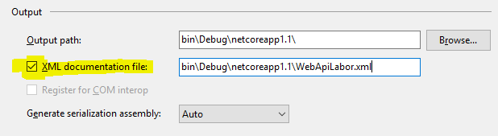
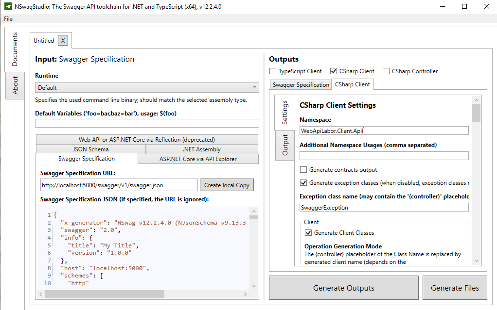
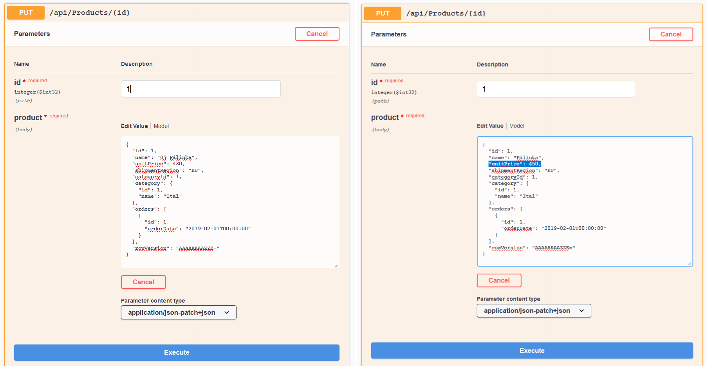
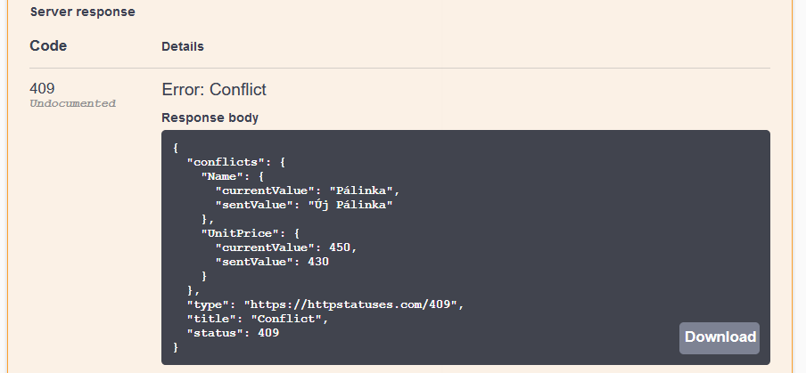

= ASP.NET Core webszolgáltatások I.-II.

== Kiegészítő anyagok, segédeszközök

* kóddarabka fájl: aspnetcorerest.md
* kiinduló solution: https://github.com/bmeaut/WebApiLab/tree/init
 ** elég csak zip-ként letölteni, nem kell klónozni
 ** figyeljünk rá, hogy az _init_ ágat töltsük le
* Fiddler vagy Postman HTTP kérések küldéséhez
* https://github.com/RicoSuter/NSwag/releases[NSwag Studio] a klienskód generáláshoz

== Kiinduló projektek beüzemelése

A kiinduló solution két .NET Standard osztálykönyvtárat foglal magába, melyek egy N-rétegű architektúra egy-egy rétegét valósítják meg:

* *WebApiLab.DAL*: lényegében az Entity Framework gyakorlatok anyagát tartalmazza, ez az adatelérési rétegünk.
    * entitásdefiníciók
    * kontext, modellkonfigurációval, kezdeti adatokkal
    * connection string kezelés és SQL naplózás (még) nincs
    * migráció (még) nincs
* *WebApiLab.BLL*: ezt szánjuk az üzleti logikai rétegnek. Fő feladata, hogy a DAL-ra építve végrehajtsa az _Interfaces_ mappában definiált műveleteket.
    * Interfaces - ez a BLL réteg specifikációja
    * Services - ide kerülnek majd az üzleti logikát, ill. az interfészeket megvalósító osztály(ok)
    * DTOs - ez majd a fölöttes API rétegnek szükséges, a BLL nem használja
    * Exceptions - saját kivétel osztály, egyelőre nincs használva

Adjunk hozzá a solution-höz egy új C# nyelvű web projektet (ASP.NET Core Web Application), a neve legyen _WebApiLab.API_.

A következő dialógusablakban válasszuk ki az _ASP.NET Core 3.1_ opciót és azon belül a API sablont. Más egyéb extrát (HTTPS, Docker, stb.) ne kérjünk. Adjuk hozzá projekt függőségként: 
* a _Bll_ projektet
* a _Microsoft.EntityFrameworkCore.Design_ NuGet csomagot

== Az EF kontext bekötése az ASP.NET Core DI rendszerébe

Mivel az ASP.NET Core projekt DI rendszert is ad, így érdemes a kontextet a DI rendszerbe regisztrálni, hogy a projekten belül a modulok/osztályok függőségként tudják használni. A regisztrálás a `ConfigureServices` függvényben történik (lásd ASP.NET Core bevezető gyakorlatot).

A kontext regisztrálása a `Startup.ConfigureServices` függvénybe:

[source,csharp]
----
services.AddDbContext<NorthwindContext>(o =>
    o.UseSqlServer(Configuration["ConnectionStrings:DefaultConnection"]));
----

Az EF naplózást az ASP.NET Core naplózó rendszere végzi, amit az alapértelmezett `Host` már inicializál, így ezzel kapcsolatban nincs teendőnk. Viszont egy új konstruktorra lesz szükségünk, ami `DbContextOptions<NorthwindContext>`-et vár.

[source,csharp]
----
public NorthwindContext(DbContextOptions<NorthwindContext> options)
    : base(options){}
----

Az Entity Framework gyakorlat alapján hozzunk létre egy új LocalDB adatbázist egy választott névvel, pl. neptun kód, northwind, stb. Az SQL Server Object Explorer-ből a connection string-et lopjuk el. (Jobbklikk az adatbázison → Properties → A Properties ablakból a _Connection String_ értéke).

Az _appsettings.Development.json_-ba vegyük fel a connection string-et. 
[source,javascript]
----
/**/{
/**/  "Logging": {
/**/    "LogLevel": {
/**/      "Default": "Information",
/**/      "Microsoft": "Warning",
/**/      "Microsoft.Hosting.Lifetime": "Information"
/**/    }
      }, //vessző bekerült
      "ConnectionStrings": {
         "DefaultConnection": "<connection string>"
      }
/**/}

----

=== Adatbázis inicializálása Code-First migrációval

Fordítsuk a teljes solution-t, állítsuk be indítandó (startup) projektnek az új Web API projektet. A _Package Manager Console_-t nyissuk meg és ellenőrizzük, állítsuk be Default Project-ként a DAL projektet. Készíttessük el a migrációt és futtassuk is le.

[source,powershell]
----
Add-Migration Init
Update-Database
----

WARNING: Fontos, hogy a fenti parancs két projektet ismerjen: azt, amelyikben a kontext van, ill. a kontextet használó futtatható projektet. A VS Package Manager Console-jában futtatva alapértelmezésben az előbbit a Default Project értéke adja meg, utóbbit az indítandó projekt. Továbbá ezeket a projekteket meg lehet adni https://docs.microsoft.com/en-us/ef/core/miscellaneous/cli/powershell#common-parameters[paraméterként] is.

TIP: Itt mutatkozik meg, hogy a migráció lényegében egy teljes alkalmazásindítást jelent a `Startup` osztályon keresztül, inicializálódik a DI konténer, a konfigurációs objektum, stb.

Ellenőrizzük, hogy rendben lefutott-e a migráció, létrejöttek-e az adatbázis objektumok, feltöltődtek-e a táblák.

== EF kontext használata a kontroller rétegben

Bár architektúra szempontból nem a legszebb, a BLL réteget gyakorlatilag mellőzve közvetlenül is használhatjuk az EF entitásokat a kontrollerek megvalósításánál.  A _Controllers_ mappában hozzunk létre egy kontrollert (Add → Controller... → API Controller with actions using Entity Framework). A felbukkanó ablakban válasszuk ki a `Product` entitás osztályt (azaz az Entities névtérbelit), a kontextet és adjunk meg nevet ( `EFProductsController`).

WARNING: Figyeljünk rá, hogy ne a `Dto` névtérből adjuk meg a DTO típust a tényleges entitástípus helyett.

A legenerálódó kontroller már használható is. Állítsuk át a zöld nyíl mellett az indítási konfigurációt a projektnevesre, hogy kestrel induljon és így lássuk a konzolon a naplót. Indítsuk a projektet és próbáljuk például lekérni az összes terméket az **api/efproducts** címről.

TIP: Érdemes a zöld nyíl melletti lenyílóban olyan böngészőt megadni (Chrome, Firefox), ami értelmes formában meg tudja jeleníteni a nyers JSON adatokat.

TIP: Az alapértelmezésben megnyitandó URL útvonalat a projekt tulajdonságok között adhatjuk meg: jobbklikk a projekten Debug lap → Launch Browser. Ide egy a gyökércímhez képesti relatív útvonalrészt kell beírni. (pl. _api/efproducts_)

Figyeljük meg, hogy a controller a konstruktorban igényli meg a DI-tól az EF kontextet, amit a szokásos módon osztályváltozóban tárol el.

== Köztes réteg alkalmazása

A rétegezett architektúra elveit követve gyakori eljárás, hogy a controller nem éri el közvetlenül az EF kontextet, hanem csak egy extra rétegen keresztül. A controller projekt így függetleníthető az EF-től.

Ehhez a megoldáshoz készítsünk külön kontroller változatot. A _Controllers_ mappába hozzunk létre egy kontrollert (Add → Controller... → API Controller with read/write actions) `ProductsController` néven.

A megoldáshoz a _BLL_ projektben már létezik a `ProductService` osztály, aminek szintén függősége az EF kontext és megvalósítja szükséges CRUD műveleteket. Az EF gyakorlaton tanultakra visszautalva mutassuk be a műveletek implementációját. Függőségeknél előnyösebb, ha interfészekre hivatkozunk, mert tesztelésnél az interfész mögötti implementációt általában egyszerűbb cserélni. Szerencsére az `IProductService` interfész is már rendelkezésünkre áll.

A BLL projekt Services mappájába hozzunk létre egy új osztályt `ProductService` néven. Implementálja az IProductService interfészt, a kiinduló implementációt generáltassuk a Visual Studio-val. Konstruktorban várja a függőségként a kontextet. A kontext segítségével implementáljuk normálisan a `GetProducts` függvényt. _Eager Loading_ használatával az egyes termékekhez a kapcsolódó kategóriát és megrendeléseket is adjuk vissza.

[source,csharp]
----
namespace WebApiLab.BLL
{
    public class ProductService : IProductService
    {
        private readonly NorthwindContext _context;
        public ProductService(NorthwindContext context)
        {
            _context = context;
        }       

        public IEnumerable<Product> GetProducts()
        {
            var products = _context.Products
                .Include(p => p.Category)
                .Include(p => p.ProductOrders)
                    .ThenInclude(po => po.Order)
                .ToList();

            return products;
        }
        /*Többi függvény alapimplementációja*/
    }
}
----

Injektáljunk `IProductService`-t a `ProductController`-be.

[source,csharp]
----
private readonly IProductService _productService;
public ProductsController(IProductService productService)
{
    _productService = productService;
}
----

Adjuk meg a DI konténernek, hogy hogyan kell egy `IProductService` típusú függőséget létrehozni. A `ConfigureServices` függvénybe:

[source,csharp]
----
services.AddTransient<IProductService, ProductService>();
----

A függőség injektálás úgy működik, hogy kontrollereket is a központi DI komponens példányosítja, és ilyenkor megvizsgálja a konstruktor paramétereket. Ha a konténerben talál alkalmas beregisztrált osztályt, akkor azt létrehozza és átadja a konstruktornak. Ezt hívjuk konstruktor injektálásnak. Ha a létrehozandó függőségnek is vannak konstruktor paraméterei, akkor azokat is megpróbálja feloldani, így rekurzívan a teljes függőségi objektum hierarchiát le tudja kezelni (ha abban nincs irányított kör).

A regisztráció során több lehetőségünk is van. Egyrészt nem kötelező interfészt megadni egy osztály beregisztrálásához, az osztályt önmagában is be lehet regisztrálni, ilyenkor a konstruktorban is osztályként kell elkérni a függőségeket.

Háromféle példányosítási stratégiával regisztrálhatjuk be az osztályainkat:

* *Transient*: minden egyes injektálás során új példány jön létre
* *Scoped*: HTTP kérésenként egy példány kerül létrehozásra és a kérésen belül mindenkinek ez lesz injektálva
* *Singleton*: mindenkinek ugyanaz a példány kerül átadásra kéréstől függetlenül

Írjunk új `Get()` változatot az eredeti helyett a `ProductsController`-be az `IProductService` függőséget felhasználva:

[source,csharp]
----
[HttpGet]
public IEnumerable<Product> Get()
{
    return _productService.GetProducts();
}
----

Próbáljuk ki (`api/products`). A konzolon láthatóan hibát kapunk, mert a `ProductService` lekérdező függvénye eager loading-gal (`Include`) navigációs property-ket is kitölt, így könnyen hivatkozási kör jön létre, amit a JSON sorosító alapértelmezésben kivétellel jutalmaz. A sorosítást a keretrendszer végzi, a kontrollerfüggvény visszatérési értékét sorosítja a HTTP tartalomegyeztetési szabályok szerint. Böngésző kliens esetén alapesetben JSON formátum lesz a befutó. Persze a sorosítás ennél közvetlenebbül is https://docs.microsoft.com/en-us/aspnet/core/web-api/advanced/formatting[konfigurálható], ha szükséges. Sajnos az ASP.NET Core 3 új, alapértelmezett sorosítója még konfigurálással sem támogatja a körkörös hivatkozások feloldását.

TIP: A korábbi verziókban használt JSON sorosítót lehetett konfigurálni, hogy oldja fel a körkörös hivatkozást. Ha mindenképp erre van szükségünk, akkor le kell cserélni az alapértelmezett sorosítót a https://docs.microsoft.com/en-us/aspnet/core/web-api/advanced/formatting?view=aspnetcore-3.1#add-newtonsoftjson-based-json-format-support[korábbira].

== DTO osztályok

Láthattuk, hogy az entitástípusok közvetlen sorosítása gyakran nem működik. A modell kifejezetten az EF számára lett megalkotva, illetve hogy a lekérdező műveleteket minél kényelmesebben végezhessük. A kliensoldal számára érdemes külön modellt megalkotni, egy ún. DTO (_Data Transfer Object_) modellt, ami a kliensoldal igényeit veszi figyelembe: *pontosan* annyi adatot és **olyan szerkezetben** tartalmaz, amire a kliensnek szüksége van.

A _BLL_ projektben jelenleg egy nagyon egyszerű DTO modell található a _DTOs_ mappában:

* nincs benne minden navigációs property, pl. `Category.Products`
* nincs benne a kapcsolótáblát reprezentáló entitás
* a termékből közvetlenül elérhetők a megrendelések

A különféle modellek közötti leképezésnél jól jönnek az ún. object mapper-ek, melyek segítenek elkerülni a leképezésnél nagyon gyakori repetitív kódokat, mint amilyen az `x.Prop=y.Prop` jellegű property érték másolgatás.

Adjuk hozzá a projekthez az _AutoMapper.Extensions.Microsoft.DependencyInjection_ csomagot. A `ConfigureServices`-ben adjuk hozzá és konfiguráljuk a leképezési szolgáltatást.

[source,csharp]
----
services.AddAutoMapper(typeof(Startup));
----

Az AutoMapper konfigurációját profilokba szervezve adhatjuk meg. Adjunk hozzá a projekthez egy új mappát AutoMapper néven és abba egy új osztályt `WebApiLabProfile` néven.

[source,csharp]
----
namespace WebApiLab.API
{
    public class WebApiProfile : Profile
    {
        public WebApiProfile()
        {
            CreateMap<Entities.Product, DTO.Product>()
                .ForMember(dto => dto.Orders, opt => opt.Ignore())
                .AfterMap((p, dto, ctx) =>
                    dto.Orders = p.ProductOrders.Select(po =>
                    ctx.Mapper.Map<DTO.Order>(po.Order)).ToList())
                .ReverseMap();
            CreateMap<Entities.Order, DTO.Order>().ReverseMap();
            CreateMap<Entities.Category, DTO.Category>().ReverseMap();
        }
    }
}
----

TIP: Az AutoMapper az `AddAutoMapper` paramétereként megadott típust definiáló szerelvényben fogja a profilt keresni.

Injektáltassuk be a leképzőt reprezentáló `IMapper` típusú objektumot a kontrollerbe.

[source,csharp]
----
/**/private readonly IProductService _productService;
    private readonly IMapper _mapper;
/**/public ProductsController(IProductService productService
                         ,IMapper mapper
/**/)
/**/{
/**/    _productService = productService;
        _mapper = mapper;
/**/}
----

Az entitásokra mutató névteret cseréljük ki a DTO-kra mutató névtérre:

[source,csharp]
----
//using WebApiLab.Entities;
using WebApiLab.API.DTO;
----

Írjuk át a REST műveleteket a leképzőt alkalmazva (a Delete-en nem kell változtatni):

[source,csharp]
----
/**/[HttpGet]
/**/public IEnumerable<Product> Get()
/**/{
        return _mapper.Map<IEnumerable<Product>>(_productService.GetProducts());
/**/}
----

Próbáljuk ismét meghívni böngészőből a fenti műveletet - most már működnie kell.

TIP: A többrétegű architektúránál elméletben minden rétegnek külön objektummodellje kellene, hogy legyen DAL: EF entitások, BLL: domain objektumok, Kontroller: DTO-k, viszont ha a domain objektumok nem visznek plusz funkciót a rendszerbe, el szoktuk hagyni.

TIP: A DTO leképezést más rétegben is végezhetnénk. Egyes megközelítések szerint az adatátviteli réteg feladata lenne, esetünkben a kontrolleré.

TIP: Ha a DTO mappelést az üzleti szolgáltatás rétegben szeretnénk végezni, akkor akár az SQL szintjén is konvertálhatjuk az http://docs.automapper.org/en/stable/Queryable-Extensions.html[AutoMapper] vagy a https://github.com/yugabe/QueryMutator[QueryMutator] NuGet csomag segítségével. Ilyenkor csak a DTO képzéshez szükséges adatokat kérdezzük le az adatbázisból.

== BLL funkciók implementációja

=== Egy elem lekérdezése

Ugyanúgy kérdezzük le, mint a `GetProducts`-ban, csak a végére beteszünk egy szűrést (`SingleOrDefault`), ami `null`-t ad vissza, ha nem volt az adott azonosítóval termék. Ha nem található a termék, akkor ebben a rétegben kivételt dobunk.

[source,csharp]
----
/**/public Product GetProduct(int productId)
/**/{
        return _context.Products
           .Include(p => p.Category)
           .Include(p => p.ProductOrders)
               .ThenInclude(po => po.Order)
           .SingleOrDefault(p => p.Id == productId) 
            ?? throw new EntityNotFoundException("Nem található a termék");
/**/}
----

=== Beszúrás

Ez nagyon hasonló az EF gyakorlaton látottakhoz, csak itt nem kell legyártanunk az új `Product` példányt, paraméterként kapjuk. A visszatérési értékben a kulcs értéke már ki lesz töltve (adatbázis osztja ki a kulcsot).

[source,csharp]
----
public Product InsertProduct(Product newProduct)
{
    _context.Products.Add(newProduct);
    _context.SaveChanges();
    return newProduct;
}
----

=== Módosítás

Konvenció szerint külön paraméterként szokták átadni a módosítandó elem azonosítóját és az új értékeket összefogó példányt. Első lépésben összeállítunk egy olyan példányt, mint amilyet az adatbázisból kérdeztünk volna le - viszont ez a példány nem lesz a kontext látókörében. Az `Attach` függvény hasonló az `Add`-hoz, hozzáadja a kontext nyilvántartásához a példányt, de az `Attach` nem jelöli meg a státuszt, marad változatlan. Explicit megjelöljük változottként, a változást végül a SaveChanges érvényesíti.

[source,csharp]
----
public void UpdateProduct(int productId, Product updatedProduct)
{
    updatedProduct.Id = productId;
    var entry = _context.Attach(updatedProduct);
    entry.State = EntityState.Modified;
    _context.SaveChanges();
}
----

=== Törlés

Egy trükkel elkerülhetjük, hogy le kelljen kérdezni a törlendő terméket. Az azonosító alapján előállítunk memóriában egy példányt a megfelelő kulccsal, majd `Remove` függvénnyel hozzáadjuk a kontexthez. A `Remove` törlendőnek jelöli a példányt.

[source,csharp]
----
public void DeleteProduct(int productId)
{
    _context.Products.Remove(new Product { Id = productId });
    _context.SaveChanges();
}
----

== REST konvenciók alkalmazása

A REST megközelítés nem csak átviteli közegnek tekinti a HTTP-t, hanem a protokoll részeit felhasználja, hogy kiegészítő információkat vigyen át. Emiatt előnyös lenne, ha nagyobb ellenőrzésünk lenne a HTTP válasz felett - szerencsére az ASP.NET Core biztosítja ehhez a megfelelő API-kat.

Egyik legegyszerűbb ilyen irányelv, hogy a lekérdezések eredményeként, ha megtaláltuk és visszaadtuk a kért adatokat, akkor *200 (OK)* HTTP válaszkódot adjunk.

TIP: A HTTP kérést érintő irányelvekről egy jó összefoglaló elérhető https://www.restapitutorial.com/lessons/httpmethods.html[itt].

Az eddig megírt `Get()` függvényünk most is *200 (OK)*-ot ad, ezt le is ellenőrizhetjük a böngészőnk hálózati monitorozó eszközében.

TIP: A HTTP kommunikáció megfigyelésére használhatjuk a böngészők beépített eszközeit, minta mailyen a https://developer.mozilla.org/en-US/docs/Tools[Firefox Developer Tools], illetve https://developers.google.com/web/tools/chrome-devtools/[Chrome DevTools]. Általában az kbd:[F12] billentyűvel aktiválhatók. Emellett, ha egy teljesértékű HTTP kliensre van szükségünk, amivel például könnyen tudunk nem csak GET kéréseket küldeni, akkor a https://www.getpostman.com/[Postman] és a https://www.telerik.com/download/fiddler[Fiddler] külön telepítendő eszközök ajánlhatók. A Fiddler, mint proxy megoldás, egy Windows gépen folyó HTTP kommunikáció megfigyelésére is alkalmas.

Első körben a két lekérdező függvényt írjuk át úgy, hogy a HTTP válaszkódokat explicit megadjuk. A jelenlegi legmodernebb mód ehhez az `AsyncResult<>` használata. Elég `T`-t visszaadnunk a függvényben, automatikusan `AsyncResult<T>` típussá konvertálódik. Tehát elvileg írhatnánk ezt:

[source,csharp]
----
//NEM FORDUL!
/**/[HttpGet]
    public ActionResult<IEnumerable<Product>> Get() 
        //ActionResult<T> visszatérési érték
/**/{
/**/    return _mapper.Map<IEnumerable<Product>>(_productService.GetProducts());
/**/}
----

Azonban ez nem fordul, mert interfész típus esetén nem működik a konverzió. Konkrét típust, pl. egy listát kell megadnunk.

[source,csharp]
----
/**/[HttpGet]
/**/public ActionResult<IEnumerable<Product>> Get()
/**/{
     return _mapper.Map<List<Product>>(_productService.GetProducts()); 
        //IEnumerable helyett List
/**/}
----

Írjuk meg ugyanígy a másik `Get` függvényt is:

[source,csharp]
----
/**/[HttpGet("{id}", Name = "Get")]
    public ActionResult<Product> Get(int id)
        //ActionResult<T> visszatérési érték
/**/{
        return _mapper.Map<Product>(_productService.GetProduct(id));
/**/}
----

Próbáljuk ki mindkét kontroller függvényt (_api/products_, _api/products/1_), ellenőrizzük a státuszkódokat is.

Ami fura, hogy még mindig nem állítottunk explicit státuszkódokat. A logikánk most még nagyon egyszerű, csak a hibamentes ágat kezeltük, így eddig az `ActionResult` alapértelmezései megoldották, hogy *200 (OK)*-ot kapjunk.

Most viszont következzen egy létrehozó művelet:

[source,csharp]
----
/**/[HttpPost]
    public ActionResult<Product> Post([FromBody] Product product)
        //ActionResult<T> visszatérési érték + Product paraméter
/**/{
        var created = _productService
            .InsertProduct(_mapper.Map<Entities.Product>(product));
        return CreatedAtAction(
                    nameof(Get),
                    new { id = created.Id },
                    _mapper.Map<Product>(created)
        );
/**/}
----

Itt már látszik az `ActionResult` haszna. A konvenciónak megfelelően 201-es kódot akarunk visszaadni. Ehhez a `ControllerBase` ősosztály biztosít segédfüggvényt. A segédfüggvény olyan `ActionResult` leszármazottat ad vissza, ami 201-es kódot szolgáltat a kliensnek. Másik konvenció, hogy a _Location_ HTTP fejlécben legyen egy URL az új termék lekérdező műveletének meghívásához. Ezt az URL-t rakjuk össze a `CreatedAtAction` paraméterei révén.

Próbáljuk ki a műveletet Fiddlerben vagy https://learning.postman.com/docs/postman/sending-api-requests/requests/[Postmanben]! Egy `Product`-ot kell felküldenünk. Egy példa érték:

[source,javascript]
----
{
    "Name" : "Pálinka",
    "UnitPrice" : 4000,
    "ShipmentRegion" : 1,
    "CategoryId" : 1
}
----

Ne felejtsük el a _Content-Type_ fejlécet  application/json-re állítani! Figyeljük meg a kapott választ. A válaszból másoljuk ki a _Location_ fejlécből az URL-t és hívjuk meg böngészőből.

image::images/aspnetcorerest-fiddlerpost.png[Fiddler - POST küldése]

A módosító, törlő műveleteknél a konvenció megengedi, hogy üres törzsű (body) választ adjunk, ilyenkor a válaszkód *204 (No Content)*. Ilyesfajta válasz előállításához is van segédfüggvény, illetve elég csak az `IActionResult` interfészt megadni visszatérési típusnak:

[source,csharp]
----
/**/[HttpPut("{id}")]
    public IActionResult Put(int id, [FromBody] Product product)
/**/{
    _productService.
                UpdateProduct(id, _mapper.Map<Entities.Product>(product));
    return NoContent();
/**/}

[HttpDelete("{id}")]
public IActionResult Delete(int id)
{
    _productService.DeleteProduct(id);
    return NoContent();
}
----

TIP: PUT mellett a módosításhoz használatos a PATCH is. A PUT konvenció szerint teljes, míg a PATCH részleges felülírásnál használatos. PATCH esetén általában valamilyen patch formátumú adatot küld a kliens, pl. https://tools.ietf.org/html/rfc6902[RFC 6902 - JSON Patch]. A JSON Patch formátumot jelenleg csak a korábbi sorosító (Newtonsoft.Json) https://docs.microsoft.com/en-us/aspnet/core/web-api/jsonpatch?view=aspnetcore-3.1[támogatja].

Próbáljuk kitörölni az újonnan felvett terméket Fiddler/Postman-ből (_DELETE_ igés kérés az `api/products/<új id>` címre, üres törzzsel). Sikerülnie kell, mert még nincs rá idegen kulcs hivatkozás.

== Hibakezelés

Eddig főleg csak a hibamentes ágakat (happy path) néztük. A REST konvenciók rendelkeznek arról is, hogy bizonyos hibahelyezetekben milyen https://httpstatuses.com[HTTP választ] illik adni, például ha a kérésben hivatkozott azonosító nem létezik - 404-es hiba a bevett eljárás. Státuszkódok szempontjából a korábban idézett oldal ad segítséget, a válasz törzsében a hibaüzenet szerkezete tekintetében az https://tools.ietf.org/html/rfc7807[RFC 7807] ad iránymutatást az ún. _Problem Details_ típusú válaszok bevezetésével. Az ASP.NET Core 2.1-es verzió óta támogatja a Problem Details válaszokat, és általában automatikusan ilyen válaszokat küld.

=== 400 Bad Request

Kezdjük a kliens által küldött nem helyes adatokkal. Ez a hibakód nem összekeverendő a 415-tel, ahol az adat formátuma nem megfelelő (XML vagy JSON): ezt általában nem kell kézzel lekezeljük, mivel ezt az ASP.NET megteszi helyettünk. 400-zal olyan hibákat szoktunk lekezelni, ahol a küldött adat formátuma megfelelő, de valamilyen saját validációs logikának nem felel meg a kapott objektum pl.: egységár nem lehet negatív stb.

Itt használjuk fel a .NET ún. https://docs.microsoft.com/en-us/aspnet/core/mvc/models/validation?view=aspnetcore-3.1#built-in-attributes[_Data Annotation_ attribútumait], amiket a DTO-kon érvényesíthetünk, és az ASP.NET Core figyelembe vesz a művelet végrehajtása során. Vegyük fel a `Product` DTO osztályban néhány megkötést attribútumok formájában.

[source,csharp]
----
    [Required(ErrorMessage = "Product name is required.", AllowEmptyStrings = false)]
/**/public string Name { get; set; }

    [Range(1, int.MaxValue, ErrorMessage = "Unit price must be higher than 0.")]
/**/public int UnitPrice { get; set; }
----

Próbáljuk ki egy *POST /api/Product* művelet meghívásával. Paraméterként kiindulhatunk a felület által adott minta JSON-ból, csak töröljük ki a navigációs property-ket és sértsük meg valamelyik (vagy mindkét) fenti szabályt. Egy példa törzs:

[source,javascript]
----
{
    "Name" : "",
    "UnitPrice" : 0,
    "ShipmentRegion" : 1,
    "CategoryId" : 1
}
----

A válasz 400-as kód és valami hasonló, RFC 7807-nek megfelelő törzs lesz:

[source,javascript]
----
{
    "type": "https://tools.ietf.org/html/rfc7231#section-6.5.1",
    "title": "One or more validation errors occurred.",
    "status": 400,
    "traceId": "|2f35d378-4420cbafb80aec04.",
    "errors": {
        "Name": [
            "Product name is required."
        ],
        "UnitPrice": [
            "Unit price must be higher than 0."
        ]
    }
}
----

=== 404 Not Found - kontroller szinten

Konvenció szerint 404-es hibát kellene adnunk, ha a keresett azonosítóval nem található erőforrás - esetünkben termék. Jelenleg a `ProductService` `EntityNotFoundException`-t dob, és amennyiben Development módban futtatjuk az alkalmazást, a cifra hibaoldal jelenik meg, amit a _DeveloperExceptionPage_ middleware generál. Ha kivesszük a middleware-t (vagy nem Development módban indítjuk, de ekkor gondoskodnunk kell connection string-ről, ami eddig csak a Development konfigurációban volt beállítva), akkor 500-as hibát kapunk vissza.

WARNING: A kezeletlen kivételek általában 500-as hibakód formájában kerülnek vissza a kliensre, mindenfajta egyéb információ nélkül (üres oldalként jelenik meg). Ez a jobbik eset, ahhoz képest, ha a teljes kivételszöveg és stack trace is visszakerülne. Az átlagos felhasználók nem tudják értelmezni, viszont a támadó szándékúaknak értékes információt jelenthet, így ajánlott elkerülni, hogy a kivétel ilyen módon kijusson. Ez az elkerülés az úgynevezett _exception shielding_ technika, és az ASP.NET Core alapértelmezetten alkalmazza.

Legegyszerűbb módszer a kontroller műveletben érvényesíteni a konvenciót:

[source,csharp]
----
/**/[HttpGet("{id}", Name = "Get")]
/**/public ActionResult<Product> Get(int id)
/**/{
        try
        {
/**/        return _mapper.Map<Product>(_productService.GetProduct(id));
        }
        catch (EntityNotFoundException)
        {
            return NotFound();
        }    
/**/}
----

TIP: Alternatív megoldás, hogy a `ProductService` egy `null` értékkel jelezné, hogy nincs találat. Ezesetben a fenti kódban a `null` értékre kellene vizsgálni, pl. `if` szerkezettel.

Próbáljuk ki egy, hogy 404-es státuszkódot és annak megfelelő _problem details_-t kapunk-e, ha egy nem létező termékazonosítóval hívjuk a fenti műveletet.

Ha saját _problem details_-t szeretnénk a 404-es kód mellé, akkor kézzel összerakhatjuk és visszaküldhetjük.

[source,csharp]
----
/**/catch (EntityNotFoundException)
/**/{
        ProblemDetails details= new ProblemDetails
        {
            Title = "Invalid ID",
            Status = StatusCodes.Status404NotFound,
            Detail = $"No product with ID {id}"
        };
        return NotFound(details); //ProblemDetails átadása
/**/}
----

Így is próbáljuk ki. Az általunk megadott üzenetet kell visszakapjuk.

=== 404 Not Found - globális kivétel leképezéssel

A rendhagyó válaszok előállításánál előnyös lehet, ha az alacsonyabb rétegekből specifikus kivételeket dobunk, mert ezeket egy központi helyen szisztematikusan átalakíthatjuk konvenciónak megfelelő HTTP válaszokká. Ez a képesség egyelőre még nem érhető el beépítetten, ezért egy https://github.com/khellang/Middleware[közösségi fejlesztésű NuGet csomagot] használunk fel.

Telepítsük fel a _Hellang.Middleware.ProblemDetails_ csomagot az API projektbe.

[source,powershell]
----
Install-Package Hellang.Middleware.ProblemDetails
----

Szokás szerint konfiguráljuk a `Startup.ConfigureServices`-ben. Sose adjuk vissza a kivétel részleteit (szigorú _exception shielding_), illetve a saját kivételtípusunkat képezzük le 404-es hibára.

[source,csharp]
----
services.AddProblemDetails(options =>
{
    options.IncludeExceptionDetails = (ctx,ex) => false;
    options.MapToStatusCode<EntityNotFoundException>(StatusCodes.Status404NotFound);
});

----

Illesszük a pipeline-ba az eddigi hibakezelő MW helyére:

[source,csharp]
----
/**/public void Configure(/*...*/)
/**/{
        //if (env.IsDevelopment())
        //{
        //    app.UseDeveloperExceptionPage();
        //}
        app.UseProblemDetails();
/**/    
/**/    //további MW-k
/**/}
----

Térjünk vissza a korábbi, nem kivétel-elkapós változatra, az előzőt kommentezzük ki:

[source,csharp]
----
[HttpGet("{id}", Name = "Get")]
public ActionResult<Product> Get(int id)
{
    return _mapper.Map<Product>(_productService.GetProduct(id));
}
----

Próbáljuk ki: hasonlóan kell működjön, mint a kontroller szintű változat, de ez általánosabb, bármely műveletből `EntityNotFoundException` érkezik, azt kezeli, nem kell minden műveletben megírni a kezelő logikát.

=== 500 Internal Server Error

Próbáljunk kitörölni egy nem létező terméket **DELETE api/products/<nem létező id>** kéréssel. Az újonnan beállított MW a nem kezelt kivétel esetén is egy alapszintű Problem Details választ állít elő 500-as kóddal.

=== Azonosítók ellenőrzése

Készítsük fel a módosító és törlő műveleteket is a nem létező azonosítók konvenció szerinti kezelésére.

[source,csharp]
----
/**/public void UpdateProduct(int productId, Product updatedProduct)
/**/{
/**/    updatedProduct.Id = productId;
/**/    var entry = _context.Attach(updatedProduct);
/**/    entry.State = EntityState.Modified;
        try
        {
/**/         _context.SaveChanges();
        }
        catch (DbUpdateConcurrencyException)
        {
            if (_context.Products.SingleOrDefault(p => p.Id == productId) == null)
                throw new EntityNotFoundException("Nem található a termék");
            else throw;
        }
/**/}

/**/public void DeleteProduct(int productId)
/**/{
/**/    _context.Products.Remove(new Product { Id = productId });          
        try
        {
/**/        _context.SaveChanges();
        }
        catch (DbUpdateConcurrencyException)
        {
            if (_context.Products.SingleOrDefault(p => p.Id == productId) == null)
                throw new EntityNotFoundException("Nem található a termék");
            else throw;
        }
/**/}
----

Ez egy optimista megközelítés: feltételezzük, hogy helyes azonosítót kapunk. Ha kivételes esetben mégsem, akkor az UPDATE/INSERT utasítás nem a megfelelő számú sort módosítja és `DbUpdateConcurrencyException`-t kapunk. Ekkor vizsgáljuk csak meg, hogy az azonosító helyes-e.

=== Saját hibaüzenet

Módosítsuk a hibakezelő MW konfigurációját a `Startup.ConfigureServices` függvényben, hogy a kivétel szövege bekerüljön a válaszba. Ez akkor lehet hasznos, ha a felhasználónak kiírandó hibaüzenetet is vissza akarjuk küldeni (másik lehetőség, hogy a kliens állítja elő, pl. a státuszkód alapján).

[source,csharp]
----
/**/services.AddProblemDetails(options =>
/**/{
/**/    options.IncludeExceptionDetails = (ctx, ex) => false;
        options.Map<EntityNotFoundException>(
            (ctx, ex) =>
            {
                var pd=StatusCodeProblemDetails.Create(StatusCodes.Status404NotFound);
                pd.Title = ex.Message;
                return pd;
            }
        );
/**/});
----

WARNING: Az _exception shielding_ elv miatt csak olyan kivételeknél alkalmazzuk, ahol a felhasználók számára hasznos, de nem technikai jellegű információt tartalmaz a kivétel szövege.

== Aszinkron műveletek

Aszinkron műveletek alkalmazásával hatékonyságjavulást érhetünk el: nem feltétlenül az egyes műveletink lesznek gyorsabbak, hanem időegység alatt több műveletet tudunk kiszolgálni. Ennek oka, hogy az `await`-nél (például egy adatbázis művelet elküldésekor) a várakozási idejére történő kiugrásnál, ha vissza tudunk ugrálni egészen az ASP.NET engine szintjéig, akkor a végrehajtó környezet a kiszolgáló szálat a várakozás idejére más kérés kiszolgálására felhasználhatja.

TIP: Ökölszabály, hogy ha elköteleztük magunkat az aszinkronitás mellett, akkor ha megoldható, az aszinkronitást vezessük végig a kontrollertől az adatbázis művelet végrehajtásáig minden rétegben. Ha egy API-nak van _TAP_ jellegű változata, akkor azt részesítsük előnyben (pl. `SaveChanges` helyett `SaveChangesAsync`). Ha aszinkronból szinkronba váltunk, csökkentjük a hatékonyságot, rosszabb esetben deadlock-ot is https://blog.stephencleary.com/2012/07/dont-block-on-async-code.html[előidézhetünk].

Vezessük végig az aszinkronitást egy művelet teljes végrehajtásán:

[source,csharp]
----
/**/public interface IProductService
/**/{
        //void UpdateProduct(int productId, Product updatedProduct);
        Task UpdateProductAsync(int productId, Product updatedProduct);
/**/    //többi fv.
/**/}

    public async Task UpdateProductAsync(int productId, Product updatedProduct)
/**/{
/**/    updatedProduct.Id = productId;
/**/    var entry = _context.Attach(updatedProduct);
/**/    entry.State = EntityState.Modified;
/**/
/**/    try
/**/    {
            await _context.SaveChangesAsync(); //async változat hívása
/**/    }
/**/    catch (DbUpdateConcurrencyException)
/**/    {
           if ((await _context.Products
                        .SingleOrDefaultAsync(p => p.Id == productId)) == null)
            //async változat hívása
/**/               throw new EntityNotFoundException("Nem található a termék");
/**/        else throw;
/**/    }
/**/}

    public async Task<IActionResult> PutAsync(int id, [FromBody] Product product)
/**/{
/**/  await _productService.
        UpdateProductAsync(id, _mapper.Map<Entities.Product>(product));
           //async változat hívása 
/**/  return NoContent();
/**/}
----

Próbáljuk ki, például küldjünk PUT-ot az `api/products/1` címre, állítsuk be a _Content-Type: application/json_ fejlécet és a POST-nál használt JSON-t küldjük a törzsben. Ezzel az 1-es `id`-jű termék adatait fogjuk felülírni.

TIP: az ASP.NET Core a routing során automatikusan levágja az Async végződést a műveletet megvalósító függvény (`PutAsync` végéről).

== Végállapot

A többi műveletet aszinkronizálva ez a végállapot:

[source,csharp]
----
public interface IProductService
{
    Task<Product> GetProductAsync(int productId);
    Task<IEnumerable<Product>> GetProductsAsync();
    Task<Product> InsertProductAsync(Product newProduct);
    Task UpdateProductAsync(int productId, Product updatedProduct);
    Task DeleteProductAsync(int productId);
}

public class ProductService : IProductService
{
    private readonly NorthwindContext _context;

    public ProductService(NorthwindContext context)
    {
        _context = context;
    }

    public async Task DeleteProductAsync(int productId)
    {
        _context.Products.Remove(new Product { Id = productId });          
        try
        {
            await _context.SaveChangesAsync();
        }
        catch (DbUpdateConcurrencyException)
        {
            if ((await _context.Products
                .SingleOrDefaultAsync(p=>p.Id == productId)) == null)
                throw new EntityNotFoundException("Nem található a termék");
            else throw;
        }
    }

    public async Task<Product> GetProductAsync(int productId)
    {
        return (await _context.Products
           .Include(p => p.Category)
           .Include(p => p.ProductOrders)
               .ThenInclude(po => po.Order)
           .SingleOrDefaultAsync(p => p.Id == productId))
           ?? throw new EntityNotFoundException("Nem található a termék");
    }

    public async Task<IEnumerable<Product>> GetProductsAsync()
    {
        var products = await _context.Products
            .Include(p => p.Category)
            .Include(p => p.ProductOrders)
                .ThenInclude(po => po.Order)
            .ToListAsync();

        return products;
    }

    public async Task<Product> InsertProductAsync(Product newProduct)
    {
        _context.Products.Add(newProduct);
        await _context.SaveChangesAsync();
        return newProduct;
    }    

    public async Task UpdateProductAsync(int productId, Product updatedProduct)
    {
        updatedProduct.Id = productId;
        var entry = _context.Attach(updatedProduct);
        entry.State = EntityState.Modified;
        try
        {
            await _context.SaveChangesAsync();
        }
        catch (DbUpdateConcurrencyException)
        {
            if ((await _context.Products
                    .SingleOrDefaultAsync(p => p.Id == productId)) == null)
                throw new EntityNotFoundException("Nem található a termék");
            else throw;
        }
    }
}

[Route("api/[controller]")]
[ApiController]
public class ProductsController : ControllerBase
{
    private readonly IProductService _productService;
    private readonly IMapper _mapper;
    public ProductsController(IProductService productService, IMapper mapper)
    {
        _productService = productService;
        _mapper = mapper;
    }

    [HttpGet]
    public async Task<ActionResult<IEnumerable<Product>>> GetAsync()
    {
        return _mapper.Map<List<Product>>(await _productService.GetProductsAsync());
    }

    [HttpGet("{id}", Name = "Get")]
    public async Task<ActionResult<Product>> Get(int id)
    {
        return _mapper.Map<Product>(_productService.GetProductAsync(id));
    }

    [HttpPost]
    public async Task<ActionResult<Product>> Post([FromBody] Product product)
    {
        var created = await _productService
            .InsertProductAsync(_mapper.Map<Entities.Product>(product));
        return CreatedAtAction(
                    nameof(Get),
                    new { id = created.Id },
                    _mapper.Map<Product>(created)
        );
    }

    [HttpPut("{id}")]
    public async Task<IActionResult> Put(int id, [FromBody] Product product)
    {
        await _productService
            .UpdateProductAsync(id, _mapper.Map<Entities.Product>(product));
        return NoContent();
    }

    [HttpDelete("{id}")]
    public async Task<IActionResult> Delete(int id)
    {
        await _productService.DeleteProductAsync(id);
        return NoContent();
    }
}

----

== Egyszerű kliens

A tárgy tematikájának ugyan nem része a kliensoldal, de demonstrációs céllal egy egyszerű kliensoldalról indított hívást implementálunk. A webes API-khoz nagyon sokféle technikával írhatunk klienst, mivel gyakorlatilag csak két képességgel kell rendelkezni:

. HTTP alapú kommunikáció, HTTP kérések küldése, a válasz feldolgozása
. JSON sorosítás

A fentiekhez szinte minden manapság használt kliensoldali technológia ad támogatást. Mi most egy sima, klasszikus .NET Framework alapú konzol alkalmazást írunk kliens gyanánt.

Adjunk a solution-höz egy konzolos projektet (.NET Framework, legalább v4.6.1) _WebApiLabor.Client_ néven. A C# verziót emeljük föl a korábbi C# gyakorlathoz hasonlóan legalább 7.1-re a projekttulajdonságok _Build_ fülén, az _Advanced_ gombbal. A _Program.cs_-ben írjuk meg az egy terméket lekérdező függvényt (`GetProductAsync`) és hívjuk meg a `Main` függvényből.

[source,csharp]
----
static async Task Main(string[] args)
{
    Console.Write("ProductId: ");
    var id = Console.ReadLine();
    await GetProductAsync(Int32.Parse(id));

    Console.ReadKey();
}

public static async Task GetProductAsync(int id)
{
    using (var client = new HttpClient())
    {
        /*A portot írjuk át a szervernek megfelelően*/
        var response = await client.
            GetAsync(new Uri($"http://localhost:5000/api/Products/{id}"));
        if (response.IsSuccessStatusCode)
        {
            var json = await response.Content.ReadAsStringAsync();
            Console.WriteLine(json);
        }
    }
}
----

TIP: Ha .NET-ben írjuk a klienst, akkor szinte biztosan a klasszikus .NET Framework-öt kell használnunk, hiszen az elterjedtebb .NET alapú kliens technológiák (WinForms, WPF) .NET Framework alapúak ... legalábbis a .NET Core v3 megjelenéséig.

Állítsuk be, hogy a szerver és a kliensoldal is elinduljon (solution jobb gomb → Set startup projects...)

Próbáljuk ki - a termék nyers JSON formában jelenik meg a konzolon. Ehhez még JSON sorosítót sem kellett használnunk. A következő lépés az lenne, hogy a JSON alapján visszasorosítanánk egy objektumba. Ehhez kliensoldalon is kellene lennie egy Product DTO-nak megfelelő osztálynak. Hogyan jöhetnek létre a kliensoldali modellosztályok?

* kézzel létrehozzuk őket a JSON alapján - macerás
* a DTO-kat osztálykönyvtárba szervezzük, mindkét oldal hivatkozza - csak akkor működik, ha mindkét oldal .NET-es, ráadásul könnyen kaphat az osztálykönyvtár olyan függőséget, ami igazából csak az egyik oldalnak kell csak, így meg mindkét oldal meg fogja kapni.
* generáltatjuk valamilyen eszközzel a szerveroldal alapján - ezt próbáljuk most ki

== OpenAPI/Swagger szerveroldal

Az _OpenAPI_ (eredeti nevén: _swagger_) eszközkészlet segítségével egy JSON alapú leírását tudjuk előállítani a szerveroldali API-nknak. A leírás alapján generálhatunk dokumentációt, sőt kliensoldali kódot is a kliensoldali fejlesztők számára. Jelenleg a legfrissebb specifikáció az OpenAPI v3-as (OAS v3). Az egyes verziók dokumentációja elérhető https://github.com/OAI/OpenAPI-Specification/tree/master/versions[itt].

Az OpenAPI nem .NET specifikus, különféle nyelven írt szervert és a klienst is támogat. Ugyanakkor készültek kifejezetten a .NET-hez is swagger eszközök, ezek közül használunk párat most. .NET környezetben legelterjedtebb eszközkészletek:

* https://github.com/RicoSuter/NSwag[NSwag] - szerver- és kliensoldali generálás is. Részleges OAS v3 támogatás.
* https://github.com/domaindrivendev/Swashbuckle.AspNetCore[Swashbuckle] - csak szerveroldali generálás. OAS v3 támogatás betában.
* https://github.com/Azure/autorest[AutoRest] - _npm_ csomag .NET Core függőséggel, csak kliensoldali kódgeneráláshoz
* https://github.com/swagger-api/swagger-codegen[Swagger codegen] - java alapú kliensoldali generátor

Első lépésként a szerveroldali kódunk alapján swagger leírást generálunk _NSwag_ segítségével. Kommentezzük ki a `ProductsController`-en kívül a többi kontroller teljes kódját. A _launchsettings.json_-ben a _launchUrl_ értékeket.

[source,javascript]
----
"profiles": {
  "IIS Express": {
      //..
     //leanpub-start-insert
    "launchUrl": "swagger",
     //leanpub-end-insert
     //..
  },
  "WebApiLabor.Api": {
    //..
    //leanpub-start-insert
    "launchUrl": "swagger",
    //leanpub-end-insert
    //..
    }
  }
}
----

Adjuk hozzá a projekthez az `NSwag.AspNetCore` csomagot, most a `Package Manager Console`-ból. Figyeljünk rá, hogy a _Default project_ az Api projektünk legyen - ebbe fog bekerülni az új függőség.

[source,powershell]
----
Install-Package NSwag.AspNetCore
----

Konfiguráljuk a szükséges szolgáltatásokat a DI rendszerbe.

[source,csharp]
----
public void ConfigureServices(IServiceCollection services)
{
    //...
    //leanpub-start-insert
    services.AddSwaggerDocument();
    //leanpub-end-insert
}
----

A swagger leíró, ill. a swagger dokumentációs felület kiszolgálására regisztráljunk egy-egy middleware-t.

[source,csharp]
----
public void Configure(IApplicationBuilder app, IHostingEnvironment env)
{
    //leanpub-start-insert
    app.UseSwagger();
    app.UseSwaggerUi3();
    //leanpub-end-insert
    app.UseMvc();
}
----

Próbáljuk ki, hogy működik-e a dokumentációs felület a */swagger* útvonalon, illetve a leíró elérhető-e a */swagger/v1/swagger.json* útvonalon.

T> A swagger leíró linkje megtalálható a dokumentációs felület címsora alatt.

A dokumentációs felületen fedezzük fel a `ProductsController` műveleteit, a visszatérési értékek leírását (példa, illetve modell-leíró), ill. a modell-leírókat a műveletlista alatt. Hívjuk is meg a */api/Products/\{id}* változatot, kitöltve a szükséges paramétert.

=== Testreszabás - XML kommentek

Az NSwag képes a kódunk XML kommentjeit hasznosítani a dokumentációs felületen. Írjuk meg egy művelet XML kommentjét.

[source,csharp]
----
/*kóddarabka*/
/// 

/// Get a specific product with the given identifier
/// 

/// <param name="id">Product's identifier</param>
/// <returns>Returns a specific product with the given identifier</returns>
/// <response code="200">Returns a specific product with the given identifier</response>
[HttpGet("{id}", Name = "Get")]
public ActionResult<Product> Get(int id)
----

A swagger komponensünk az XML kommenteket nem a forráskódból, hanem egy generált állományból képes kiolvasni. Állítsuk be ennek a generálását a projekt build beállításai között ( Build → XML documentation file). A checkbox bekattintásakor felajánlott értéket el is fogadhatjuk.

=== Testreszabás - Felsorolt típusok sorosítása szövegként

Másik kis testreszabási lehetőség, amit kipróbálunk, a felsorolt típusok szövegként való generálása (az egész számos kódolás helyett). A `ConfigureServices`-ben a JSON sorosítást konfiguráljuk:

[source,csharp]
----
services.AddMvc()
    .SetCompatibilityVersion(CompatibilityVersion.Version_2_2)
    .AddJsonOptions(
        json => json.SerializerSettings.ReferenceLoopHandling
                = ReferenceLoopHandling.Ignore)
     //leanpub-start-insert
    .AddJsonOptions(options =>
        options.SerializerSettings.Converters.
            Add(new StringEnumConverter()));
     //leanpub-end-insert
----

W> Figyeljünk rá, hogy a `StringEnumConverter` a Json.NET-es legyen, ne az EF-es.

Próbáljuk ki, hogy az XML kommentünk megjelenik-e a megfelelő műveletnél, illetve a modell-leírókban a `Product.ShipmentRegion` szöveges értékeket vesz-e fel.

=== Testreszabás - HTTP státuszkódok dokumentálása

Gyakori testreszabási feladat, hogy az egyes műveletek esetén a válasz pontos HTTP státuszkódját is dokumentálni szeretnénk, illetve ha több különböző kódú válasz is lehetséges, akkor mindegyiket.

Ehhez elég egy (vagy több) `ProducesResponseType` attribútumot felrakni a műveletre.

[source,csharp]
----
[HttpPost]
//leanpub-start-insert
[ProducesResponseType(StatusCodes.Status201Created)]
//leanpub-end-insert
public ActionResult<Product> Post([FromBody] Product product)
{/*...*/}

[HttpPut("{id}")]
//leanpub-start-insert
[ProducesResponseType(StatusCodes.Status204NoContent)]
//leanpub-end-insert
public async Task<IActionResult> Put(int id,
   [FromBody] Product product)
{/*...*/}

[HttpDelete("{id}")]
//leanpub-start-insert
[ProducesResponseType(StatusCodes.Status204NoContent)]
//leanpub-end-insert
public IActionResult Delete(int id)
----

Ellenőrizzük, hogy a swagger dokumentációs felületen a fentieknek megfelelő státuszkódok jelennek-e meg.

== OpenAPI/Swagger kliensoldal

A kliensoldalt az _NSwag Studio_ eszközzel generáltatjuk. Előkészítésként adjuk a projekthez az alábbiakat:

* _Newtonsoft.Json_ NuGet csomagot
* a _System.Runtime.Serialization_ és a  _System.ComponentModel.DataAnnotations_ .NET FW szerelvényeket függőségként
* egy osztályt `Api` néven

Indítsuk el a projektünket (a szerveroldalra lesz most szükség) és az NSwag Studio-t és adjuk meg az NSwag Studio-ban az alábbi beállításokat:

* Input rész (bal oldal): válasszuk a _Swagger Specification_ fület és adjuk meg a swagger leírónk címét. Nyomjuk meg a *Create local Copy* gombot.
* Input rész (bal oldal) - Runtime: Default
* Output rész (jobb oldal) - jelöljük be a CSharp Client jelölőt
* Output rész (jobb oldal) - CSharp Client fül - Settings alfül: fölül a _Namespace_ mezőben adjunk meg egy névteret, pl. _WebApiLabor.Client.Api_

Jobb oldalt alul a _Generate Ouputs_ gombbal generáltathatjuk a kliensoldali kódot.

A generált kóddal írjuk felül az _Api.cs_ tartalmát (ehhez le kell állítani a futtatást). Ezután a projektnek fordulnia kell. Írjunk meg a _Program.cs_-ben a `GetProduct` új változatát:

[source,csharp]
----
public static async Task<Product> GetProduct2Async(int id)
{
    using (var httpClient = new HttpClient())
    {
        ProductsClient client= new ProductsClient(httpClient);
        return await client.GetAsync(id);
    }
}
----

Használjuk az új változatot a `Main` függvényben.

[source,csharp]
----
static async Task Main(string[] args)
{
    //..
    //leanpub-start-insert
    //await GetProductAsync(Int32.Parse(id));
    var p = await GetProduct2Async(int.Parse(id));
    Console.WriteLine(p.Name);
    //leanpub-end-insert
    Console.ReadKey();
}
----

Próbáljuk ki, hogy megjelenik-e a kért termék neve.

T> Ez csak egy minimálpélda volt, az NSwag nagyon sok beállítással https://github.com/RicoSuter/NSwag/wiki[rendelkezik].

A kliensre innentől nem lesz szükség, beállíthatjuk, hogy csak a szerver induljon.

W> A generált kliens helyes működéséhez a műveletek minden nem hibát jelző státuszkódjait (2xx) dokumentáljuk swagger-ben a `ProducesResponseType` attribútummal, különben helyes szerver oldali lefutás után is kliensoldalon _nem várt státuszkód_ hibát kaphatunk.

== Hibakezelés II.

=== 409 Conflict - konkurenciakezelés

Konfiguráljuk fel a `Product` entitást úgy, hogy az esetleges konkurenciahelyzeteket is felismerje a frissítés során. Jelöljünk ki egy kitüntetett mezőt (`RowVersion`), amit minden update műveletkor frissítünk, így ez az egész rekordra vonatkozó konkurenciatokenként is felfogható.

Ehhez vegyünk fel egy `byte[]`-t a `Product` entitás osztályba `RowVersion` néven.

[source,csharp]
----
public class Product
{
    //...
    //leanpub-start-insert
    public byte[] RowVersion { get; set; }
    //leanpub-end-insert
}
----

Állítsuk be, hogy az EF kontextben (`OnModelCreating`), hogy minden update-nél frissítse ezt a mezőt és ez legyen a konkurencia token:

[source,csharp]
----
modelBuilder.Entity<Product>()
    .Property(p => p.RowVersion)
    .ValueGeneratedOnAddOrUpdate()
    .IsConcurrencyToken();
----

A háttérben az EF az update során egy plusz feltételt csempész az SQL utasításba a SaveChanges során, mégpedig, hogy az adatbázisban lévő `RowVersion` mező adatbázisbeli értéke az ugyanaz-e mint, amit ő ismert (a kliens által). Ha ez a feltétel sérül, akkor konkurenciahelyzet áll fent, mivel valaki már megváltoztatta a DB-ben lévő értéket.

Migrálnunk kell mert megjelent egy új mező a `Product` táblánkban. Ne felejtsük el a szokásos módon beállítani az indítandó és a kontextet tartalmazó projekteket!

[source,powershell]
----
Add-Migration ProductRowVersion -StartupProject WebApiLabor.Api
Update-Database -StartupProject WebApiLabor.Api
----

T> A `StartupProject` kapcsolóra csak akkor van szükség, ha több indítandó projekt van beállítva.

Még a Product DTO osztályba is fel kell vegyük a `RowVersion` tulajdonságot és legyen ez is kötelező.

[source,csharp]
----
public class Product
{
    //...
    //leanpub-start-insert
    [Required(ErrorMessage = "RowVersion is required")]
    public byte[] RowVersion { get; set; }
    //leanpub-end-insert
}
----

Konkurenciahelyzet esetén a 409-es hibakóddal szokás visszatérni, illetve PUT művelet során a válasz azt is tartalmazhatja, hogy melyek voltak az ütköző mezők. Az ütközés feloldása tipikusan nem feladatunk ilyenkor. Készítsünk egy saját ProblemDetails leszármazottat. Hozzunk létre egy új osztály `ConcurrencyProblemDetails` néven, az alábbi implementációval:

[source,csharp]
----
/*kóddarabka*/
public class Conflict
{
    public object CurrentValue { get; set; }
    public object SentValue { get; set; }
}

public class ConcurrencyProblemDetails : StatusCodeProblemDetails
{
    public Dictionary<string, Conflict> Conflicts { get; }

    public ConcurrencyProblemDetails(DbUpdateConcurrencyException ex) :
        base(StatusCodes.Status409Conflict)
    {
        Conflicts = new Dictionary<string, Conflict>();
        var entry = ex.Entries[0];
        var props = entry.Properties
            .Where(p => !p.Metadata.IsConcurrencyToken).ToArray();
        var currentValues = props.ToDictionary(
            p => p.Metadata.Name, p => p.CurrentValue);

        //with DB values
        entry.Reload();

        foreach (var property in props)
        {
            if (!currentValues[property.Metadata.Name].
                Equals(property.CurrentValue))
            {
                Conflicts[property.Metadata.Name] = new Conflict
                {
                    CurrentValue = property.CurrentValue,
                    SentValue = currentValues[property.Metadata.Name]
                };
            }
        }
    }
}
----

A fenti megvalósítás összeszedi az egyes property-khez (a `Dictionary` kulcsa) a jelenlegi (`CurrentValue`) és a kliens által küldött (`SentValue`) értéket. Adjunk egy újabb leképezést a hibakezelő MW-hez a `Startup.ConfigureServices`-ben:

[source,csharp]
----
services.AddProblemDetails(options =>
{
    //..
    //leanpub-start-insert
    options.Map<DbUpdateConcurrencyException>(
        ex => new ConcurrencyProblemDetails(ex));
    //leanpub-end-insert
});
----

Próbáljuk ki!

* Indítsunk el a swagger oldalt két példányban.
* Hajtsunk végre egy _GET api/Product/1_ kérést.
* A kapott eredményt használjuk fel a PUT művelet elkészítéséhez *mindkét oldalpéldányon*.
* Az egyik oldalon írjuk át a `name` tulajdonságot, de még ne indítsuk el a kérést!
* A másik oldalon
 ** írjuk át az árat egy új értékre, de ügyeljünk arra, hogy a nevet a régi értéken hagyjuk.
 ** indítsuk is el a kérést! Figyeljük meg, hogy a válasz sikeres (204), ár és a `rowVersion` megváltozott.
* Az előző swagger oldalon indítsuk el a név frissítését. (Emlékezzünk, hogy már más az adatbázisban lévő entitás rowVersion értéke, így konfliktusra fogunk futni.)
 ** Az eredmény 409-es státuszkód és a Problem Details-ben láthatjuk a konfliktust okozó értékeket

W> Ha igazi klienst írunk figyeljünk arra, hogy a konkurencia tokent mindig küldjük le a kliensre, a kliens változatlanul küldje vissza a szerverre, a szerver pedig a módosítás során a klienstől kapott tokent szerepeltesse a módosítandó entitásban. A legtöbb hibás implementáció ezen okokra vezethető vissza.

T> Az NSwag hajlamos kötelezően kitöltendővé tenni a konkurencia token mezőt, ami beszúrásnál kellemetlen, hiszen kliensoldalon még nem tudható a token kezdeti értéke. Használhatunk bármilyen értéket, amit a generált kliens elfogad (akár `byte[0]` is lehet), az adatbázis fogja a kezdeti token értéket beállítani.
