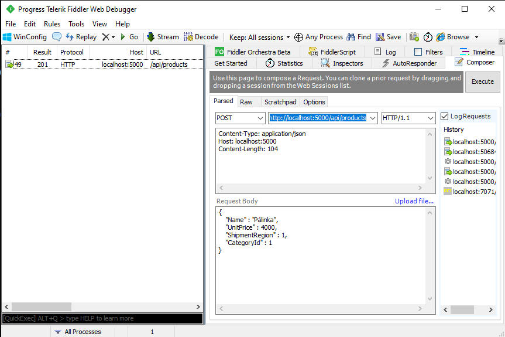

= ASP.NET Core webszolgáltatások I.-II.

== Kiegészítő anyagok, segédeszközök

* kapcsolódó GitHub repo: https://github.com/bmeaut/WebApiLab
** elég csak https://github.com/bmeaut/WebApiLab/archive/refs/heads/master.zip[zip-ként letölteni], nem kell klónozni 
* https://www.getpostman.com/[Postman] vagy https://www.telerik.com/download/fiddler[Fiddler Classic] HTTP kérések küldéséhez

== Kiinduló projektek beüzemelése

A kiinduló solution két .NET 6 osztálykönyvtárat foglal magába, melyek egy N-rétegű architektúra egy-egy rétegét valósítják meg:

* *WebApiLab.Dal*: lényegében az Entity Framework gyakorlatok anyagát tartalmazza, ez az adatelérési rétegünk.
** entitásdefiníciók
** kontext, modellkonfigurációval, kezdeti adatokkal
** connection string kezelés és SQL naplózás a korábbi gyakorlatok alapján
** migráció (még) nincs
* *WebApiLab.Bll*: ezt szánjuk az üzleti logikai rétegnek. Fő feladata, hogy a DAL-ra építve végrehajtsa az _Interfaces_ mappában definiált műveleteket.
** Interfaces - ez a BLL réteg specifikációja
** Services - ide kerülnek majd az üzleti logikát, ill. az interfészeket megvalósító osztály(ok)
** Dtos - csak később lesz szerepük, egyelőre nincsenek használva
** Exceptions - saját kivétel osztály, egyelőre nincs használva

Adjunk hozzá a solution-höz egy új C# nyelvű web API projektet (ASP.NET Core Web *API*, nem pedig Web App), a neve legyen _WebApiLab.Api_.

A következő dialógusablakban válasszuk ki az _.NET 6_ opciót. Az extrát közül ne kérjünk: HTTPS, Docker, authentikáció. Viszont hagyjuk bepipálva a Controller és az  OpenAPI támogatást. A generált projektből törölhetjük a minta API fájljait, azaz a _Weather_ kezdetű fájlokat a projekt gyökeréből és a _Controllers_ mappából.

Adjuk hozzá függőségként:

* a _BLL_ projektet (menu:projekten jobbklikk[Dependencies > Add Project Reference...])
* a _Microsoft.EntityFrameworkCore.Tools_ NuGet csomagot

== Az EF bekötése az ASP.NET Core DI, naplózó, konfiguráló rendszereibe

A kontext konfigurálása az EF gyakorlat során - mivel ott egy sima konzol alkalmazást írtunk - a kontext `OnConfiguring` függvényében történt. Mivel az ASP.NET Core projekt DI rendszert is ad, így érdemes a kontextet a DI rendszerbe regisztrálni, hogy a projekten belül a modulok/osztályok függőségként tudják használni. A regisztrálás a legfelső szintű kódban történik (lásd ASP.NET Core bevezető gyakorlatot). 

A kontext regisztrálása a legfelső szintű kódban a DI konténerbe:

[source,csharp]
----
builder.Services.AddDbContext<AppDbContext>(o =>
    o.UseSqlServer(builder.Configuration.GetConnectionString("DefaultConnection")));
----

Az EF naplózást az ASP.NET Core naplózó rendszere végzi, amit a kiinduló builder már inicializál, így ezzel kapcsolatban nincs teendőnk. Viszont egy új kontext konstruktorra lesz szükségünk, ami `DbContextOptions<AppDbContext>`-et vár.

A kontext `OnConfiguring`-jára pedig nincs szükség, úgyhogy töröljük ki, helyére tegyük az új konstruktort:

[source,csharp]
----
public AppDbContext(DbContextOptions<AppDbContext> options)
    : base(options)
{
}
----

Az Entity Framework gyakorlat alapján hozzunk létre egy új LocalDB adatbázist egy választott névvel, pl. neptun kód, northwind, stb. Az SQL Server Object Explorer-ből a connection string-et lopjuk el. (menu:nyissuk le az adatbáziskapcsolatot[jobbklikk az adatbázison > Properties > a Properties ablakból a _Connection String_ értéke]).

Az _appsettings.Development.json_-ba vegyük fel a connection string-et és a generált SQL megfigyeléséhez a _Microsoft_ kategóriájú naplók minimum szintjét csökkentsük _Information_-re.

[source,javascript]
----
/**/{
/**/  "Logging": {
/**/    "LogLevel": {
/**/      "Default": "Information",
          "Microsoft": "Information",
/**/    }
      }, //vessző bekerült
      "ConnectionStrings": {
         "DefaultConnection": "<connection string>"
      }
/**/}
----

TIP: Kukac (`@`) ilyenkor nem kell a connection string elé mert ez JSON. Az adatbáziskapcsolatot azért kellhet lenyitni, hogy az SQL Server Object Explorer csatlakozzon is az új adatbázishoz, ezután tudjuk megszerezni a connection stringet.

=== Adatbázis inicializálása Code-First migrációval

Fordítsuk a teljes solution-t, állítsuk be indítandó (startup) projektnek az új Web API projektet (menu:jobbklikk a projekten[Set as Startup Project]). A _Package Manager Console_-t nyissuk meg, és ellenőrizzük, állítsuk be Default Project-ként a DAL projektet. Készíttessük el a migrációt és futtassuk is le.

[source,powershell]
----
Add-Migration Init
Update-Database
----

WARNING: Fontos, hogy a fenti parancs két projektet ismerjen: azt, amelyikben a kontext van, ill. a kontextet használó futtatható projektet. A VS Package Manager Console-jában futtatva alapértelmezésben az előbbit a Default Project értéke adja meg, utóbbit az indítandó projekt. Továbbá ezeket a projekteket meg lehet adni https://docs.microsoft.com/en-us/ef/core/miscellaneous/cli/powershell#common-parameters[paraméterként] is.

TIP: Itt mutatkozik meg, hogy a migráció lényegében egy teljes alkalmazásindítást jelent a `Program` osztályon keresztül, inicializálódik a DI konténer, a konfigurációs objektum, stb.

Ellenőrizzük az SQL Server Object Explorer-ben, hogy rendben lefutott-e a migráció, létrejöttek-e az adatbázis objektumok, feltöltődtek-e a táblák.

== EF entitások használata az API felületen

Bár architektúra szempontból nem a legszebb, a BLL réteget gyakorlatilag mellőzve közvetlenül is használhatjuk az EF entitásokat a kontrollerek megvalósításánál. Ehhez használhatjuk a Visual Studio Entity Frameworkös Controller sablonjait. 

Adjuk hozzá az API projekthez a *Microsoft.VisualStudio.Web.CodeGeneration.Design* NuGet csomagot.

PMC-ben telepítsük az ASP.NET Core kódgeneráló eszközt
[source,powershell]
----
dotnet tool install -g dotnet-aspnet-codegenerator
----

Majd lépjünk be a projekt könyvtárába
[source,powershell]
----
cd .\WebApiLab.Api
----

Végül generáljunk a kódgenerálóval REST API (`-api`) kontrollert a `Product` entitáshoz (`-m`), mely az `AppDbContext` kontextushoz  (`-dc`) tartozik. A generált osztály neve legyen `EFProductController` (`-name`), az `WebApiLab.Api.Controllers` névtérbe  (`-namespace`) kerüljön. A generált fájl a *Controllers* mappába (`-outDir`) kerüljön.

[source,powershell]
----
dotnet aspnet-codegenerator controller -m WebApiLab.Dal.Entities.Product -dc WebApiLab.Dal.AppDbContext -outDir Controllers -name EFProductController -namespace WebApiLab.Api.Controllers -api
----

WARNING: Figyeljünk rá, hogy *ne* a `Dtos` névtérből adjuk meg a DTO típust a tényleges entitástípus helyett.

A legenerálódó kontroller már használható is. Állítsuk át a zöld nyíl mellett az indítási konfigurációt a projektnevesre, hogy ne IIS Express induljon és így lássuk a konzolon a naplót. Indítsuk a projektet és próbáljuk például lekérni az összes terméket az **api/efproduct** címről vagy a swagger felületről.

TIP: Érdemes a zöld nyíl melletti lenyílóban olyan böngészőt megadni (Chrome, Firefox), ami értelmes formában meg tudja jeleníteni a nyers JSON adatokat, ha nem swagger felületről tesztelünk.

TIP: Az alapértelmezésben megnyitandó URL útvonalat a projekt tulajdonságok között adhatjuk meg: menu:zöld nyíl melletti legördülő menü[<Projektnév> Debug Properties]. Ide egy a gyökércímhez képesti relatív útvonalrészt kell beírni. (pl. _api/efproduct_)

Figyeljük meg, hogy a controller a konstruktorban igényli meg a DI-tól az EF kontextet, amit a szokásos módon osztályváltozóban tárol el.

== Köztes réteg alkalmazása

A rétegezett architektúra elveit követve gyakori eljárás, hogy a kontroller nem éri el közvetlenül az EF kontextet, hanem csak egy extra rétegen keresztül. A kontroller projekt így függetleníthető az EF modelltől.

Ehhez a megoldáshoz készítsünk külön kontroller változatot. A _Controllers_ mappába hozzunk létre egy kontrollert (menu:Add[Controller > bal fában Common > API > jobb oldalon API Controller with read/write actions]) `ProductsController` néven.

A BLL projekt Services mappájába hozzunk létre egy új osztályt `ProductService` néven. Az új osztály kontroller számára nyújtandó funkcióit az `IProductService` adja meg. Implementáljuk ezt az interfészt, a kiinduló implementációt generáltassuk a Visual Studio-val. Konstruktorban várja a függőségként a kontextet. A kontext segítségével implementáljuk normálisan a `GetProducts` függvényt. _Eager Loading_ használatával az egyes termékekhez a kapcsolódó kategóriát és megrendeléseket is adjuk vissza.

[source,csharp]
----
public class ProductService : IProductService
{
    private readonly AppDbContext _context;

    public ProductService(AppDbContext context)
    {
        _context = context;
    }       

    public IEnumerable<Product> GetProducts()
    {
        var products = _context.Products
            .Include(p => p.Category)
            .Include(p => p.ProductOrders)
                .ThenInclude(po => po.Order)
            .ToList();

        return products;
    }
    /*Többi függvény generált implementációja*/
}
----

Injektáljunk `IProductService`-t a `ProductsController`-be.

[source,csharp]
----
private readonly IProductService _productService;

public ProductsController(IProductService productService)
{
    _productService = productService;
}
----

Adjuk meg a DI alrendszernek, hogy hogyan kell egy `IProductService` típusú függőséget létrehozni. A `ConfigureServices` függvénybe:

[source,csharp]
----
builder.Services.AddTransient<IProductService, ProductService>();
----

A függőség injektálás úgy működik, hogy kontrollereket is a központi DI komponens példányosítja, és ilyenkor megvizsgálja a konstruktor paramétereket. Ha a konténerben talál alkalmas beregisztrált osztályt, akkor azt létrehozza és átadja a konstruktornak. Ezt hívjuk konstruktor injektálásnak. Ha a létrehozandó függőségnek is vannak konstruktor paraméterei, akkor azokat is megpróbálja feloldani, így rekurzívan a teljes függőségi objektum hierarchiát le tudja kezelni (ha abban nincs irányított kör).

A regisztráció során több lehetőségünk is van. Egyrészt nem kötelező interfészt megadni egy osztály beregisztrálásához, az osztályt önmagában is be lehet regisztrálni, ilyenkor a konstruktorban is osztályként kell elkérni a függőségeket.

Háromféle példányosítási stratégiával regisztrálhatjuk be az osztályainkat:

* *Transient*: minden egyes injektálás során új példány jön létre
* *Scoped*: HTTP kérésenként egy példány kerül létrehozásra és a kérésen belül mindenkinek ez lesz injektálva
* *Singleton*: mindenkinek ugyanaz az egy példány kerül átadásra kéréstől függetlenül

Írjunk új `Get()` változatot az eredeti helyett a `ProductsController`-be az `IProductService` függőséget felhasználva:

[source,csharp]
----
[HttpGet]
public IEnumerable<Product> Get()
{
    return _productService.GetProducts();
}
----

Próbáljuk ki (`api/products`). Hibát kapunk, mert a `ProductService` lekérdező függvénye eager loading-gal (`Include`) navigációs property-ket is kitölt, így könnyen hivatkozási kör jön létre, amit a JSON sorosító alapértelmezésben kivétellel jutalmaz. A sorosítást a keretrendszer végzi, a kontrollerfüggvény visszatérési értékét sorosítja a HTTP tartalomegyeztetési szabályok szerint. Böngésző kliens esetén alapesetben JSON formátum lesz a befutó. Persze a sorosítás ennél közvetlenebbül is https://docs.microsoft.com/en-us/aspnet/core/web-api/advanced/formatting[konfigurálható], ha szükséges.

A kontrollerek által használt JSON sorosítót konfigurálhatjuk a `Startup.ConfigureServices`-ben, például beállíthatjuk, hogy ha egy objektumot már korábban sorosított, akkor csak hivatkozzon rá és ne sorosítsa újra.

[source,csharp]
----
/**/builder.Services.AddControllers()
    .AddJsonOptions(o => o.JsonSerializerOptions.ReferenceHandler = ReferenceHandler.Preserve);
----

Így már sikerülni fog a sorosítást, egy elég furcsa JSON-t láthatunk, ahol az első elem egy nagyobb objektumgráfot leíró rész, a többi elem pedig csak hivatkozás.

Ennek a megoldásnak a hátránya, hogy a kliensoldali sorosítónak is támogatnia kell ezt a sorosítási logikát, a JSON-on belüli kereszthivatkozások kezelését. 

Emiatt kommentezzük is ki ezt a beállítást, keressünk más megoldást.

== DTO osztályok

Láthattuk, hogy az entitástípusok közvetlen sorosítása gyakran nehézségekbe ütközik. A modell kifejezetten az EF számára lett megalkotva, illetve hogy a lekérdező műveleteket minél kényelmesebben végezhessük. A kliensoldal számára érdemes külön modellt megalkotni, egy ún. DTO (_Data Transfer Object_) modellt, ami a kliensoldal igényeit veszi figyelembe: **pontosan** annyi adatot és **olyan szerkezetben** tartalmaz, amire a kliensnek szüksége van.

A _BLL_ projektben jelenleg egy nagyon egyszerű DTO modell található a _DTOs_ mappában:

* rekord típusok alkotják a modellt
* nincs benne minden navigációs property, pl. `Category.Products`
* nincs benne a kapcsolótáblát reprezentáló entitás
* a termékből közvetlenül elérhetők a megrendelések

A különféle modellek közötti leképezésnél jól jönnek az ún. __object mapper__-ek, melyek segítenek elkerülni a leképezésnél nagyon gyakori repetitív kódokat, mint amilyen az `x.Prop=y.Prop` jellegű propertyérték-másolgatás.

Adjuk hozzá az API projekthez az _AutoMapper.Extensions.Microsoft.DependencyInjection_ csomagot, a BLL projekthez pedig az _AutoMapper_ csomagot. 

A leképezési konfigurációkat profilokba szervezve adhatjuk meg. Adjunk hozzá a projekthez egy új osztályt `WebApiProfile` néven a BLL projekt _DTOs_ mappába. Az AutoMapper konvenció alapon működik, tehát a DTO-entitás párokon kívül nem kell megadni például egyesével a property- vagy konstruktorparaméter-leképezéseket, ha a nevek alapján a leképezés kikövetkeztethető. Külön konfigurálásra csak a nem-triviális esetekben van szükség.

[source,csharp]
----
using AutoMapper;

namespace WebApiLab.Bll.Dtos;

public class WebApiProfile : Profile
{
    public WebApiProfile()
    {
        CreateMap<Dal.Entities.Product, Product>().ReverseMap();
        CreateMap<Dal.Entities.Order, Order>().ReverseMap();
        CreateMap<Dal.Entities.Category, Category>().ReverseMap();
    }
}

----

A DI konténerhez adjuk hozzá és konfiguráljuk a leképezési szolgáltatást.

[source,csharp]
----
builder.Services.AddAutoMapper(typeof(WebApiProfile));
----

TIP: Az AutoMapper az `AddAutoMapper` paramétereként megadott típust definiáló szerelvényben fogja a profilt keresni. A konkrét típusnak nincs más jelentősége, nem kell feltétlenül profilnak lenni.

Injektáltassuk be a leképzőt reprezentáló `IMapper` típusú objektumot a `ProductService`-be.

[source,csharp]
----
/**/private readonly NorthwindContext _context;
    private readonly IMapper _mapper;
/**/
/**/public ProductService(NorthwindContext context
                        , IMapper mapper)
/**/{
/**/    _context = context;
        _mapper = mapper;
/**/}
----

A `ProductsController`-ben, az `IProductService`-ben és a `ProductService`-ben az entitásokra mutató névteret cseréljük ki a DTO-kra mutatóra:

[source,csharp]
----
//using WebApiLab.Dal.Entities;
using WebApiLab.Bll.Dtos;
----

Írjuk át a lekérdezést a `ProductService`-ben a leképzőt alkalmazva:

[source,csharp]
----
/**/public IEnumerable<Product> GetProducts()
/**/{
/**/    var products = _context.Products
            .ProjectTo<Product>(_mapper.ConfigurationProvider)
            .AsEnumerable();
/**/    return products;
/**/}
----

Hogy ne zavarjanak be a swaggernek az ``EFProductController``ben használt entitás osztályok, töröljük ki a Controllers mappából az ``EFProductController``t!

Próbáljuk ismét meghívni böngészőből, figyeljük meg a naplóban, hogy milyen SQL lekérdezés fut le.

TIP: A többrétegű architektúránál elméletben minden rétegnek külön objektummodellje kellene, hogy legyen DAL: EF entitások, BLL: https://en.wikipedia.org/wiki/Domain_model[domain objektumok], Kontroller: DTO-k, viszont ha a domain objektumok nem visznek plusz funkciót a rendszerbe, akkor el szoktuk hagyni.

A DTO leképezést más rétegben is végezhetnénk. Egyes megközelítések szerint a kontroller réteg feladata lenne, azonban, ha az EF lekérdezésekkel összevonva végezzük a leképezést, akkor kiaknázhatjuk a _query result shaping_ előnyeit, azaz csak azt kérdezzük le az adatbázisból, amire a leképezésnek szüksége van. Az AutoMapper `ProjectTo` függvénye ráadásul mindezt el is intézi helyettünk a leképezési konfiguráció alapján.

TIP: A `ProjectTo` speciálisan `IQueryable`-n működik. Ha csak simán memóriabeli objektumok között szeretnénk leképezni, akkor az `IMapper` `Map<>` függvényét hívjuk. A memóriabeli  leképezésnek hátránya, hogy EF szinten gondoskodnunk kell róla, hogy `Include` hívásokkal a leképezéshez szükséges kapcsolódó entitásokat is lekérdezzük. A `ProjectTo` ezt is elintézi helyettünk.

A `ProjectTo` metódust felfoghatjuk a továbbiakban egy LINQ-s `Select()` operátornak, annyi különbséggel, hogy az AutoMapper generálja azt az ``Expression``t, ami alapján előáll majd az eredmény.

== BLL funkciók implementációja

=== Egy elem lekérdezése

Valósítsunk meg további interfész által előírt funkciókat a `ProductService` osztályban:

[source,csharp]
----
/**/public Product GetProduct(int productId)
/**/{
        return _context.Products
            .ProjectTo<Product>(_mapper.ConfigurationProvider)
            .SingleOrDefault(p => p.Id == productId)
            ?? throw new EntityNotFoundException("Nem található a termék");
/**/}
----

=== Beszúrás

Ez hasonló az EF gyakorlaton látottakhoz, csak itt nem kell legyártanunk az új `Product` példányt, paraméterként kapjuk és memóriában leképezzük az enititásra. A `SaveChanges` hívás után a kulcs értéke már ki lesz töltve (adatbázis osztja ki a kulcsot).

[source,csharp]
----
public Product InsertProduct(Product newProduct)
{
    var efProduct = _mapper.Map<Dal.Entities.Product>(newProduct);
    _context.Products.Add(efProduct);
    _context.SaveChanges();
    return GetProduct(efProduct.Id);
}
----

=== Módosítás

Konvenció szerint külön paraméterként szokták átadni a módosítandó elem azonosítóját és az új értékeket összefogó példányt. Leképezés után összeállítunk egy olyan entitás példányt, mint amilyet az adatbázisból kérdeztünk volna le - viszont ez a példány nem lesz a kontext látókörében. Az `Attach` függvény hasonló az `Add`-hoz, hozzáadja a kontext nyilvántartásához a példányt, de az `Attach` alapesetben nem jelöli meg a státuszt, marad változatlan (_Unchanged_). Explicit megjelöljük változottként, a változást végül a SaveChanges érvényesíti.

[source,csharp]
----
public void UpdateProduct(int productId, Product updatedProduct)
{
    var efProduct = _mapper.Map<Dal.Entities.Product>(updatedProduct);
    efProduct.Id = productId;
    _context.Entry(efProduct).State = EntityState.Modified;
    _context.SaveChanges();
}
----

TIP: Alternatíva lehetne még ennél a függvény esetében, hogy lekérdezzük azonosító (`Id`) alapján az entitást és AutoMapperrel a lekérdezett objektumba mappeljük a DTO-t. Ebben az esetben nincs szükség `Attach`-ra és állapotkezelésre sem, viszont extra lekérdezéssel jár.

=== Törlés

Egy trükkel elkerülhetjük, hogy le kelljen kérdezni a törlendő terméket. Az azonosító alapján előállítunk memóriában egy példányt a megfelelő kulccsal, majd `Remove` függvénnyel hozzáadjuk a kontexthez. A `Remove` törlendőnek jelöli a példányt.

[source,csharp]
----
public void DeleteProduct(int productId)
{
    _context.Products.Remove(new Dal.Entities.Product(null!) { Id = productId });
    _context.SaveChanges();
}
----

== REST konvenciók alkalmazása

A REST megközelítés nem csak átviteli közegnek tekinti a HTTP-t, hanem a protokoll részeit felhasználja, hogy kiegészítő információkat vigyen át. Emiatt előnyös lenne, ha nagyobb ellenőrzésünk lenne a HTTP válasz felett - szerencsére az ASP.NET Core biztosítja ehhez a megfelelő API-kat.

Egyik legegyszerűbb ilyen irányelv, hogy a lekérdezések eredményeként, ha megtaláltuk és visszaadtuk a kért adatokat, akkor *200 (OK)* HTTP válaszkódot adjunk.

TIP: A HTTP kérést érintő irányelvekről egy jó összefoglaló elérhető https://www.restapitutorial.com/lessons/httpmethods.html[itt].

Az eddig megírt `Get()` függvényünk most is *200 (OK)*-ot ad, ezt le is ellenőrizhetjük a böngészőnk hálózati monitorozó eszközében.

TIP: A HTTP kommunikáció megfigyelésére használhatjuk a böngészők beépített eszközeit, minta amilyen a https://developer.mozilla.org/en-US/docs/Tools[Firefox Developer Tools], illetve https://developers.google.com/web/tools/chrome-devtools/[Chrome DevTools]. Általában az kbd:[F12] billentyűvel aktiválhatók. Emellett, ha egy teljesértékű HTTP kliensre van szükségünk, amivel például könnyen tudunk nem csak GET kéréseket küldeni, akkor a https://www.getpostman.com/[Postman] és a https://www.telerik.com/download/fiddler[Fiddler Classic] külön telepítendő eszközök ajánlhatók. A Fiddler, mint proxy megoldás, egy Windows gépen folyó HTTP kommunikáció megfigyelésére is alkalmas.

Első körben a két lekérdező függvényt írjuk át úgy, hogy a HTTP válaszkódokat explicit megadjuk. A jelenlegi legmodernebb mód ehhez az `ActionResult<>` használata. Elég `T`-t visszaadnunk a függvényben, automatikusan `ActionResult<T>` típussá konvertálódik. Tehát elvileg írhatnánk ezt:

[source,csharp]
----
//NEM FORDUL!
/**/[HttpGet]
    public ActionResult<IEnumerable<Product>> Get() 
        //ActionResult<T> visszatérési érték
/**/{
/**/    return _productService.GetProducts();
/**/}
----

Azonban ez nem fordul, mert interfész típus esetén nem működik a konverzió. Konkrét típust, pl. egy listát kell megadnunk.

[source,csharp]
----
/**/[HttpGet]
/**/public ActionResult<IEnumerable<Product>> Get()
/**/{
        return _productService.GetProducts().ToList(); //ToList bekerült            
/**/}
----

Írjuk meg ugyanígy a másik `Get` függvényt is:

[source,csharp]
----
/**/[HttpGet("{id}", Name = "Get")]
    public ActionResult<Product> Get(int id)
        //ActionResult<Product> visszatérési érték
/**/{
        return _productService.GetProduct(id);
/**/}
----

Próbáljuk ki mindkét kontroller függvényt (_api/products_, _api/products/1_), ellenőrizzük a státuszkódokat is.

Ami fura, hogy még mindig nem állítottunk explicit státuszkódokat. A logikánk most még nagyon egyszerű, csak a hibamentes ágat kezeltük, így eddig az `ActionResult` alapértelmezései megoldották, hogy *200 (OK)*-ot kapjunk.

Most viszont következzen egy létrehozó művelet:

[source,csharp]
----
/**/[HttpPost]
    public ActionResult<Product> Post([FromBody] Product product)
        //ActionResult<T> visszatérési érték + Product paraméter
/**/{
        var created = _productService.InsertProduct(product);
        return CreatedAtAction(nameof(Get), new { id = created.Id }, created);
/**/}
----

Itt már látszik az `ActionResult` haszna. A konvenciónak megfelelően 201-es kódot akarunk visszaadni. Ehhez a `ControllerBase` ősosztály biztosít segédfüggvényt. A segédfüggvény olyan `ActionResult` leszármazottat ad vissza, ami 201-es kódot szolgáltat a kliensnek. Másik konvenció, hogy a _Location_ HTTP fejlécben legyen egy URL az új termék lekérdező műveletének meghívásához. Ezt az URL-t rakjuk össze a `CreatedAtAction` paraméterei révén.

Gyakori, hogy a lefele irányú (kliens felé) bővebb adathalmaz kerül leküldésre, mint amit egy létrehozáskor vagy módosításkor várunk. Esetünkben is az `Orders` és a `Category` propertyk létrehozáskor feleslegesek. Erre a célra jobb egy külön DTO-t létrehozni, ami csak a megfelelő adatokat tartalmazza. Most ideiglenesen tegyük nullozhatóvá ezt a két propertyt.

[source,csharp]
----
public record Product
{
    /*többi property*/
    public Category? Category { get; init; } //? módosító bekerült
    public List<Order>? Orders { get; init; } //? módosító bekerült
}
----

Próbáljuk ki a műveletet Swagger felületről. Egy `Product`-ot kell felküldenünk. erre egy példa érték:

[source,javascript]
----
{
    "Name" : "Pálinka",
    "UnitPrice" : 4000,
    "ShipmentRegion" : 1,
    "CategoryId" : 1
}
----

WARNING: Ha Fiddlerből vagy Postmanből tesztelünk, ne felejtsük el a _Content-Type_ fejlécet  *application/json*-re állítani! Figyeljük meg a kapott választ. A válaszból másoljuk ki a _Location_ fejlécből az URL-t és hívjuk meg böngészőből.

Fiddler Classic példa POST hívásra:

A módosító, törlő műveleteknél a konvenció megengedi, hogy üres törzsű (body) választ adjunk, ilyenkor a válaszkód *204 (No Content)*. Ilyesfajta válasz előállításához is van segédfüggvény, illetve elég csak az `ActionResult` típust megadni visszatérési típusnak:

[source,csharp]
----
/**/[HttpPut("{id}")]
    public ActionResult Put(int id, [FromBody] Product product)
         //ActionResult visszatérési érték + Product paraméter
/**/{
        _productService.UpdateProduct(id, product);
        return NoContent();
/**/}

/**/[HttpDelete("{id}")]
public ActionResult Delete(int id)
     //ActionResult visszatérési érték
/**/{
        _productService.DeleteProduct(id);
        return NoContent();
/**/}
----

TIP: PUT mellett a módosításhoz használatos a PATCH is. A PUT konvenció szerint teljes, míg a PATCH részleges felülírásnál használatos. PATCH esetén általában valamilyen patch formátumú adatot küld a kliens, pl. https://tools.ietf.org/html/rfc6902[RFC 6902 - JSON Patch]. A JSON Patch formátumot jelenleg csak a JSON korábbi sorosító (_Newtonsoft.Json_) https://docs.microsoft.com/en-us/aspnet/core/web-api/jsonpatch[támogatja].

TIP: Gyakori, hogy a PUT művelet esetében nem 204 No Content válasszal térünk vissza, hanem 200 OK státuszkóddal és a módosított erőforrással, hogy a kliens a tényleges érvényre jutott értékekkel befrissíthesse a saját adatait.

Próbáljuk kitörölni az újonnan felvett terméket Swaggerből/Fiddler/Postman-ből (_DELETE_ igés kérés az `api/products/<új id>` címre, üres törzzsel). Sikerülnie kell, mert még nincs rá idegen kulcs hivatkozás.

== Hibakezelés

Eddig főleg csak a hibamentes ágakat (happy path) néztük. A REST konvenciók rendelkeznek arról is, hogy bizonyos hibahelyezetekben milyen https://httpstatuses.com[HTTP választ] illik adni, például ha a kérésben hivatkozott azonosító nem létezik - 404-es hiba a bevett eljárás. Státuszkódok szempontjából a korábban idézett oldal ad segítséget, a válasz törzsében a hibaüzenet szerkezete tekintetében az https://tools.ietf.org/html/rfc7807[RFC 7807] ad iránymutatást az ún. _Problem Details_ típusú válaszok bevezetésével. Az ASP.NET Core 2.1-es verzió óta támogatja a _Problem Details_ válaszokat, és általában automatikusan ilyen válaszokat küld.

=== 400 Bad Request

Kezdjük a kliens által küldött nem helyes adatokkal. Ez a hibakód nem összekeverendő a 415-tel, ahol az adat formátuma nem megfelelő (XML vagy JSON): ezt általában nem kell kézzel lekezeljük, mivel ezt az ASP.NET megteszi helyettünk. 400-zal olyan hibákat szoktunk lekezelni, ahol a küldött adat formátuma megfelelő, de valamilyen saját validációs logikának nem felel meg a kapott objektum pl.: egységár nem lehet negatív stb.

Itt használjuk fel a .NET ún. https://docs.microsoft.com/en-us/aspnet/core/mvc/models/validation#built-in-attributes[_Data Annotation_ attribútumait], amiket a DTO-kon érvényesíthetünk, és az ASP.NET Core figyelembe vesz a művelet végrehajtása során. Vegyük fel a `Product` DTO osztályban néhány megkötést attribútumok formájában.

[source,csharp]
----
    [Required(ErrorMessage = "Product name is required.", AllowEmptyStrings = false)]
/**/public string Name { get; init; }

    [Range(1, int.MaxValue, ErrorMessage = "Unit price must be higher than 0.")]
/**/public int UnitPrice { get; init; }
----

Próbáljuk ki egy *POST /api/Products* művelet meghívásával. Paraméterként kiindulhatunk a felület által adott minta JSON-ból, csak töröljük ki a navigációs property-ket és sértsük meg valamelyik (vagy mindkét) fenti szabályt. Egy példa törzs:

[source,javascript]
----
{
    "Name" : "",
    "UnitPrice" : 0,
    "ShipmentRegion" : 1,
    "CategoryId" : 1
}
----

A válasz 400-as kód és valami hasonló, RFC 7807-nek megfelelő törzs lesz:

[source,javascript]
----
{
    "type": "https://tools.ietf.org/html/rfc7231#section-6.5.1",
    "title": "One or more validation errors occurred.",
    "status": 400,
    "traceId": "|2f35d378-4420cbafb80aec04.",
    "errors": {
        "Name": [
            "Product name is required."
        ],
        "UnitPrice": [
            "Unit price must be higher than 0."
        ]
    }
}
----

=== 404 Not Found - kontroller szinten

Konvenció szerint 404-es hibát kellene adnunk, ha a keresett azonosítóval nem található erőforrás - esetünkben termék. Jelenleg a `ProductService` `EntityNotFoundException`-t dob, és amennyiben Development módban futtatjuk az alkalmazást, a cifra hibaoldal jelenik meg, amit a _DeveloperExceptionPage_ middleware generál. Ha kivesszük a middleware-t (vagy nem Development módban indítjuk, de ekkor gondoskodnunk kell connection string-ről, ami eddig csak a Development konfigurációban volt beállítva), akkor 500-as hibát kapunk vissza.

WARNING: A kezeletlen kivételek általában 500-as hibakód formájában kerülnek vissza a kliensre, mindenfajta egyéb információ nélkül (üres oldalként jelenik meg). Ez a jobbik eset, ahhoz képest, ha a teljes kivételszöveg és stack trace is visszakerülne. Az átlagos felhasználók nem tudják értelmezni, viszont a támadó szándékúaknak értékes információt jelenthet, így ajánlott elkerülni, hogy a kivétel ilyen módon kijusson. Ez az elkerülés az úgynevezett _exception shielding_ technika, és az ASP.NET Core alapértelmezetten alkalmazza.

Legegyszerűbb módszer a kontroller műveletben érvényesíteni a konvenciót:

[source,csharp]
----
/**/[HttpGet("{id}", Name = "Get")]
/**/public ActionResult<Product> Get(int id)
/**/{
        try
        {
/**/        return _productService.GetProduct(id);
        }
        catch (EntityNotFoundException)
        {
            return NotFound();
        }
/**/}
----

TIP: Alternatív megoldás, hogy a `ProductService` egy `null` értékkel jelezné, hogy nincs találat. Ezesetben a fenti kódban a `null` értékre kellene vizsgálni, pl. `if` szerkezettel.

Próbáljuk ki egy, hogy 404-es státuszkódot és annak megfelelő _problem details_-t kapunk-e, ha egy nem létező termékazonosítóval hívjuk a fenti műveletet.

Ha saját _problem details_-t szeretnénk a 404-es kód mellé, akkor kézzel összerakhatjuk és visszaküldhetjük.

[source,csharp]
----
/**/catch (EntityNotFoundException)
/**/{
        ProblemDetails details= new ProblemDetails
        {
            Title = "Invalid ID",
            Status = StatusCodes.Status404NotFound,
            Detail = $"No product with ID {id}"
        };
        return NotFound(details); //ProblemDetails átadása
/**/}
----

Így is próbáljuk ki. Az általunk megadott üzenetet kell visszakapjuk.

=== 404 Not Found - globális kivételleképezéssel

A rendhagyó válaszok előállításánál előnyös lehet, ha az alacsonyabb rétegekből specifikus kivételeket dobunk, mert ezeket egy központi helyen szisztematikusan átalakíthatjuk konvenciónak megfelelő HTTP válaszokká. Ez a képesség egyelőre még nem érhető el beépítetten, ezért egy https://github.com/khellang/Middleware[közösségi fejlesztésű NuGet csomagot] használunk fel.

Telepítsük fel a _Hellang.Middleware.ProblemDetails_ csomagot az API projektbe. Megtehetjük a szokásos módon, de akár a _Package Manager Console_-ból is a következő paranccsal (az API projekt legyen megadva, mint _Default Project_):

[source,powershell]
----
Install-Package Hellang.Middleware.ProblemDetails
----

Szokás szerint konfiguráljuk a legfelső szintű kódban. Sose adjuk vissza a kivétel részleteit (szigorú _exception shielding_), illetve a saját kivételtípusunkat képezzük le 404-es hibára.

[source,csharp]
----
builder.Services.AddProblemDetails(options =>
{
    options.IncludeExceptionDetails = (ctx,ex) => false;
    options.MapToStatusCode<EntityNotFoundException>(StatusCodes.Status404NotFound);
});
----

Illesszük a pipeline-ba a legelső helyre:

[source,csharp]
----
/**/var app = builder.Build();
    app.UseProblemDetails();
----

Térjünk vissza a korábbi, nem kivétel-elkapós változatra, az előzőt kommentezzük ki:

[source,csharp]
----
[HttpGet("{id}", Name = "Get")]
public ActionResult<Product> Get(int id)
{
    return _productService.GetProduct(id);
}
----

Próbáljuk ki: hasonlóan kell működjön, mint a kontroller szintű változat, de ez általánosabb, bármely műveletből `EntityNotFoundException` érkezik, azt kezeli, nem kell minden műveletben megírni a kezelő logikát.

=== 500 Internal Server Error

Próbáljunk kitörölni egy nem létező terméket **DELETE api/products/<nem létező id>** kéréssel. Az újonnan beállított MW a nem kezelt kivétel esetén is egy alapszintű Problem Details választ állít elő 500-as kóddal.

=== Azonosítók ellenőrzése

Készítsük fel a módosító és törlő műveleteket is a nem létező azonosítók konvenció szerinti kezelésére.

[source,csharp]
----
/**/public void UpdateProduct(int productId, Product updatedProduct)
/**/{
/**/    /*...*/
        try
        {
/**/         _context.SaveChanges();
        }
        catch (DbUpdateConcurrencyException)
        {
            if (!_context.Products.Any(p => p.Id == productId))
                throw new EntityNotFoundException("Nem található a termék");
            else
                throw;
        }
/**/}

/**/public void DeleteProduct(int productId)
/**/{
/**/    /*...*/     
        try
        {
/**/        _context.SaveChanges();
        }
        catch (DbUpdateConcurrencyException)
        {
            if (!_context.Products.Any(p => p.Id == productId))
                throw new EntityNotFoundException("Nem található a termék");
            else
                throw;
        }
/**/}
----

Ez egy optimista megközelítés: feltételezzük, hogy helyes azonosítót kapunk. Ha kivételes esetben mégsem, akkor az UPDATE/INSERT utasítás nem a megfelelő számú sort módosítja és `DbUpdateConcurrencyException`-t kapunk. Ekkor vizsgáljuk csak meg, hogy az azonosító helyes-e.

TIP: Egy másik megközelítés szerint a DELETE műveletnek idempotensnek kellene lennie, tehát egymás után többször végrehajtva is sikeres eredményt kell kapjunk. Ez azt is jelenti, hogy 404-es hiba helyet 204 No Content státuszkódot kell küldenünk akkor is, ha nem található adott ID-val entitás. Ez a jelenlegi kódban egyszerűen implementálhatjuk, hogy nem dobunk kivételt az megfelelő ágban.

=== Saját hibaüzenet

Módosítsuk a hibakezelő MW konfigurációját a `Startup.ConfigureServices` függvényben, hogy a kivétel szövege bekerüljön a válaszba. Ez akkor lehet hasznos, ha a felhasználónak kiírandó hibaüzenetet is vissza akarjuk küldeni (másik lehetőség, hogy a kliens állítja elő, pl. a státuszkód alapján).

[source,csharp]
----
/**/services.AddProblemDetails(options =>
/**/{
/**/    options.IncludeExceptionDetails = (ctx, ex) => false;
        options.Map<EntityNotFoundException>(
            (ctx, ex) =>
            {
                var pd=StatusCodeProblemDetails.Create(StatusCodes.Status404NotFound);
                pd.Title = ex.Message;
                return pd;
            }
        );
/**/});
----

WARNING: Az _exception shielding_ elv miatt csak olyan kivételeknél alkalmazzuk, ahol a felhasználók számára hasznos, de nem technikai jellegű információt tartalmaz a kivétel szövege.

Próbáljuk ki, hogy az egy termék lekérdezésénél, a módosításnál és a törlésnél is, a rossz azonosító egységesen működik-e: 404-es hibát ad vissza, a Problem Details-ben a kivétel szövegével.

== Aszinkron műveletek

Aszinkron műveletek alkalmazásával hatékonyságjavulást érhetünk el: nem feltétlenül az egyes műveletink lesznek gyorsabbak, hanem időegység alatt több műveletet tudunk kiszolgálni. Ennek oka, hogy az `await`-nél (például egy adatbázis művelet elküldésekor) a várakozási idejére történő kiugrásnál, ha vissza tudunk ugrálni egészen az ASP.NET engine szintjéig, akkor a végrehajtó környezet a kiszolgáló szálat a várakozás idejére más kérés kiszolgálására felhasználhatja.

TIP: Ökölszabály, hogy ha elköteleztük magunkat az aszinkronitás mellett, akkor ha megoldható, az aszinkronitást vezessük végig a kontrollertől az adatbázis művelet végrehajtásáig minden rétegben. Ha egy API-nak van _TAP_ jellegű változata, akkor azt részesítsük előnyben (pl. `SaveChanges` helyett `SaveChangesAsync`). Ha aszinkronból szinkronba váltunk, csökkentjük a hatékonyságot, rosszabb esetben deadlock-ot is https://blog.stephencleary.com/2012/07/dont-block-on-async-code.html[előidézhetünk].

Vezessük végig az aszinkronitást egy művelet teljes végrehajtásán:

[source,csharp]
----
// Service réteg - interfész

/**/public interface IProductService
/**/{
        //void UpdateProduct(int productId, Product updatedProduct);
        Task UpdateProductAsync(int productId, Product updatedProduct);
/**/    //többi fv.
/**/}

// Service réteg - implementáció

    public async Task UpdateProductAsync(int productId, Product updatedProduct)
/**/{
/**/    var efProduct = _mapper.Map<Dal.Entities.Product>(updatedProduct);
/**/    efProduct.Id = productId;
/**/    var entry = _context.Attach(efProduct);
/**/    entry.State = EntityState.Modified;
/**/
/**/    try
/**/    {
            await _context.SaveChangesAsync(); //async változat hívása
/**/    }
/**/    catch (DbUpdateConcurrencyException)
/**/    {
/**/          if (!await _context.Products
                        .AnyAsync(p => p.Id == productId))
            //async változat hívása
/**/               throw new EntityNotFoundException("Nem található a termék");
/**/        else
/**/            throw;
/**/    }
/**/}

// Kontroller réteg

    public async Task<IActionResult> Put(int id, [FromBody] Product product)
/**/{
/**/  await _productService.
                .UpdateProductAsync(id, product);
                //async változat hívása 
/**/  return NoContent();
/**/}
----

WARNING: Az _Async_ végződés alkalmazása kontroller műveletek nevében jelenleg nem ajánlott, mert könnyen https://github.com/dotnet/aspnetcore/issues/8998[hibákba futhatunk].

Próbáljuk ki, például küldjünk PUT-ot az `api/products/1` címre, állítsuk be a _Content-Type: application/json_ fejlécet és a POST-nál használt JSON-t küldjük a törzsben. Ezzel az 1-es `id`-jű termék adatait fogjuk felülírni.

== Végállapot

A többi műveletet aszinkronizálva az alábbi a végállapot (elérhető a kapcsolódó GitHun repo https://github.com/bmeaut/WebApiLab/tree/net6[net6-os ágán] is):

[source,csharp]
----
public interface IProductService
{
    public Task<Product> GetProductAsync(int productId);
    public Task<IEnumerable<Product>> GetProductsAsync();
    public Task<Product> InsertProductAsync(Product newProduct);
    public Task UpdateProductAsync(int productId, Product updatedProduct);
    public Task DeleteProductAsync(int productId);
}

public class ProductService : IProductService
{
    private readonly AppDbContext _context;
    private readonly IMapper _mapper;

    public ProductService(AppDbContext context, IMapper mapper)
    {
        _context = context;
        _mapper = mapper;
    }

    public async Task<Product> GetProductAsync(int productId)
    {
        return await _context.Products
            .ProjectTo<Product>(_mapper.ConfigurationProvider)
            .SingleOrDefaultAsync(p => p.Id == productId)
            ?? throw new EntityNotFoundException("Nem található a termék");
    }

    public async Task<IEnumerable<Product>> GetProductsAsync()
    {
        var products = await _context.Products
            .ProjectTo<Product>(_mapper.ConfigurationProvider)
            .ToListAsync();

        return products;
    }

    public async Task<Product> InsertProductAsync(Product newProduct)
    {
        var efProduct = _mapper.Map<Dal.Entities.Product>(newProduct);
        _context.Products.Add(efProduct);
        await _context.SaveChangesAsync();
        return await GetProductAsync(efProduct.Id);
    }

    public async Task UpdateProductAsync(int productId, Product updatedProduct)
    {
        var efProduct = _mapper.Map<Dal.Entities.Product>(updatedProduct);
        efProduct.Id = productId;
        var entry = _context.Attach(efProduct);
        entry.State = EntityState.Modified;
        try
        {
            await _context.SaveChangesAsync();
        }
        catch (DbUpdateConcurrencyException)
        {
            if (!await _context.Products.AnyAsync(p => p.Id == productId))
                throw new EntityNotFoundException("Nem található a termék");
            else
                throw;
        }
    }

    public async Task DeleteProductAsync(int productId)
    {
        _context.Products.Remove(
            new Dal.Entities.Product(null!) { Id = productId });
        try
        {
            await _context.SaveChangesAsync();
        }
        catch (DbUpdateConcurrencyException)
        {
            if (!await _context.Products.AnyAsync(p => p.Id == productId))
                throw new EntityNotFoundException("Nem található a termék");
            else
                throw;
        }
    }
}

[Route("api/[controller]")]
[ApiController]
public class ProductController : ControllerBase
{
    private readonly IProductService _productService;

    public ProductController(IProductService productService)
    {
        _productService = productService;
    }

    // GET: api/<ProductController>
    [HttpGet]
    public async Task<ActionResult<IEnumerable<Product>>> Get()
    {
        return (await _productService.GetProductsAsync()).ToList();
    }

    // GET api/<ProductController>/5
    [HttpGet("{id}")]
    public async Task<ActionResult<Product>> Get(int id)
    {
        return await _productService.GetProductAsync(id);
    }

    // POST api/<ProductController>
    [HttpPost]
    public async Task<ActionResult<Product>> Post([FromBody] Product product)
    {
        var created = await _productService.InsertProductAsync(product);
        return CreatedAtAction(nameof(Get), new { id = created.Id }, created);
    }

    // PUT api/<ProductController>/5
    [HttpPut("{id}")]
    public async Task<ActionResult> Put(int id, [FromBody] Product value)
    {
        await _productService.UpdateProductAsync(id, value);
        return NoContent();
    }

    // DELETE api/<ProductController>/5
    [HttpDelete("{id}")]
    public async Task<ActionResult> Delete(int id)
    {
        await _productService.DeleteProductAsync(id);
        return NoContent();
    }
}
----