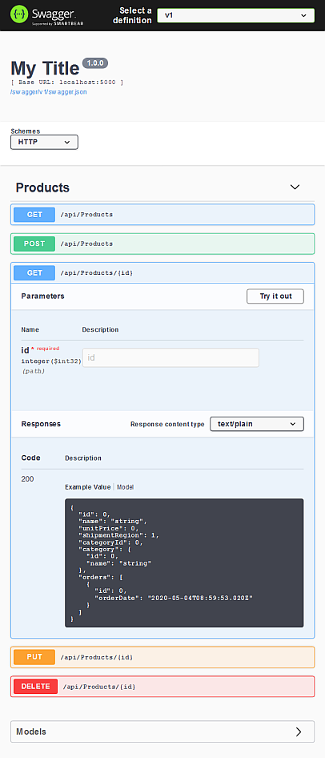
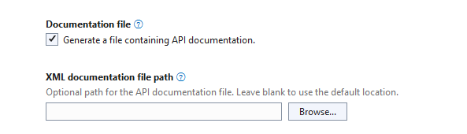
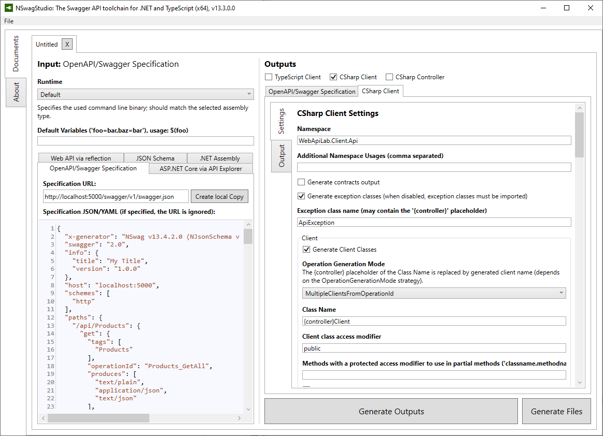
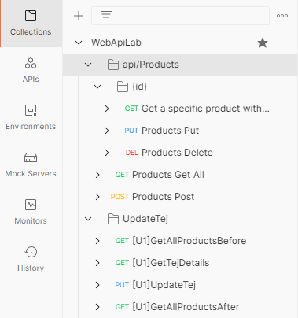
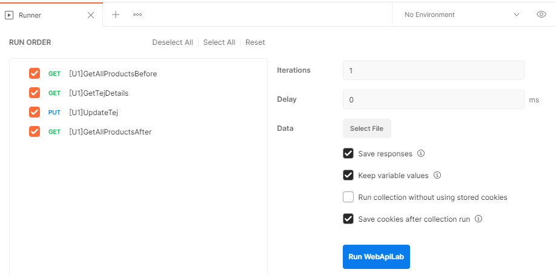
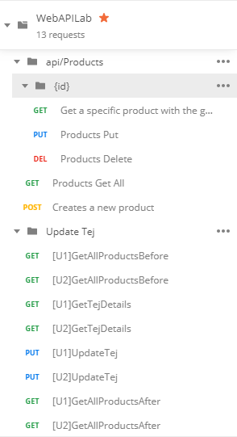
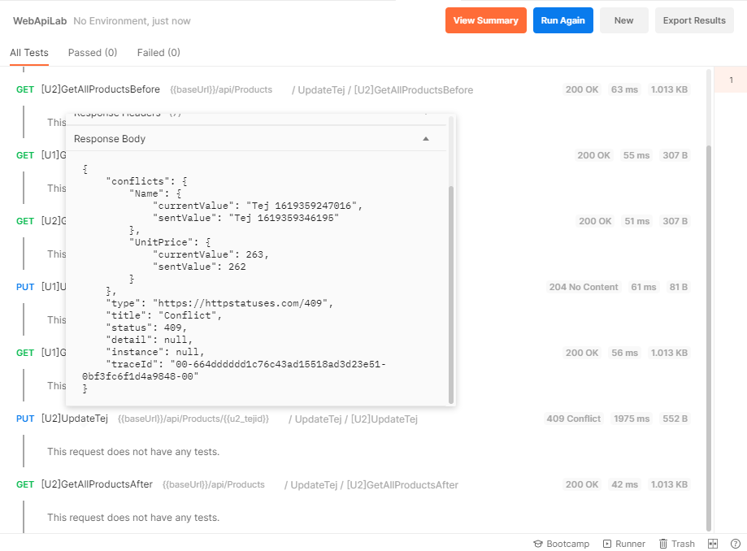

= ASP.NET Core webszolgáltatások III.

== Kiegészítő anyagok, segédeszközök

* kapcsolódó GitHub repo: https://github.com/bmeaut/WebApiLab
** elég csak https://github.com/bmeaut/WebApiLab/archive/refs/heads/net6-client-init.zip[zip-ként letölteni] a `net6-client-init` ágat, nem kell klónozni 
* https://github.com/RicoSuter/NSwag/wiki/NSwagStudio[NSwag Studio] - itt is elég csak a https://github.com/RicoSuter/NSwag/releases/latest[legfrissebb zip verziót] az *Assets* részről letölteni
* https://www.getpostman.com/[Postman] HTTP kérések küldéséhez

== Kiinduló projektek beüzemelése

Csak ki kell csomagolni a zip-et, ez az előző gyakorlat folytatása - a kódot ismerjük.
Ha nincs már meg az adatbázisunk, akkor az előző gyakorlat alapján hozzuk létre az adatbázist Code-First migrációval (`Update-Database`).

== Egyszerű kliens

A tárgy tematikájának ugyan nem része a kliensoldal, de demonstrációs céllal egy egyszerű kliensoldalról indított hívást implementálunk. A webes API-khoz nagyon sokféle technikával írhatunk klienst, mivel gyakorlatilag csak két képességgel kell rendelkezni:

* HTTP alapú kommunikáció, HTTP kérések küldése, a válasz feldolgozása
* JSON sorosítás

A fentiekhez szinte minden manapság használt kliensoldali technológia ad támogatást. Mi most egy sima, .NET 6 alapú konzol alkalmazást írunk kliens gyanánt.

A két képességet könnyen lefedhetjük a *System.Net.Http* (HTTP kommunikáció) és a *System.Text.Json* (JSON sorosítás) csomagokkal. Mindkettő a *Microsoft.NetCore.App* shared framework része, így általában nem kell külön beszereznünk őket.

Adjunk a solution-höz egy konzolos projektet (Console App (.NET 6), **nem .NET Framework!**) _WebApiLab.Client_ néven. A _Program.cs_-ben írjuk meg az egy terméket lekérdező függvényt (`GetProductAsync`) és hívjuk meg.

[source,csharp]
----
Console.Write("ProductId: ");
var id = Console.ReadLine();
if(id != null)
    await GetProductAsync(int.Parse(id));

Console.ReadKey();

static async Task GetProductAsync(int id)
{
    using var client = new HttpClient();

    /*Ha eltér, a portot írjuk át a szervernek megfelelően*/
    var response = await client.GetAsync(new Uri($"http://localhost:5184/api/Products/{id}"));
    response.EnsureSuccessStatusCode();
    var jsonStream = await response.Content.ReadAsStreamAsync();
    var json = await JsonDocument.ParseAsync(jsonStream);
    Console.WriteLine($"{json.RootElement.GetProperty("name")}:" +
        $"{json.RootElement.GetProperty("unitPrice")}.-");
}
----

TIP: Az elterjedtebb .NET alapú kliensek, a WinForms, WPF alkalmazások a legutóbbi időkig .NET Framework alapúak voltak, viszont már egy ideje a .NET 6 is támogatja a WinForms, WPF, WinUI, MAUI (régi Xamarin) alkalmazásokat. Célszerű ezeket választani a régi .NET Framework alapú változatok helyett.

Állítsuk be, hogy a szerver és a kliensoldal is elinduljon (menu:solutionön jobbklikk[Set startup projects...]), majd próbáljuk ki, hogy a megadott azonosítójú termék neve és ára megjelenik-e a konzolon.

Jelenleg csak alapszintű (nem típusos) JSON sorosítást alkalmazunk. A következő lépés az lenne, hogy a JSON alapján visszasorosítanánk egy konkrétabb objektumba. Ehhez kliensoldalon is kellene lennie egy `Product` DTO-nak megfelelő osztálynak. Hogyan jöhetnek létre a kliensoldali modellosztályok?

* kézzel létrehozzuk őket a JSON alapján - macerás, bár vannak rá https://www.meziantou.net/visual-studio-tips-and-tricks-paste-as-json.htm[eszközök], amik segítenek 
* a DTO-kat osztálykönyvtárba szervezzük, mindkét oldal hivatkozza - csak akkor működik, ha mindkét oldal .NET-es, ráadásul könnyen kaphat az osztálykönyvtár olyan függőséget, ami igazából az egyik oldalnak kell csak, így meg mindkét oldal meg fogja kapni
* generáltatjuk valamilyen eszközzel a szerveroldal alapján - ezt próbáljuk most ki

Állítsuk be, hogy csak a szerveroldal (_Api_ projekt) induljon.

== OpenAPI/Swagger szerveroldal

Az _OpenAPI_ (eredeti nevén: _Swagger_) eszközkészlet segítségével egy JSON alapú leírását tudjuk előállítani a szerveroldali API-nknak. A leírás alapján generálhatunk dokumentációt, sőt kliensoldali kódot is a kliensoldali fejlesztők számára. Jelenleg a legfrissebb specifikáció az OpenAPI v3-as (OAS v3). Az egyes verziók dokumentációja elérhető https://github.com/OAI/OpenAPI-Specification/tree/master/versions[itt].

Az OpenAPI nem .NET specifikus, különféle nyelven írt szervert és klienst is támogat. Ugyanakkor készültek kifejezetten a .NET-hez is OpenAPI eszközök, ezek közül használunk párat most. .NET környezetben a legelterjedtebb eszközkészletek:

* https://github.com/RicoSuter/NSwag[NSwag] - leíró-, szerver-, és kliensoldali generálás is. Részleges OAS v3 támogatás.
* https://github.com/domaindrivendev/Swashbuckle.AspNetCore[Swashbuckle] - csak leíró generálás. OAS v3 támogatott.
* https://github.com/Azure/autorest[AutoRest] - _npm_ csomag .NET Core függőséggel, csak kliensoldali kódgeneráláshoz. Részleges OAS v3 támogatás.
* https://github.com/swagger-api/swagger-codegen[Swagger codegen] - java alapú kliensoldali generátor. C# támogatás https://github.com/swagger-api/swagger-codegen-generators/issues/172[csak OpenAPI v2-höz]
* https://learn.microsoft.com/en-us/openapi/kiota[Kiota] - új, Microsoft fejlesztésű C# alapú kliensoldali generátor. OAS v3 támogatott.
* https://learn.microsoft.com/en-us/openapi/kiota[Kiota] - új, Microsoft fejlesztésű, C# alapú kliensoldali generátor. OAS v3 támogatott.

Első lépésként a szerveroldali kódunk alapján Swagger leírást generálunk _NSwag_ segítségével.

Adjuk hozzá a projekthez az *NSwag.AspNetCore* csomagot a `Package Manager Console`-ból vagy az API projekt Manage NuGet packages UI-on, és töröljük ki a *Swashbuckle.AspNetCore* csomagot.

Konfiguráljuk a szükséges szolgáltatásokat a DI rendszerbe.

[source,csharp]
----
//builder.Services.AddEndpointsApiExplorer();
//builder.Services.AddSwaggerGen();
builder.Services.AddOpenApiDocument();
----

Az OpenAPI leíró, illetve a dokumentációs felület kiszolgálására regisztráljunk egy-egy NSwag middleware-t az *Endpoint MW elé*. Az eddigi Swagger támogatással kapcsolatos kódok törölhetők.

[source,csharp]
----
/**/if (app.Environment.IsDevelopment())
/**/{
    //app.UseSwagger();
    //app.UseSwaggerUI();
    app.UseOpenApi();
    app.UseSwaggerUi3();
/**/}

----

A Swagger UI a /swagger útvonalon lesz elérhető. Próbáljuk ki, hogy működik-e a dokumentációs felület a */swagger* útvonalon, illetve a leíró elérhető-e a */swagger/v1/swagger.json* útvonalon.

TIP: A Swagger leíró linkje megtalálható a dokumentációs felület címsora alatt.

A dokumentációs felületen fedezzük fel a `ProductsController` műveleteit (*Products* felirat kinyitásával), a visszatérési értékek leírását (példa, illetve modell-leíró), illetve a modell-leírókat a műveletlista alatt. Hívjuk is meg a */api/Products/{id}* változatot, kitöltve a szükséges paramétert.

TIP: A kipróbáláshoz ne felejtsük el megnyomni a jobb oldalon a *Try it out* gombot.

.SwaggerUI felület

=== Testreszabás - XML kommentek

Az NSwag képes a kódunk https://docs.microsoft.com/en-us/dotnet/csharp/codedoc[XML kommentjeit] hasznosítani a dokumentációs felületen. Írjuk meg egy művelet XML kommentjét.

[source,csharp]
----
/// 

/// Get a specific product with the given identifier
/// 

/// <param name="id">Product's identifier</param>
/// <returns>Returns a specific product with the given identifier</returns>
/// <response code="200">Listing successful</response>
/**/[HttpGet("{id}")]
/**/public async Task<ActionResult<Product>> Get(int id){/*...*/}
----

A Swagger komponensünk az XML kommenteket nem a forráskódból, hanem egy generált állományból képes kiolvasni. Állítsuk be ennek a generálását a projekt build beállításai között ( menu:Build[XML documentation file]). Az alatta lévő textbox-ot üresen hagyhatjuk.

.Projektbeállítások (Build lap) - XML dokumentációs fájl generálása

=== Testreszabás - Felsorolt típusok sorosítása szövegként

Következő kis testreszabási lehetőség, amit kipróbálunk, a felsorolt típusok szövegként való generálása (az egész számos kódolás helyett). Ez általában a bevált módszer, mivel a kliensek számára https://softwareengineering.stackexchange.com/questions/220091/how-to-represent-enum-types-in-a-public-api[kifejezőbb]. A DI-ban a JSON sorosítást konfiguráljuk:

[source,csharp]
----
/**/builder.Services.AddControllers() //; törölve
    .AddJsonOptions(o =>
    {
        //o.JsonSerializerOptions.ReferenceHandler = ReferenceHandler.Preserve;
        o.JsonSerializerOptions.Converters.Add(new JsonStringEnumConverter());
    });
----

Próbáljuk ki, hogy az XML kommentünk megjelenik-e a megfelelő műveletnél, illetve a válaszban a `Product.ShipmentRegion` szöveges értékeket vesz-e fel.

=== Testreszabás - HTTP státuszkódok dokumentálása

Gyakori testreszabási feladat, hogy az egyes műveletek esetén a válasz pontos HTTP státuszkódját is dokumentálni szeretnénk, illetve ha több különböző kódú válasz is lehetséges, akkor mindegyiket.

Ehhez elég egy (vagy több) `ProducesResponseType` attribútumot felrakni a műveletre.

[source,csharp]
----
/// 

/// Creates a new product
/// 

/// <param name="product">The product to create</param>
/// <returns>Returns the product inserted</returns>
/// <response code="201">Insert successful</response>
/**/[HttpPost]
    [ProducesResponseType(StatusCodes.Status201Created)]
/**/public async Task<ActionResult<Product>> Post([FromBody] Product product)
{/*...*/}

/**/[HttpPut("{id}")]
    [ProducesResponseType(StatusCodes.Status204NoContent)]
/**/public async Task<ActionResult> Put(int id, [FromBody] Product value)
    {/*...*/}

/**/[HttpDelete("{id}")]
    [ProducesResponseType(StatusCodes.Status204NoContent)]
/**/public async Task<ActionResult> Delete(int id)
    {/*...*/}
----

Ellenőrizzük, hogy a dokumentációs felületen a fentieknek megfelelő státuszkódok jelennek-e meg.

== OpenAPI/Swagger kliensoldal

A kliensoldalt az _NSwag Studio_ eszközzel generáltatjuk. Ez a generátor egy egyszerűen használható, de mégis sok beállítást támogató eszköz, azonban van pár hiányossága:

* egyetlen fájlt https://github.com/RicoSuter/NSwag/issues/1398[generál]
* nem támogatja az új JSON sorosítót, csak a https://github.com/RicoSuter/NSwag/issues/2243[régebbit]

Előkészítésként adjuk a Client projekthez az alábbiakat:

* _Newtonsoft.Json_ NuGet csomagot
* egy osztályt `ApiClients` néven

Indítsuk el a projektünket (a szerveroldalra lesz most szükség) és az NSwag Studio-t, és adjuk meg az alábbi beállításokat:

* Input rész (bal oldal): válasszuk az _OpenAPI/Swagger Specification_ fület és adjuk meg a OpenAPI leírónk címét (pl.: http://localhost:5000/swagger/v1/swagger.json). Nyomjuk meg a *Create local Copy* gombot.
* Input rész (bal oldal) - Runtime: Net60
* Output rész (jobb oldal) - jelöljük be a _CSharp Client_ jelölőt
* Output rész (jobb oldal) - _CSharp Client_ fül - Settings alfül: fölül a _Namespace_ mezőben adjunk meg egy névteret, pl. _WebApiLab.Client.Api_, lentebb a _Use the base URL for the request_ ne legyen bepipálva

.NSwag Studio beállítások

Jobb oldalt alul a _Generate Outputs_ gombbal generáltathatjuk a kliensoldali kódot.

A generált kóddal írjuk felül az _ApiClients.cs_ tartalmát (ehhez le kell állítani a futtatást). Ezután a projektnek fordulnia kell. Írjuk meg a _Program.cs_-ben a `GetProduct` új változatát:

[source,csharp]
----
static async Task<Product> GetProduct2Async(int id)
{
    /*Ha eltér, a portot írjuk át a szervernek megfelelően*/
    using var httpClient = new HttpClient() 
        { BaseAddress = new Uri("http://localhost:5184/") };  
    var client = new ProductsClient(httpClient);
    return await client.GetAsync(id);
}
----

Használjuk az új változatot.

[source,csharp]
----
/**/if (id != null)
    {
        //await GetProductAsync(int.Parse(id));
        var p = await GetProduct2Async(int.Parse(id));
        Console.WriteLine($"{p.Name}: {p.UnitPrice}.-");
    }
----

Állítsuk be, hogy a szerver és a kliensoldal is elinduljon, majd próbáljuk ki, hogy megjelenik-e a kért termék neve és ára.

TIP: Ez csak egy minimálpélda volt, az NSwag nagyon sok beállítással https://github.com/RicoSuter/NSwag/wiki[rendelkezik].

A kliensre innentől nem lesz szükség, beállíthatjuk, hogy csak a szerver induljon.

WARNING: A generált kliens helyes működéséhez a műveletek minden nem hibát jelző státuszkódjait (2xx) dokumentálnunk kellene Swagger-ben a `ProducesResponseType` attribútummal, különben helyes szerver oldali lefutás után is kliensoldalon _nem várt státuszkód_ hibát kaphatunk.

== Hibakezelés II.

=== 409 Conflict - konkurenciakezelés

Konfiguráljuk fel a `Product` **entitást** úgy, hogy az esetleges konkurenciahelyzeteket is felismerje a frissítés során. Jelöljünk ki egy kitüntetett mezőt (`RowVersion`), amit minden update műveletkor frissítünk, így ez az egész rekordra vonatkozó konkurenciatokenként is felfogható.

Ehhez vegyünk fel egy `byte[]`-t a `Product` entitás osztályba `RowVersion` néven.

[source,csharp]
----
/**/public class Product
/**/{
/**/    //...
        public byte[] RowVersion { get; set; } = null!;
/**/}
----

Állítsuk be az EF kontextben (`OnModelCreating`), hogy minden módosításnál frissítse ezt a mezőt és ez legyen a konkurenciatoken, az `IsRowVersion` függvény ezt egyben el is intézi:

[source,csharp]
----
modelBuilder.Entity<Product>()
    .Property(p => p.RowVersion)
    .IsRowVersion();
----

TIP: A háttérben az EF a módosítás során egy plusz feltételt csempész az UPDATE SQL utasításba, mégpedig, hogy az adatbázisban lévő `RowVersion` mező adatbázisbeli értéke az ugyanaz-e mint, amit ő ismert (a kliens által látott) értéke. Ha ez a feltétel sérül, akkor konkurenciahelyzet áll fent, mivel valaki már megváltoztatta az adatbázisban lévő értéket.

Migrálnunk kell, mert megjelent egy új mező a `Products` táblánkban. Ne felejtsük el a szokásos módon beállítani a Default Project-et a DAL-ra a Package Manager Console-ban!

[source,powershell]
----
Add-Migration ProductRowVersion
Update-Database
----

Még a `Product` DTO osztályba is fel kell vegyük a `RowVersion` tulajdonságot és legyen ez is kötelező.

[source,csharp]
----
/**/public record Product
/**/{
/**/    //...
        [Required(ErrorMessage = "RowVersion is required")]
        public byte[] RowVersion { get; init; } = null!;
/**/}
----

Konkurenciahelyzet esetén a 409-es hibakóddal szokás visszatérni, illetve *PUT* művelet során a válasz azt is tartalmazhatja, hogy melyek voltak az ütköző mezők. Az ütközés feloldása tipikusan nem feladatunk ilyenkor. 

Készítsünk egy saját `ProblemDetails` leszármazottat. Hozzunk létre egy új mappát *ProblemDetails* néven az *Api* projektben és bele egy új osztályt `ConcurrencyProblemDetails` néven, az alábbi implementációval:

[source,csharp]
----
public record Conflict(object? CurrentValue, object? SentValue);

public class ConcurrencyProblemDetails : StatusCodeProblemDetails
{
    public Dictionary<string, Conflict> Conflicts { get; }

    public ConcurrencyProblemDetails(DbUpdateConcurrencyException ex) :
        base(StatusCodes.Status409Conflict)
    {
        Conflicts = new Dictionary<string, Conflict>();
        var entry = ex.Entries[0];
        var props = entry.Properties
            .Where(p => !p.Metadata.IsConcurrencyToken).ToArray();
        var currentValues = props.ToDictionary(
            p => p.Metadata.Name, p => p.CurrentValue);

        entry.Reload();

        foreach (var property in props)
        {
            if (!Equals(currentValues[property.Metadata.Name], property.CurrentValue))
            {
                Conflicts[property.Metadata.Name] = new Conflict
                (
                    property.CurrentValue,
                    currentValues[property.Metadata.Name]
                );
            }
        }
    }
}
----

A fenti megvalósítás összeszedi az egyes property-khez (a `Dictionary` kulcsa) a jelenlegi (`CurrentValue`) és a kliens által küldött (`SentValue`) értéket. Adjunk egy újabb leképezést a hibakezelő MW-hez a legfelső szintű kódban:

[source,csharp]
----
/**/builder.Services.AddProblemDetails(options =>
/**/{
/**/    //..
        options.Map<DbUpdateConcurrencyException>(
            ex => new ConcurrencyProblemDetails(ex));
/**/});
----

Ezzel kész is az implementációnk, amit Postman-ből fogjuk kipróbálni. A kész kód elérhető a https://github.com/bmeaut/WebApiLab/tree/net6-client-megoldas[_net6-client-megoldas_] ágon.

TIP: A kötelezően kitöltendő konkurencia mező beszúrásnál kellemetlen, hiszen kliensoldalon még nem tudható a token kezdeti értéke. Ilyenkor használhatunk bármilyen értéket, az adatbázis fogja a kezdeti token értéket beállítani.

== Postman használata

Postman segítségével összeállítunk egy olyan hívási sorozatot, ami két felhasználó átlapolódó módosító műveletét szimulálja. A két felhasználó ugyanazt a terméket (tej) fogja módosítani, ezzel konkurenciahelyzetet előidézve.

=== Kollekció generálás OpenAPI leíró alapján

A Postman képes az OpenAPI leíró alapján példahívásokat generálni. Ehhez indítsuk el a szerveralkalmazásunkat és a Postman-t is. A Postman-ben fölül az *Import* gombot választva adjuk meg az OpenAPI leíró swagger.json URL-jét (amit az elindított BE /swagger oldalán a címsor alatt találunk). A felugró ablakban csak a *Generate collection from imported APIs* opciót válasszuk. Ezután megjelenik egy új Postman API és egy új kollekció is *My Title* néven - ezeket nevezzük át *WebApiLab*-ra (menu:jobbklikk a néven[Rename]). 

TIP: További segítség a https://learning.postman.com/docs/designing-and-developing-your-api/importing-an-api/#importing-api-definitions[dokumentációban].

A kollekcióban mind az öt műveletre található példahívás.

=== Változók

A változókat a kéréseken belüli és a kérések közötti adatátadásra használhatjuk. Több hatókör (scope) közül választhatunk, amikor definiálunk egy változót: globális, kollekción belüli, környezeten belüli, kérésen belüli lokális. Sőt, egy adott nevű változót is definiálhatunk több szinten is - ilyenkor a specifikusabb felülírja az általánosabbat. Ebben a példában mi most csak a kollekció szintet fogjuk használni.

A kollekciót kiválasztva egy új fül jelenik meg, itt a *Variables* fülön állíthatjuk a változókat, illetve megnézhetjük az aktuális értéküket.

TIP: További segítség a kollekció változók felvételéhez a https://learning.postman.com/docs/sending-requests/variables/#defining-collection-variables[dokumentációban].

Vegyük fel az alábbi változókat:

* `u1_allprods` - az első felhasználó által lekérdezett összes termék adata
* `u1_tejid` - az előző listából az első felhasználó által kiválasztott termék (tej) azonosítója
* `u1_tej` - az előbbi azonosító alapján lekérdezett termék adata
* `u1_tej_deluxe` - az előbbi termék módosított termékadata, amit a felhasználó menteni kíván

Ne felejtsük el elmenteni a kollekció változtatásait a *Save* (CTRL + S) gombbal.

WARNING: A Postman https://github.com/postmanlabs/postman-app-support/issues/3466[nem ment automatikusan], ezért lehetőleg mindig mentsünk (kbd:[CTRL+S]), amikor egy másik hívás, kollekció szerkesztésére térünk át.

=== Mappák

A kéréseinket külön mappákba szervezve elkülöníthetjük a kollekción belül az egyes (rész)folyamatokat. Mappákat a kollekció extra menüjén (a kollekció neve mellett a *...* ikont megnyomva) belül az *Add Folder* menüpont segítségével vehetünk fel.

Vegyünk fel a kollekciónkba egy új mappát *Update Tej* néven.

TIP: További segítség új mappa felvételéhez a https://learning.postman.com/docs/collections/using-collections/#adding-folders-to-a-collection[dokumentációban].

=== Egy felhasználó folyamata

Egy tipikus módosító folyamat felhasználói szempontból az alábbi lépésekből áll - az egyes lépésekhez szerveroldali API műveletek kapcsolódnak, ezeket a listaelemekhez hozzá is rendelhetjük:

* összes termék megjelenítése - API: összes termék lekérdezése
* módosítani kívánt termék kiválasztása - API: *nincs teendő, tisztán kliensoldali művelet*
* a módosítani kívánt termék részletes adatainak megjelenítése - API: egy termék adatainak lekérdezése
* a kívánt módosítás(ok) bevitele - API: *nincs, tisztán kliensoldali művelet*
* mentés - API: adott termék módosítása
* (vissza) navigáció + aktuális (frissített) állapot megjelenítése - API: összes termék lekérdezése

A négy API hívást klónozzuk (kbd:[CTRL+D]) a generált példahívásokból. Egy adott hívásra csináljunk egy klónt (jobbklikk -> *Duplicate*), drag-and-drop-pal húzzuk rá az új mappánkra, végül nevezzük át (kbd:[CTRL+E]). Ezekre a hívásokra csináljuk meg:

* összes termék lekérdezése (módosítás előtt), azaz **Products Get All** példahívás, nevezzük át erre: **[U1]GetAllProductsBefore**
* egy termék adatainak lekérdezése, azaz az `{id}` mappán belüli **Get a specific product with the given identifier** példahívás, nevezzük át erre **[U1]GetTejDetails**
* adott termék módosítása, azaz az `{id}` mappán belüli **Products Put** példahívás, nevezzük át erre **[U1]UpdateTej**
* összes termék lekérdezése (módosítás után), azaz **Products Get All** példahívás, nevezzük át erre: **[U1]GetAllProductsAfter**

.Postman hívások - egy felhasználó folyamata

WARNING: Vegyük észre, hogy az elnevezések az OpenAPI leíró alapján generálódnak, tehát ha máshogy dokumentáltuk az API-nkat, akkor más lesz a példahívások neve is.

=== Összes termék lekérdezése, saját vizualizáció és adattárolás változóba

Az **[U1]GetAllProductsBefore** hívás már most is kipróbálható külön a https://learning.postman.com/docs/getting-started/sending-the-first-request/#sending-a-request[*Send* gombbal] és az alsó *Body* részen látható az eredmény formázott (*Pretty*) és nyers (*Raw*) nézetben.

Saját vizualizációt is írhatunk, ehhez a kérés *Tests* fülét használhatjuk. Az ide írt _JavaScript_ nyelvű kód a kérés után fog lefutni. Általában a válaszra vonatkozó teszteket szoktuk ide írni.

Írjuk be a kérés **Tests** fülén lévő szövegdobozba az alábbi kódot, ami egy táblázatos formába formázza a válasz JSON fontosabb adatait:

[source,javascript]
----
const template = `
    <table bgcolor="#FFFFFF">
        <tr>
            <th>Name</th>
            <th>Unit price</th>
            <th>[Hidden]Concurrency token</th>
        </tr>

        {{#each response}}
            <tr>
                <td>{{name}}</td>
                <td>{{unitPrice}}</td>
                <td>{{rowVersion}}</td>
            </tr>
        {{/each}}
    </table>
`;
const respJson = pm.response.json();
pm.visualizer.set(template, {
    response: respJson
});
----

TIP: További segítség a vizualizációkhoz a https://learning.postman.com/docs/sending-requests/visualizer/[dokumentációban].

A visszakapott adatokra a későbbi lépéseknek is szükségük lesz, ezért mentsük el az `u1_allprods` változóba.

[source,javascript]
----
/**/pm.visualizer.set(template, {
/**/    response: respJson
/**/});

pm.collectionVariables.set("u1_allprods", JSON.stringify(respJson));
----

WARNING: Változóba mindig sorosított (pl. egyszerű szöveg típusú) adatot mentsünk, ne közvetlenül a JavaScript változókat.

Próbáljuk ki így a kérést, alul a *Body* fül *Visualize* alfülén táblázatos megjelenítésnek kell megjelennie, illetve a kollekció változókezelő felületén az `u1_allprods` értékbe be kellett íródnia a teljes válasz törzsnek.

TIP: További segítség szkriptek írásához a https://learning.postman.com/docs/writing-scripts/intro-to-scripts/[dokumentációban].

TIP: Nem kötelező előzetesen felvenni a változókat, a `set` hívás hatására létrejön, ha még nem létezik.

=== Egy termék részletes adatainak lekérdezése, változók felhasználása

A forgatókönyvünk szerint a felhasználó a termékek listájából kiválaszt egy terméket (a _Tej_ nevűt). Ezt a lépést szkriptből szimuláljuk, mint az **[U1]GetTejDetails** hívás előtt lefutó szkript. A hívás előtt futó szkripteket a hívás *Pre-request Script* fülén lévő szövegdobozba írhatjuk:

[source,javascript]
----
const allProds = JSON.parse(pm.collectionVariables.get("u1_allprods"));
const tejid = allProds.find(({ name }) => name.startsWith('Tej')).id;
pm.collectionVariables.set("u1_tejid", tejid);
----

Tehát kiolvassuk az elmentett terméklistát, kikeressük a _Tej_ nevű elemet, vesszük annak azonosítóját, amit elmentünk az `u1_tejid` változóba. Ezt a változót már fel is használjuk a kérés paramétereként: a *Params* fülön az `id` nevű URL paraméter (*Path Variable*) értéke legyen `{{u1_tejid}}`

A kérés lefutása után mentsük el a válasz törzsét az `u1_tej` változóba. A *Tests* fülön lévő szövegdobozba:

[source,javascript]
----
pm.collectionVariables.set("u1_tej", pm.response.text());
----

TIP: Ezt a fázist ki is lehetne hagyni, mert a listában már minden szükséges adat benne volt a módosításhoz, de általánosságban gyakori, hogy egy részletes nézeten lehet a módosítást elvégezni, ami a részletes adatok lekérdezésével jár.

=== Módosított termék mentése

Mielőtt a módosított terméket elküldenénk a szervernek, szimuláljuk magát a felhasználói módosítást. Az *[U1]UpdateTej* hívás *Pre-request Script*-je legyen ez:

[source,javascript]
----
const tej = JSON.parse(pm.collectionVariables.get("u1_tej"));
tej.unitPrice++;
pm.collectionVariables.set("u1_tej_deluxe", JSON.stringify(tej));
----

Látható, hogy a módosított termékadatot egy új változóba (`u1_tej_deluxe`) mentjük. Ennél a hívásnál is a *Params* fülön az `id` nevű URL paraméter (*Path Variable*) értéke legyen `{{u1_tejid}}`. Viszont itt már a kérés törzsét is ki kell tölteni a módosított termékadattal. Mivel ez meg is van változóban, így elég a *Body* fül szövegdobozába (*Raw* nézetben) csak ennyit beírni: `{{u1_tej_deluxe}}`.

=== Frissített terméklista lekérdezése, folyamat futtatása

Az utolsó folyamatlépésnél már nincs sok teendő, ha akarunk vizualizációt, akkor a *Tests* fül szövegdobozába másoljuk át a fentebbi vizualizációs szkriptet.

Egy kéréssorozat futtatásához használható a *Collection Runner* funkció, ami a kollekció vagy egy almappájának oldaláról (ami a kollekció/almappa kiválasztásakor jelenik meg) a jobb szélen a *Save* melletti *Run* gombra nyomva hozható elő. A megjelenő ablak bal oldalán megjelennek a választott kollekció/mappa alatti hívások, amiket szűrhetünk (a hívások előtti jelölődobozzal), illetve sorrendezhetünk (a sor legelején lévő fogantyúval). 

TIP: További segítség kollekciók futtatásához a https://learning.postman.com/docs/collections/running-collections/intro-to-collection-runs/[dokumentációban].

Az eddig elkészült folyamatunk futtatásához válasszuk ki az *Update Tej* mappát. Érdemes beállítani a jobb részen a *Save responses* jelölőt, így a lefutás után megvizsgálhatjuk az egyes kérésekre jött válaszokat. 

.Postman Runner konfigurálása egy felhasználó folyamatának futtatásához

Próbáljuk lefuttatni a folyamatot, a lefutás után a válaszokban ellenőrizzük a termékadatokat (kattintsuk meg a hívást, majd a felugró ablakocskában https://learning.postman.com/docs/running-collections/intro-to-collection-runs/#running-your-collections[válasszuk a *Response Body* részt]), különösen az utolsó hívás utánit - a tej árának meg kellett változnia az első híváshoz képest.

.Postman Runner - egy felhasználó folyamatának lefutása
image::images/aspnetcoreclient-postman-runres1user.png[Postman futtatási eredmény - egy felhasználó]

=== A második felhasználó folyamata

Az alábbi lépésekkel állítsuk elő a második felhasználó folyamatát:

* vegyünk fel minden `u1` változó alapján új változót `u2` névkezdettel
* duplikáljunk minden *[U1]* hívást, a klónok neve legyen ugyanaz, mint az eredetié, de kezdődjön *[U2]*-vel
* a klónok minden szkriptjében, illetve paraméterében írjunk át **minden** `u1`-es változónevet `u2`-esre
** az *[U2]GetAllProductsBefore* hívásban a *Tests* fülön egy helyen
** az *[U2]GetTejDetails* hívásban a *Pre-request Script*  fülön két helyen, a *Tests* fülön egy helyen, illetve a *Params* fülön egy helyen
** az *[U2]UpdateTej* hívásban a *Pre-request Script*  fülön két helyen, a *Body* fülön egy helyen, illetve a *Params* fülön egy helyen
* az *[U2]UpdateTej* hívás *Pre-request Script* módosító utasítását írjuk át a lenti kódra. A termék nevét módosítjuk, nem az árát, a konkurenciahelyzetet ugyanis akkor is érzékelni kell, ha a két felhasználó nem ugyanazt az adatmezőt módosítja (ugyanazon terméken belül).

[source,javascript]
----
tej.name = "Tej " + new Date().getTime();
----

.Postman hívások - mindkét felhasználó folyamata

Ezzel elkészült a második felhasználó folyamata. Attól függően, hogy hogyan lapoltatjuk át a négy-négy hívást, kapunk vagy nem kapunk 409-es válaszkódot futtatáskor.
Az alábbi sorrend nem ad hibát, hiszen a második felhasználó azután kéri le a terméket, hogy az első felhasználó már módosított:

. **[U1]GetAllProductsBefore**
. **[U2]GetAllProductsBefore**
. **[U1]GetTejDetails**
. **[U1]UpdateTej**
. **[U1]GetAllProductsAfter**
. **[U2]GetTejDetails**
. **[U2]UpdateTej**
. **[U2]GetAllProductsAfter**

Az utolsó hívás után a tej ára és neve is megváltozott.

Az alábbi sorrend viszont hibát ad, hiszen a második felhasználó már elavult `RowVersion`-t fog mentéskor elküldeni:

. **[U1]GetAllProductsBefore**
. **[U2]GetAllProductsBefore**
. **[U1]GetTejDetails**
. **[U2]GetTejDetails**
. **[U1]UpdateTej**
. **[U1]GetAllProductsAfter**
. **[U2]UpdateTej**
. **[U2]GetAllProductsAfter**

.Postman Runner lefutás konkurenciahelyzettel

TIP: Érdemes megvizsgálni a 409-es hibakódú válasz törzsét és benne a változott mezők eredeti és megváltozott értékét.

WARNING: Ha igazi klienst írunk, figyeljünk arra, hogy a konkurenciatokent mindig küldjük le a kliensnek, a kliens változatlanul küldje vissza a szerverre, és a szerver pedig a módosítás során **a klienstől kapott** tokent szerepeltesse a módosítandó entitásban. A legtöbb hibás implementáció arra vezethető vissza, hogy nem követjük ezeket az elveket. Szerencsére az adatelérési kódunkban ezeknek a problémáknak a nagy részét megoldja az EF.

TIP: Hívásokból álló folyamatokat nem csak *Runnerben* állíthatunk össze, hanem https://learning.postman.com/docs/running-collections/building-workflows/[szkriptből is]. Ha épp ellenkezőleg, kevesebb szkriptelést szeretnénk, akkor a https://learning.postman.com/docs/postman-flows/gs/flows-overview[Postman Flows] ajánlott.

Az elkészült teljes Postman kollekció importálható https://raw.githubusercontent.com/bmeaut/WebApiLab/net6-client-megoldas/Postman/WebAPILab.postman_collection.json[erről a linkről] az OpenAPI importáláshoz hasonló módon. A kollekció szinten ne felejtsük el beállítani a `baseUrl` változót a szerveralkalmazásunk alap URL-jére.
